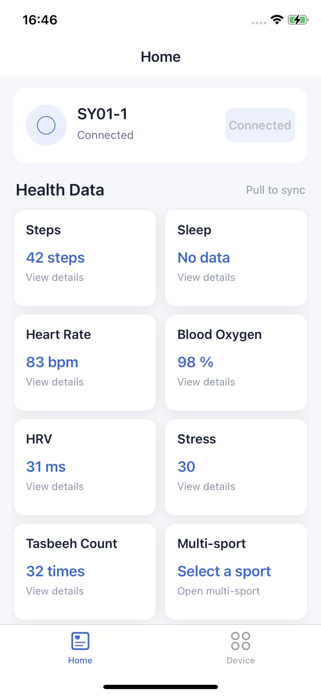
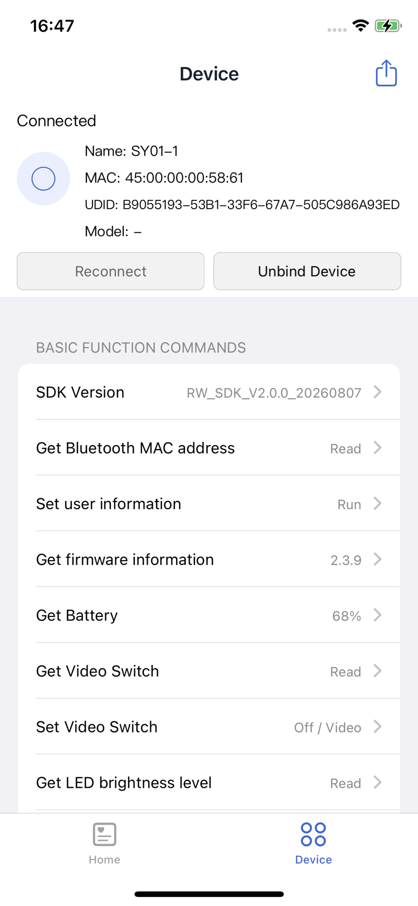

# RW iOS SDK

RWFit iOS BLE SDK — 用于智能戒指/手环设备的蓝牙通信开发套件。

RWFit iOS BLE SDK — Bluetooth communication SDK for smart ring/band devices.

## 文档 / Documentation

- [中文文档](doc/blesdkios_zh.md)
- [English Documentation](doc/blesdkios_en.md)

## Demo 展示 / Demo Preview

  
  

## License

[MIT License](LICENSE)
