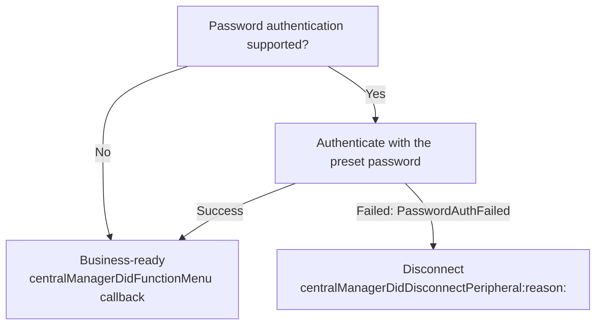

# RW BLE iOS SDK User Guide

## 1. Introduction

This document explains the functional APIs and usage scenarios provided by the SDK.

This document applies only to RW company Bluetooth devices.

#### 1.1 Supported Platforms and Languages

- iOS 15 and above, Objective-C language.

#### 1.2 Terminology

-  App: Refers to the application running on a mobile phone or tablet.
-  Device: Refers to wearable hardware devices, such as watches and rings.
-  Upload: Refers to data sent from the device to the App.
-  Download: Refers to data sent from the App to the device.

#### 1.3 Notes

1. This document uses Objective-C for all examples. If you use Swift, you must import the corresponding Objective-C header files in the project's Bridging Header.

2. The SDK is distributed as `DHBleSDK.xcframework` and supports both physical iOS devices and the iOS Simulator. The simulator can be used for UI, navigation, and regular business-logic testing; BLE scanning, connection, and device communication still require a physical device.

   

## 2. Quick Start

**Step 1: Install the latest version of Xcode**

To develop with the RW BLE iOS SDK, Xcode must be installed.

**Step 2: Manually add dependencies**

Manually add `DHBleSDK.xcframework` to your project. Xcode automatically selects the appropriate physical-device or simulator variant. The SDK is static, so set it to `Do Not Embed` under the target's `Frameworks, Libraries, and Embedded Content` section.


**Step 3: Configure info.plist**

```objective-c
 //Add Bluetooth usage descriptions to info.plist.
 NSBluetoothAlwaysUsageDescription
 NSBluetoothPeripheralUsageDescription
```

**Step 4: Initialize the SDK**

```objective-c
//Initialize the DHBleSDK in AppDelegate.
- (void)initBleSDK{
    [DHBleCentralManager setLogStatus:YES];
    [DHBleCentralManager initWithServiceUuids:@[]];
}
```

>  [!CAUTION]
>
> When logging is enabled `[DHBleCentralManager setLogStatus:YES]` , log files will be stored in the `Document/DeviceLog` directory.


## 3. API Reference

### 3.1 Device Scanning, Connection, Binding, and Reconnection

##### 3.1.1 Scan for Devices

>  Description: Call `startScan` to scan for BLE devices and implement the `DHBleConnectDelegate`.
>
>  If the returned `DHPeripheralModel` has an empty `macAddr`, it indicates that the device is already paired in system settings.

```objective-c
// 1. Start scanning
[DHBleCentralManager startScan];

// 2. Device delegate
[DHBleCentralManager shareInstance].connectDelegate = self;

// 3. DHBleConnectDelegate callbacks report discovered devices
- (void)centralManagerDidDiscoverPeripheral:(NSArray <DHPeripheralModel *>*)peripherals
```

##### 3.1.2 Stop Scanning

> Description: Stop scanning for BLE devices.

```objective-c
[DHBleCentralManager stopScan];
```


##### 3.1.3 Connect Device

> Description: Connect to a specified device and set the connection delegate.

```objective-c
// 1. Initialize and register the callback.
[DHBleCentralManager shareInstance].connectDelegate = self;

// 2. Connect device
DHPeripheralModel *deviceModel = self.deviceArray[indexPath.row];
[DHBleCentralManager connectDeviceWithModel:deviceModel];

// 3. Implement and receive callbacks for Bluetooth connection status.
@protocol DHBleConnectDelegate <NSObject>
```

`DHBleConnectDelegate` Interface Description:

| method                                | illustrate                                                   |
| :------------------------------------ | ------------------------------------------------------------ |
| centralManagerDidDiscoverPeripheral   | After calling `startScan`, the system will return a callback when a device is found. |
| centralManagerDidConnectPeripheral    | After calling `connectDeviceWithModel`, the function will return upon successful connection. |
| centralManagerDidFunctionMenu         | The function will return after successfully obtaining the device configuration table; business operations should be performed after this point. |
| centralManagerDidDisconnectPeripheral | Called when Bluetooth disconnects. Implement the new method with `reason` to obtain the disconnection reason. |
| centralManagerDidFailedPeripheral     | Bluetooth failure will trigger a callback.                   |
| centralManagerDidUpdateState          | The Bluetooth switch state change will trigger a callback.   |

Disconnection callback with reason:

`-(void)centralManagerDidDisconnectPeripheral:(CBPeripheral *)peripheral reason:(DHBleDisconnectReason)reason`

| Enum Value                                | Description                    |
| ----------------------------------------- | ------------------------------ |
| `DHBleDisconnectReasonUnknown`            | Unknown or normal disconnection |
| `DHBleDisconnectReasonManualDisconnect`   | Disconnected by the App        |
| `DHBleDisconnectReasonPasswordAuthFailed` | Device password authentication failed |

> If the new method with `reason` is implemented, the SDK will not also call the original `centralManagerDidDisconnectPeripheral:` method. If it is not implemented, the original callback remains compatible.

>  [!TIP]
>
> After connecting, business operations should only be performed after the `centralManagerDidFunctionMenu` method has been called.


(1) Listening to `BluetoothNotificationConnectStateChange` can also provide information about changes in the connection state.

```objective-c
[[NSNotificationCenter defaultCenter] addObserver:self selector:@selector(connectStateChange:) name:BluetoothNotificationConnectStateChange object:nil];

- (void)connectStateChange:(NSNotification *)ntf
{
  NSLog(@"NewHomeController connectStateChange");
  if ([DHBluetoothManager shareInstance].isConnected){
    self.infoDeviceStateLb.text = @"Connected";
  }
  else{
    self.infoDeviceStateLb.text = @"Disconnected";
  }
}
```

(2) `[DHBleCentralManager isConnected]` can be used to check if the connection was successful.

##### 3.1.4 Disconnect the device.

> Interface description: Disconnect the currently connected device;

```objective-c
 [DHBleCentralManager disconnectDevice];
```

##### 3.1.5 Binding and automatic reconnection, unbinding

###### 3.1.5.1 DHBleCentralManager Save to the current device locally.

> After setting this, the current device's UDID will be saved, and it will automatically reconnect.

Method Description:

`+(void)setBindedStatus:(BOOL)isBinded`

Example of usage:

```objective-c
//Save locally, and reopening the file will reconnect.
[DHBleCentralManager setBindedStatus:YES];
```

###### 3.1.5.2 DHBleCentralManager Delete locally saved data

> After this setting is applied, the UDID of the current device will be deleted, similar to unlinking the device locally.

Method Description:

`+(void)setBindedStatus:(BOOL)isBinded`

Example of usage:

```objective-c
[DHBleCentralManager setBindedStatus:NO];
[DHBleCentralManager disconnectDevice];
```

##### 3.1.6 Equipment Configuration Table

>  [!IMPORTANT]
>
> Due to the variety of device models and their differing supported features, a feature table has been introduced to allow users to check the supported functions of each device.  Please refer to the DeviceFuncV2Model class for details. The feature table content can be saved according to your specific business needs.

`-(void)centralManagerDidFunctionMenu:(DeviceFuncV2Model *)deviceFuncModel`

DeviceFuncV2Model class attribute definitions:

| attribute                   | illustrate                                                |
| --------------------------- | --------------------------------------------------------- |
| isPushMsgEnableSwitch       | Enable or disable message control switch                  |
| pushMsgSwitchValue          | Supported message types, low 32 bits (bit0-bit31)        |
| pushMsgSwitchValue2         | Supported message types, high 32 bits (bit32-bit63); defaults to 0 on old devices |
| activityDataInterval        | Today's step-detail interval in minutes; an unconfigured value is normalized to 60 |
| isAlarm                     | Does it support an alarm clock?                           |
| isBackLight                 | Does it support screen sleep time settings?               |
| isSupportWorkout3           | Does it support multiple sports modes?                    |
| isSupportMuslimCountSwitch  | Does it support enabling/disabling Muslim prayers?        |
| isSupportHrSp02Alert        | Does it support HR and SpO2 alarm notification functions? |
| isSupportMotoVibrationLevel | Does it support motor vibration alerts?                   |
| isSupportAlarmVibrationDuration | Does it support alarm vibration duration setting?     |
| isSupportVibrationInterval  | Does it support vibration interval setting?             |
| isDataTypeActivity          | Does it support step counting?                            |
| isDataTypeHeart             | Does it support heart rate monitoring?                    |
| isDataTypeBloodPressure     | Does it support blood pressure measurement?               |
| isDataTypeSleep             | Does it support sleep mode?                               |
| isDataTypeSPO2              | Does it support blood oxygen monitoring?                  |
| isDataTypeHRV               | Does it support heart rate variability?                   |
| isDataTypeStress            | Does it support pressure sensitivity?                     |
| isDataTypeBloodSugar        | Does it support blood glucose monitoring?                 |
| isDataTypeMuslimCount       | Do you support giving compliments/praise?                 |
| isSupportMuslimTimeDisplayMode | Does it support Muslim time display mode?              |
| isSupportSensorRawPPG       | Does it support PPG Green raw data?                       |
| isSupportPPGMonitoring      | Does it support PPG timed monitoring?                     |
| isSupportTemperatureMonitoring | Does it support temperature timed monitoring?          |
| isSupportCountReminder      | Does it support count reminder interval setting?          |
| isSupportSensorRawACC       | Does it support ACC raw data?                             |
| isSupportSensorRawPPGRed    | Does it support PPG Red raw data?                         |
| isSupportSensorRawIR        | Does it support IR (infrared) raw data?                   |
| isSupportSensorRawSleep     | Does it support sleep real-time data?                     |
| isSupportFallDetect         | Does it support fall detection alert?                     |
| isSupportRecording          | Does it support recording function?                      |
| isSupportDevicePasswordAuth | Does it support device password authentication?          |
| isSupportScreenControl      | Does it support instant screen on/off control?            |
| isSupportUnitSetting        | Does it support metric/imperial unit settings?             |
| isSupportDeviceChallenge    | Does it support device identity authentication?            |
| isSupportSedentary          | Does it support sedentary reminder settings?               |
| isDrink                     | Does it support drink reminder settings?                   |

##### 3.1.8 Use an External CBCentralManager for Scanning and Let the SDK Connect

> Description: If the customer App integrates multiple BLE SDKs and uses its own unified BLE scanning entry, pass the scanning `CBCentralManager` to this SDK. The customer App is only responsible for scanning. Connection, service discovery, characteristic discovery, data transfer, and disconnection are still handled by the SDK.

> [!IMPORTANT]
>
> A `CBPeripheral` is bound to the `CBCentralManager` that discovered it. The `peripheral` passed to the SDK must come from the currently set `externalCentralManager`. The SDK does not use private APIs to verify the source. If the Central and Peripheral do not match, the connection may fail or time out.

Method Description:

```objective-c
// Initialize the SDK and specify an external CBCentralManager.
// Pass nil to use the SDK-managed mode.
+ (void)initWithServiceUuids:(NSArray <NSString *>*)uuids
      externalCentralManager:(nullable CBCentralManager *)centralManager;

// Set an external CBCentralManager at runtime.
// It can only be set when the SDK is not connecting or connected.
+ (void)setExternalCentralManager:(nullable CBCentralManager *)centralManager;

// Check whether the SDK is using an external CBCentralManager.
+ (BOOL)isUsingExternalCentralManager;

// Connect to a device discovered by the customer's unified scanner.
+ (void)connectPeripheral:(CBPeripheral *)peripheral
        advertisementData:(nullable NSDictionary *)advertisementData
                     RSSI:(nullable NSNumber *)RSSI;
```

Parameter Description:

| parameter | type | description |
| --------- | ---- | ----------- |
| centralManager | CBCentralManager | The same Central used by the customer App for unified scanning. The SDK will use it to connect. |
| peripheral | CBPeripheral | The device object discovered by `centralManager`. The connection must use this object. |
| advertisementData | NSDictionary | Advertisement data used to complete `DHPeripheralModel` fields such as `macAddr`, `deviceModel`, and device name. It is not required for the connection itself and can be nil. |
| RSSI | NSNumber | Signal strength used to complete `DHPeripheralModel.rssi`. It is not required for the connection itself and can be nil. |

Example:

```objective-c
// 1. The customer App scans devices with its own CBCentralManager.
// centralManager, peripheral, advertisementData, and RSSI come from the customer's scan callback.

// 2. Pass the same CBCentralManager to the SDK.
[DHBleCentralManager initWithServiceUuids:@[]
                   externalCentralManager:centralManager];

// Or set the external Central at runtime if the SDK has already been initialized.
[DHBleCentralManager setExternalCentralManager:centralManager];

// 3. Set the SDK connection delegate.
[DHBleCentralManager shareInstance].connectDelegate = self;

// 4. Let the SDK start the connection.
[DHBleCentralManager connectPeripheral:peripheral
                     advertisementData:advertisementData
                                  RSSI:RSSI];
```

Notes:

- The old integration method `[DHBleCentralManager initWithServiceUuids:@[]]` remains unchanged, and the SDK will create its own `CBCentralManager`.
- In external Central mode, the SDK connects by using the same `CBCentralManager` passed by the customer App.
- After the SDK starts connecting, it takes over `centralManager.delegate`, and subsequent connection callbacks are handled by the SDK.
- The customer App should stop its own scanning flow before handing the device to the SDK for connection.
- Do not switch `externalCentralManager` while connecting, connected, discovering services, or synchronizing data.
- For automatic reconnection in external Central mode, the customer App must keep the passed `centralManager` instance alive.


### 3.2 Device function operation

Error code definitions for API calls SendStateCode:

| SendStateCode           | value | illustrate                         |
| ----------------------- | ----- | ---------------------------------- |
| SendState_OK            | 0     | OK                                 |
| SendState_BLENoOpen     | 1     | Failure, Bluetooth is not enabled. |
| SendState_BLEDisconnect | 2     | Failure, Bluetooth not connected.  |
| SendState_TimeOut       | 3     | Failure, Timeout                   |
| SendState_Failed        | 4     | fail                               |
| SendState_DuplicateSend | 5     | Repeat command                     |
| SendState_NotSupport    | 6     | Device not supported               |


#### 3.2.1 Basic function command interface

##### 3.2.1.0 Get SDK Version

> Get the SDK version number.

Method Description:

`[DHBleCommand getSDKVersion]`

Example of usage:

```objective-c
NSLog(@"%@", [DHBleCommand getSDKVersion]);
```


##### 3.2.1.1 Get Bluetooth MAC address

> Because the iOS system cannot obtain the MAC address from the broadcast packet after pairing, this method is provided to retrieve it.

Method Description:

`+ (void)ringGetMacAddress:(void(^)(int code, id data))block`

Return parameter description:

| parameter | type              | illustrate |                   |
| --------- | ----------------- | ---------- | ----------------- |
| model     | DHDeviceInfoModel | class      | macAddr:  MAC address |

Example of usage:

```objective-c
[DHBleCommand ringGetMacAddress:^(int code, id  _Nonnull data) {
  DHDeviceInfoModel *tDeviceInfoData = data;
  NSLog(@"mac: %@", tDeviceInfoData.macAddr);
}];
```


##### 3.2.1.2 Set user information

> User information settings are related to step count, calories burned, and distance.  During device initialization, the default settings are: gender 1, age 18, height 170cm, and weight 65 kg.

Method Description:

`+ (void)setUserInfo:(DHUserInfoSetModel *)model block:(void(^)(int code, id data))block`

Parameter Description:

| parameter | type               |       | illustrate                                                   |
| --------- | ------------------ | ----- | ------------------------------------------------------------ |
| model     | DHUserInfoSetModel | class | gender: Gender (0. Female, 1. Male)<br>Height: height in cm, floating-point number<br/>Weight: weight in kg, floating-point number<br/>Step Goal: step count target value, currently no functionality<br/>Age: age<br/> |

Example of usage:

```objective-c
DHUserInfoSetModel *userInfoModel = [[DHUserInfoSetModel alloc] init];
userInfoModel.gender = 1;
userInfoModel.height = 170;
userInfoModel.weight = 600;
userInfoModel.stepGoal = 8000;
userInfoModel.age = 20;
[DHBleCommand setUserInfo:userInfoModel block:^(int code, id  _Nonnull data) {
  if (code == 0){
    NSLog(@"set ok");
  }
}];
```


##### 3.2.1.3 Get Device Information

> Retrieves the device model, firmware version, and UI version.

Method:

`+ (void)getFirmwareVersion:(void(^)(int code, id data))block`

Return value:

| DHFirmwareVersionModel property | Type | Description |
| ------------------------------- | ---- | ----------- |
| deviceModel | NSString | Device model, the unique identifier for each product model |
| firmwareVersion | NSString | Firmware version |
| uiVersion | NSString | UI version |

> **Important:** Before an OTA update, verify that the device `deviceModel` matches the target device model of the firmware file. Start the update only when they match. Do not update a device with firmware for a different model.

Example:

```objective-c
[DHBleCommand getFirmwareVersion:^(int code, id _Nonnull data) {
    if (code == 0 && [data isKindOfClass:[DHFirmwareVersionModel class]]) {
        DHFirmwareVersionModel *model = data;
        NSLog(@"model %@ firmware %@ UI %@",
              model.deviceModel, model.firmwareVersion, model.uiVersion);
    }
}];
```

##### 3.2.1.4 Get Battery Level

> Retrieves the current device battery level.

Method:

`+ (void)getBattery:(void(^)(int code, id data))block`

Return value:

| DHBatteryInfoModel property | Type | Description |
| --------------------------- | ---- | ----------- |
| battery | NSInteger | Remaining battery level, range 0-100 |
| status | NSInteger | Charging status: `0` not charging, `1` charging; requires device firmware support. Defaults to `0` when not returned by older firmware. |

Example:

```objective-c
[DHBleCommand getBattery:^(int code, id _Nonnull data) {
    if (code == 0 && [data isKindOfClass:[DHBatteryInfoModel class]]) {
        DHBatteryInfoModel *model = data;
        NSLog(@"battery %zd, charging status %zd", model.battery, model.status);
    }
}];
```

###### 3.2.1.4.1 Real-time Battery Monitoring

Supported devices actively push the current battery level and charging status when charging starts or stops. This capability requires device firmware support and is not a periodic update. Call `getBattery` when the app needs to actively query the current battery level.

Observe `BluetoothNotificationProtocolPush` for real-time battery updates:

```objective-c
id observer = [[NSNotificationCenter defaultCenter]
    addObserverForName:BluetoothNotificationProtocolPush
                object:nil
                 queue:NSOperationQueue.mainQueue
            usingBlock:^(NSNotification *notification) {
    NSDictionary *userInfo = notification.userInfo;
    if ([userInfo[@"dataType"] unsignedIntegerValue] != DHDevicePushTypePower) return;

    DHBatteryInfoModel *model = userInfo[@"dataValue"];
    NSLog(@"real-time battery %zd, charging status %zd", model.battery, model.status);
}];

// Remove with the same observer instance when it is no longer needed.
[[NSNotificationCenter defaultCenter] removeObserver:observer];
```

##### 3.2.1.5 Get and Set the Video Control Mode

> Set the ring gesture control mode; <u>this function requires pairing with Bluetooth HID.</u>

Parameter Description:

| Parameter | Type | Description        | Value                                      |
| --------- | ---- | ------------------ | ------------------------------------------ |
| `isOpen`  | int  | Video control mode | `0`: Off, `1`: Video, `2`: Book, `3`: Music |

```objective-c
//Set video control mode
DHVideoHidSetModel *tModeSetModel = [[DHVideoHidSetModel alloc] init];
tModeSetModel.isOpen = 1; //0 Off, 1 Video, 2 Book, 3 Music
[DHBleCommand setVideoHid:tModeSetModel block:^(int code, id  _Nonnull data) {
  if (code == 0){
    NSLog(@"setVideoHid OK");
  }
}];

// Get video control mode
[DHBleCommand getVideoHid:^(int code, id  _Nonnull data) {
  if (code == 0){
    DHVideoHidSetModel *model = data;
    NSLog(@"getVideoHid OK mode %d", model.isOpen);
  }
}];
```

##### 3.2.1.6 Get and set LED screen brightness.

Method Description:

`+(void)getRingLEDLight:(void(^)(int code, id data))block;`

`+(void)setRingLEDLight:(DHLedLightSetModel *)model block:(void(^)(int code, id data))block;`

Parameter Description:

| parameter | type               |       | illustrate                                                   |
| --------- | ------------------ | ----- | ------------------------------------------------------------ |
| model     | DHLedLightSetModel | class | isOpen: false means off, true means (Levels 1-3)<br/>Light Level: 1 (dim light), 2 (soft light), 3 (bright light) |

Example of usage:

```objective-c
// Get the LED screen brightness level.
[DHBleCommand getRingLEDLight:^(int code, id  _Nonnull data) {
  if (code == 0){
    DHLedLightSetModel *model = data;
    NSLog(@"getRingLEDLight OK isOpen %d", model.isOpen);
  }
}];

// Set the LED screen brightness. 
DHLedLightSetModel *tModeSetModel = [[DHLedLightSetModel alloc] init];
tModeSetModel.isOpen = YES; //
tModeSetModel.lightLevel = 3; //1 (dim light), 2 (soft light), 3 (bright light)
[DHBleCommand setRingLEDLight:tModeSetModel block:^(int code, id  _Nonnull data) {
  if (code == 0){
    NSLog(@"setRingLEDLight OK");
  }
}];
```


##### 3.2.1.7 Get and set the wearing position.

> Gets or sets the ring wearing position.
>
> Configuration table property: `isWearDir`.

Methods:

`+ (void)getRingWearHand:(void(^)(int code, id data))block`

`+ (void)setRingWearHand:(UInt8)wearHand block:(void(^)(int code, id data))block`

Parameter:

| Parameter | Type | Description | Values |
| --------- | ---- | ----------- | ------ |
| wearHand | UInt8 | Wearing position | 0: Left hand; 1: Right hand |

Return value:

| Return data | Type | Description |
| ----------- | ---- | ----------- |
| data | NSNumber | Wearing position: 0 for left hand, 1 for right hand |

Example:

```objective-c
// Get the wearing position
[DHBleCommand getRingWearHand:^(int code, id _Nonnull data) {
  if (code == 0){
    NSInteger wearHand = [data integerValue]; // 0: Left; 1: Right
    NSLog(@"wearing position %zd", wearHand);
  }
}];

// Set the wearing position
UInt8 wearHand = 0; // 0: Left; 1: Right
[DHBleCommand setRingWearHand:wearHand block:^(int code, id _Nonnull data) {
  if (code == 0){
    NSLog(@"setRingWearHand OK");
  }
}];
```

##### 3.2.1.8 Starting and stopping photo taking

> Enable camera control when the APP enters its custom camera page. The device can then notify the APP to take a photo by gesture. Disable camera control when the APP leaves the camera page.
>
> Configuration table property: `isTakePhoto`.
>
> Receive device photo events through `BluetoothNotificationCameraTakePicture`.

Method:

`+ (void)controlCamera:(NSInteger)type block:(void(^)(int code, id data))block`

Parameter:

| Parameter | Type | Description | Values |
| --------- | ---- | ----------- | ------ |
| type | NSInteger | Camera control | 0: Disable; 1: Enable |

Example:

```objective-c
// Call when the APP enters the camera page
- (void)openCameraPage {
    [[NSNotificationCenter defaultCenter] addObserver:self
                                             selector:@selector(cameraTakePictureNotification:)
                                                 name:BluetoothNotificationCameraTakePicture
                                               object:nil];
    [DHBleCommand controlCamera:1 block:^(int code, id _Nonnull data) {
        NSLog(@"enable camera control code=%d", code);
    }];
}

// Call when the APP leaves the camera page
- (void)closeCameraPage {
    [DHBleCommand controlCamera:0 block:^(int code, id _Nonnull data) {
        NSLog(@"disable camera control code=%d", code);
    }];
    [[NSNotificationCenter defaultCenter] removeObserver:self
                                                    name:BluetoothNotificationCameraTakePicture
                                                  object:nil];
}

- (void)cameraTakePictureNotification:(NSNotification *)notification {
    // Take a photo with the APP's custom camera here
}
```

##### 3.2.1.9 Find devices

> After initiating the search function, the device's light or screen will turn on.

Method Description:

`+(void)controlFindDeviceBegin:(void(^)(int code, id data))block;`

Example of usage:

```objective-c
[DHBleCommand controlFindDeviceBegin:^(int code, id  _Nonnull data) {

}];

```


##### 3.2.1.10 Turn off the device, restore factory settings.

Method Description:

`+(void)controlDevice:(NSInteger)type block:(void(^)(int code, id data))block;`

Parameter Description:

| parameter | type      |      | illustrate                         |
| --------- | --------- | ---- | ---------------------------------- |
| type      | NSInteger | Integer | 1: Turn off<br/>2: restore factory |

Example of usage:

```objective-c
// 1: power off, 2: restore factory settings
[DHBleCommand controlDevice:1 block:^(int code, id  _Nonnull data) {

}];

```

##### 3.2.1.11 Alarm

Configuration table attribute: `isAlarm`

###### 3.2.1.11.1 Get the alarms that have been set.

Method Description:

`+(void)getAlarms:(void(^)(int code, id data))block`

Example of usage:

```objective-c
// Get alarms saved in the device
[DHBleCommand getAlarms:^(int code, id  _Nonnull data) {
  if (code == 0) {
    NSArray *tAlarmList = data;
    NSLog(@"getAlarms %zd", tAlarmList.count);
  }
}];
```

###### 3.2.1.11.2 Set an alarm

> **The current protocol does not support modifying individual alarms. Any operation to switch on/off or delete a single alarm requires resending the entire alarm configuration.**

Method Description:

`+(void)setAlarms:(NSArray <DHAlarmSetModel *>*)alarms block:(void(^)(int code, id data))block;`

Parameter Description:

| parameter | type                  | illustrate | illustrate                                                   |
| --------- | --------------------- | ---------- | ------------------------------------------------------------ |
| alarms    | List<DHAlarmSetModel> | List       | isOpen: true Open/false Off<br/>repeats: IntArray(7) Sunday to Saturday, set the corresponding element to 1 for repetition.<br/>hour: start hour<br/>minute: start minute |

Example of usage:

```objective-c
// Set an alarm        
DHAlarmSetModel *tAlarm1 = [[DHAlarmSetModel alloc] init];
tAlarm1.hour = 07; // hour
tAlarm1.minute = 00; // minute
tAlarm1.isOpen = true; // on/off switch
tAlarm1.repeats = @[@(0),@(0),@(0),@(0),@(0),@(0),@(1)]; // Repeat schedule; repeats on Saturday

DHAlarmSetModel *tAlarm2 = [[DHAlarmSetModel alloc] init];
tAlarm2.hour = 8;
tAlarm2.minute = 00;
tAlarm2.isOpen = true;
tAlarm2.repeats = @[]; // one-shot alarm

[DHBleCommand setAlarms:@[tAlarm1, tAlarm2] block:^(int code, id  _Nonnull data) {

}];
```

###### 3.2.1.11.3 Delete all alarms

> By passing an empty array to the `setAlarms` parameter, you can delete all alarms.

```objective-c
[DHBleCommand setAlarms:@[] block:^(int code, id  _Nonnull data) {

}];
```


##### 3.2.1.12 Setting and retrieving the number of vibrations

> Set the number of times the device vibrates;
>
> Configuration table property: `isSupportMotoVibrationLevel`

Method Description:

`+(void)setRingMotorLevel:(NSInteger)motorLevel motorNum:(NSInteger)motorNum block:(void(^)(int code, id data))block;`

`+(void)getRingMotorLevel:(void(^)(int code, id data))block;`

Parameter Description:

| parameter  | type | illustrate | illustrate                                                   |
| ---------- | ---- | ---------- | ------------------------------------------------------------ |
| motorLevel | Int  | Integer       | Vibration intensity: 0: Off, 1: Low, 2: Medium, 3: High; *This function is not defined and can be ignored* |
| motorNum   | Int  | Integer       | The number of vibrations can be set (0-6 times), with a default setting of 2 times. Setting it to 0 will disable vibration. |

Example of usage:

```objective-c
// Set
[DHBleCommand setRingMotorLevel:1 motorNum:2 block:^(int code, id  _Nonnull data) {
  if (code == 0){
    NSLog(@"set ok");
  }
}];

// Get
[DHBleCommand getRingMotorLevel:^(int code, id  _Nonnull data) {
  if (code == 0){
    DHVibrationLevelModel *tVibrationModel = data;
    NSLog(@"getRingMotorLevel Level %d num %d", tVibrationModel.vibrationLevel, tVibrationModel.vibrationNumber);
  }
}];


```

##### 3.2.1.13 Setting and retrieving screen sleep mode settings.

>  Set screen sleep mode and time;
>
>  Configuration table property: `isBackLightSleepMode`

Method Description:

`+(void)setDisplaySleepMode:(DHBrightTimeSetModel *)model block:(void(^)(int code, id data))block`

`+(void)getDisplaySleepMode:(void(^)(int code, id data))block`

Parameter Description:

| parameter            | type  | illustrate | illustrate                                                   |
| -------------------- | ----- | ---------- | ------------------------------------------------------------ |
| DHBrightTimeSetModel | class |            | sleepOpen: Switch on (YES) or off (NO)<br/>sleepStartHour: Start time (hour)<br/>sleepStartMin: Start time (minute)<br/>sleepEndHour: End time (hour)<br/>sleepEndMin: End time (minute) |

Example of usage:

```objective-c
// Set
DHBrightTimeSetModel *sleepModel = [[DHBrightTimeSetModel alloc] init];
sleepModel.sleepOpen = YES;
sleepModel.sleepStartHour = 20;
sleepModel.sleepStartMin = 00;
sleepModel.sleepEndHour = 06;
sleepModel.sleepEndMin = 00;
[DHBleCommand setDisplaySleepMode:sleepModel block:^(int code, id  _Nonnull data) {

}];

// Get
[DHBleCommand getDisplaySleepMode:^(int code, id  _Nonnull data) {
  if (code == 0){
    DHBrightTimeSetModel *tModel = data;
    NSLog(@"getDisplaySleepMode sleepOpen %d sleepStartHour %d sleepStartMin %d", tModel.sleepOpen, tModel.sleepStartHour, tModel.sleepEndMin);
  }
}];


```

##### 3.2.1.14 Setting and retrieving notification push settings

> `DeviceFuncV2Model.isPushMsgEnableSwitch` indicates whether the device
> supports message-push switch settings. `pushMsgSwitchValue` and
> `pushMsgSwitchValue2` are capability masks for bit0-bit31 and bit32-bit63;
> they are not the device's current switch states.
>
> When opening the message-push settings page, call `ringGetAncs:` to fetch
> the current switches from the device. On success, `data` is a
> `DHAncsSetModel`. Modify that model and call `ringSetAncs:block:` to write
> the switches back to the device.

| Purpose | Property/API | Result |
| ------- | ------------ | ------ |
| Check feature support | `DeviceFuncV2Model.isPushMsgEnableSwitch` | Whether message-push switches are supported |
| Check supported message types | `pushMsgSwitchValue` / `pushMsgSwitchValue2` | Supported message types, bit0-bit63 |
| Fetch current switches | `ringGetAncs:` | `DHAncsSetModel` |
| Set current switches | `ringSetAncs:block:` | Setting result |

Method Description:

`+(void)ringSetAncs:(DHAncsSetModel *)model block:(void(^)(int code, id data))block`

`+(void)ringGetAncs:(void(^)(int code, id data))block`

Parameter Description:

| parameter      | type  | illustrate | illustrate                                      |
| -------------- | ----- | ---------- | ----------------------------------------------- |
| DHAncsSetModel | class |            | See the definition of the DHAncsSetModel class. |

Example of usage:

```objective-c
// Set
DHAncsSetModel *tAncsModel = [[DHAncsSetModel alloc] init];
tAncsModel.isSMS = YES;
[DHBleCommand ringSetAncs:tAncsModel block:^(int code, id  _Nonnull data) {

}];

// Get
[DHBleCommand ringGetAncs:^(int code, id  _Nonnull data) {
  if (code == 0){
    DHAncsSetModel *ancsModel = data;
    NSLog(@"SMS=%d Wechat=%d", ancsModel.isSMS, ancsModel.isWechat);
  }
}];

// Determine which app message types the device supports, in the order below.
UInt8 tBitRow = i;
if (i == 24){ // others
  tBitRow = 0;
}
if (i > 0 && (tMsgSwitchValue & (1 << tBitRow)) < 1){ // Force unsupported message types to false regardless of the values read from the device.
  continue;
}

self.msgOpenFlagArr = [NSMutableArray arrayWithArray:@[
  @(self.model.isCall),
  @(self.model.isSMS),
  @(self.model.isEmail),
  @(self.model.isSkype),
  @(self.model.isFacebook),
  @(self.model.isWhatsapp),
  @(self.model.isLine),
  @(self.model.isInstagram),
  @(self.model.isKakaotalk),
  @(self.model.isGmail),
  @(self.model.isTwitter),
  @(self.model.isLinkedin),
  @(self.model.isJLSinaWeiBo),

  @(self.model.isQQ),
  @(self.model.isWechat),
  @(self.model.isJLBand),
  @(self.model.isJLTelegram),
  @(self.model.isJLBetween),
  @(self.model.isJLNavercafe),
  @(self.model.isYoutube),
  @(self.model.isJLNetflix), //(1<<21)
  @(self.model.isMax), // (1<<22)
  @(self.model.isVkim), // (1<<23)
  //        @(self.model.isMessenger),

  @(self.model.isOther)
]];

```

##### 3.2.1.15 Get and set whether the "likes" feature is enabled.

>  Set whether the "like" function is enabled;
>
>  Configuration table property: `isSupportMuslimCountSwitch`

Method Description:

`+(void)setMuslimCountSwitch:(UInt8)isOpen block:(void(^)(int code, id data))block`

`+(void)getMuslimCountSwitch:(void(^)(int code, id data))block`

Parameter Description:

| parameter | type | illustrate | illustrate        |
| --------- | ---- | ---------- | ----------------- |
| isOpen    | Int  |            | 0: Off<br>1: Open |

Example of usage:

```objective-c
// Set
[DHBleCommand setMuslimCountSwitch:1 block:^(int code, id  _Nonnull data) {

}];

// Get
[DHBleCommand getMuslimCountSwitch:^(int code, id  _Nonnull data) {
  if (code == 0){
    Boolean tOpen = [data boolValue];
    NSLog(@"getMuslimCountSwitch tOpen %d", tOpen);
  }
}];

```


##### 3.2.1.16 Get and set heart rate/blood oxygen alarm configuration.

>  This function allows you to set heart rate and blood oxygen level notification and alarm data; the alarm notification will be sent via `BluetoothNotificationRingHealthOverAlert`.
>
>  Configuration table attribute: `isSupportHrSp02Alert`

Method Description:

`+(void)getHRAlert:(void(^)(int code, id data))block`

`+(void)setHRAlert:(DHHRAlertModel *)overModel block:(void(^)(int code, id data))block`


 `+(void)getSP02Alert:(void(^)(int code, id data))block`  

 `+(void)setSP02Alert:(DHHRAlertModel *)overModel block:(void(^)(int code, id data))block`

Parameter Description:

| Parameter      | type  | illustrate | illustrate                                                   |
| -------------- | ----- | ---------- | ------------------------------------------------------------ |
| DHHRAlertModel | class |            | isOpen: YES (On), NO (Off);<br/>overValue: Alarm threshold, default values are heart rate exceeding 160 and blood oxygen below 94%.<br>underValue: An alarm will be triggered if the value is below the set threshold; if the retrieved value is 0xff, it indicates that this function is not supported. |

**Note: If the `underValue` returned by `getHRAlert()` is 0xff, it means this feature is not supported.**

Example of usage:

```objective-c
//set
DHHRAlertModel *tHRAlertModel = [[DHHRAlertModel alloc] init];
tHRAlertModel.isOpen = YES;
tHRAlertModel.overValue = 160;
tHRAlertModel.underValue = 0xff;
[DHBleCommand setHRAlert:tHRAlertModel block:^(int code, id  _Nonnull data) {

}];

//get
[DHBleCommand getHRAlert:^(int code, id  _Nonnull data) {
  if (code == 0){
    DHHRAlertModel *model = data;
    NSLog(@"getHRAlert %d %zd", model.isOpen, model.overValue);
  }
}];


// Alarm notification push
    [[NSNotificationCenter defaultCenter] addObserver:self selector:@selector(healthOverAlert:) name:BluetoothNotificationRingHealthOverAlert object:nil];

- (void)healthOverAlert:(NSNotification *)ntf
{
    NSDictionary *tUserInfo = ntf.userInfo;
    NSInteger tType = [tUserInfo[@"type"] integerValue];
    NSInteger tValue = [tUserInfo[@"value"] integerValue];
    
    if (tType == 0){ //HeartRate Alert
        
    }
    else if (tType == 1){ //SP02
        
    }
}
```

##### 3.2.1.17 Get and set screen timeout duration.

>  Configuration table property: `isBackLight`

Method Description:

`+(void)getBrightTime:(void(^)(int code, id data))block`

`+(void)setBrightTime:(DHBrightTimeSetModel *)model block:(void(^)(int code, id data))block`

Parameter Description:

| DHBrightTimeSetModel Parameter | Type   | Description                                                  | Value |
| ------------------------------ | ------ | ------------------------------------------------------------ | ----- |
| duration                       | Int    | Screen-on duration, in seconds (s), range 0-30s;             |       |
| durationNums                   | String | Supported duration values by the device; if available, separated by commas; |       |

##### 3.2.1.18 Get and Set Wrist-Raise Screen-On Duration

>  Configuration table property: `isSupportRaisescreen`

Method Description:

`+(void)ringGetGesture:(void(^)(int code, id data))block;`

`+(void)ringSetGesture:(DHGestureSetModel *)model block:(void(^)(int code, id data))block;`

Parameter Description:

| BrightScreenBean Parameter | Type | Description                    | Value |
| -------------------------- | ---- | ------------------------------ | ----- |
| isOpen                     | Int  | true: enabled; false: disabled |       |
| startHour                  | Int  | Start time (hour)              |       |
| startMin                   | Int  | Start time (minute)            |       |
| endHour                    | Int  | End time (hour)                |       |
| endMin                     | Int  | End time (minute)              |       |


##### 3.2.1.19 **Set Time Format (12-Hour / 24-Hour)**

>  This setting only applies to devices with a display.

Method Description:

`+(void)ringSetTimeformat:(UInt8)timeformat block:(void(^)(int code, id data))block;`

Parameter Description:

| Parameter  | Type | Description              |      |
| ---------- | ---- | ------------------------ | ---- |
| timeformat | Int  | 0: 24-Hour<br>1: 12-Hour |      |


##### 3.2.1.20 Alarm Vibration Duration Setting and Getting

> Set the alarm vibration count;
>
> Configuration table property: `isSupportAlarmVibrationDuration`

Method Description:

`+(void)setAlarmVibrationDuration:(UInt8)count block:(void(^)(int code, id data))block`

`+(void)getAlarmVibrationDuration:(void(^)(int code, id data))block`

Parameter Description:

| Parameter | Type  | Description | Value                                              |
| --------- | ----- | ----------- | -------------------------------------------------- |
| count     | UInt8 | Integer     | Vibration count (0-6), default 2, 0 means no vibration |

Example of usage:

```objective-c
//Set
[DHBleCommand setAlarmVibrationDuration:2 block:^(int code, id  _Nonnull data) {
    if (code == 0){
        NSLog(@"setAlarmVibrationDuration OK");
    }
}];

//Get
[DHBleCommand getAlarmVibrationDuration:^(int code, id  _Nonnull data) {
    if (code == 0){
        NSLog(@"getAlarmVibrationDuration count %@", data);
    }
}];
```


##### 3.2.1.21 Device Push Listening

Device-initiated data is delivered through `BluetoothNotificationProtocolPush`. Use `DHDevicePushType` to identify the event type. Dispatch to the main queue before updating the UI.

userInfo:

| Key | Type | Description |
| --- | ---- | ----------- |
| dataType | NSNumber | Event type; see `DHDevicePushType` |
| dataValue | id | Parsed business object for that type |
| timestamp | NSNumber | Unix milliseconds when the SDK received the push |

DHDevicePushType:

| Type | dataValue | Description |
| ---- | --------- | ----------- |
| DHDevicePushTypePower | DHBatteryInfoModel | Battery and charging-status push, see 3.2.1.4.1 |
| DHDevicePushTypeRecordStatus | NSDictionary | Recording-status push: status (1=recording), isRecording, startTime (Unix seconds), duration (seconds), totalCapacity, remainingCapacity |
| DHDevicePushTypeTouchEvent | NSDictionary | Touch event: keyType (1 touch / 2 fall), touchType (1 single … 5 shake); see the field table below |

Fields of the touch event `dataValue`:

| Field | Description | Value |
| ---- | ---- | ---- |
| keyType | Key type | 1: Touch key; 2: Fall (requires the fall-detect reminder enabled, see 3.2.1.24) |
| touchType | Touch type | 1: Single tap; 2: Double tap; 3: Triple tap; 4: Long press; 5: Flick. Defaults to 1 for fall events |

> Touch operations are reported regardless of the screen state, and the APP defines the response behavior. This feature requires the device firmware to be customized and enabled.

Example:

```objective-c
id observer = [[NSNotificationCenter defaultCenter]
    addObserverForName:BluetoothNotificationProtocolPush
                object:nil
                 queue:nil
            usingBlock:^(NSNotification *notification) {
    NSDictionary *userInfo = notification.userInfo;
    switch ([userInfo[@"dataType"] unsignedIntegerValue]) {
        case DHDevicePushTypePower: {
            DHBatteryInfoModel *model = userInfo[@"dataValue"];
            NSLog(@"battery push %zd%%", model.battery);
            break;
        }
        case DHDevicePushTypeTouchEvent: {
            NSDictionary *event = userInfo[@"dataValue"];
            NSLog(@"touch push keyType=%zd touchType=%zd",
                  [event[@"keyType"] integerValue], [event[@"touchType"] integerValue]);
            break;
        }
        default:
            break;
    }
}];

// Remove the observer when no longer needed; pass the same instance used to add it
[[NSNotificationCenter defaultCenter] removeObserver:observer];
```


##### 3.2.1.22 Vibration Interval Setting and Getting

> Set the interval time between each vibration, used to adjust vibration rhythm;
>
> Configuration table property: `isSupportVibrationInterval`

Method Description:

`+(void)setVibrationInterval:(UInt16)intervalMs block:(void(^)(int code, id data))block`

`+(void)getVibrationInterval:(void(^)(int code, id data))block`

Parameter Description:

| Parameter  | Type   | Description | Value                                              |
| ---------- | ------ | ----------- | -------------------------------------------------- |
| intervalMs | UInt16 | Integer     | Interval duration (100-1000ms), default 500ms      |

Example of usage:

```objective-c
//Set
[DHBleCommand setVibrationInterval:500 block:^(int code, id  _Nonnull data) {
    if (code == 0){ NSLog(@"setVibrationInterval OK"); }
}];

//Get
[DHBleCommand getVibrationInterval:^(int code, id  _Nonnull data) {
    if (code == 0){ NSLog(@"getVibrationInterval %@ms", data); }
}];
```


##### 3.2.1.23 HR Calibration (Factory Test)

> Start device heart rate calibration mode. After sending the calibration command, the device returns 2 responses:
>
> 1st response: result=0 (calibrating); 2nd response: result≠0 (calibration done).
>
> block callback data is NSDictionary: `testMode`(UInt8) + `result`(UInt32, 0=calibrating, non-0=done).

Method Description:

`+(void)startFactoryTest:(UInt8)testMode block:(void(^)(int code, id data))block`

Parameter Description:

| Parameter | Type  | Description | Value              |
| --------- | ----- | ----------- | ------------------ |
| testMode  | UInt8 | Test mode   | 0x15: HR Calibration |

Example of usage:

```objective-c
[DHBleCommand startFactoryTest:0x15 block:^(int code, id  _Nonnull data) {
    if (code == 0 && [data isKindOfClass:[NSDictionary class]]){
        NSDictionary *info = data;
        NSInteger result = [info[@"result"] integerValue];
        if (result == 0){
            NSLog(@"HR calibrating...");
        } else {
            NSLog(@"HR calibration done, result=%zd", result);
        }
    }
}];
```


##### 3.2.1.24 Fall Detection Setting

> Set or get the fall detection alert switch. When enabled, the device will report fall events via touch event notification (3.2.1.21).
>
> Fall events are returned through the `BluetoothNotificationProtocolPush` notification, with `dataType` = `DHDevicePushTypeTouchEvent`; `keyType=2` in `dataValue` indicates a fall event, see 3.2.1.21.
>
> Configuration table property: `isSupportFallDetect`

Method Description:

`+(void)setFallDetect:(UInt8)enable block:(void(^)(int code, id data))block`

`+(void)getFallDetect:(void(^)(int code, id data))block`

Parameter Description:

| Parameter | Type  | Description | Value         |
| --------- | ----- | ----------- | ------------- |
| enable    | UInt8 | Switch      | 0: off, 1: on |

Example of usage:

```objective-c
//Get fall detect switch
[DHBleCommand getFallDetect:^(int code, id  _Nonnull data) {
    if (code == 0){
        NSLog(@"getFallDetect OK: %@", data);
    }
}];

//Set fall detect on
[DHBleCommand setFallDetect:1 block:^(int code, id  _Nonnull data) {
    if (code == 0){
        NSLog(@"setFallDetect ON OK");
    }
}];
```


##### 3.2.1.25 Count Reminder Interval Setting

> Set or get the count reminder interval. When enabled, after the user completes a count operation, the device starts timing and vibrates once when the interval is reached to remind the user to continue counting.
>
> Configuration table property: `isSupportCountReminder`

Method Description:

`+(void)setCountReminderInterval:(UInt8)interval block:(void(^)(int code, id data))block`

`+(void)getCountReminderInterval:(void(^)(int code, id data))block`

Parameter Description:

| Parameter | Type  | Description      | Value                                    |
| --------- | ----- | ---------------- | ---------------------------------------- |
| interval  | UInt8 | Interval minutes | 0: off, 30/60/90/120: reminder interval  |

Example of usage:

```objective-c
//Get count reminder interval
[DHBleCommand getCountReminderInterval:^(int code, id  _Nonnull data) {
    if (code == 0){
        NSLog(@"CountReminderInterval: %@ min", data);
    }
}];

//Set count reminder interval to 60 minutes
[DHBleCommand setCountReminderInterval:60 block:^(int code, id  _Nonnull data) {
    if (code == 0){
        NSLog(@"setCountReminderInterval OK");
    }
}];
```


##### 3.2.1.26 Device Password Authentication

> Check `isSupportDevicePasswordAuth` in the device configuration table to determine whether the device supports password authentication.
>
> The password must contain four digits. A `nil` or empty value is treated as the default password `0000`.
>
> For a supported device, `centralManagerDidFunctionMenu` is called only after authentication succeeds. If authentication fails, the SDK disconnects and returns `DHBleDisconnectReasonPasswordAuthFailed`. Unsupported devices continue to use the original connection flow.



###### 3.2.1.26.1 Set the Automatic Authentication Password

`+(void)prepareAutoPassword:(nullable NSString *)password`

> Set the password used by the SDK for automatic authentication. It may be configured after SDK initialization, but it must be called before connecting. The same value is also used when reconnecting to a locally bound device.

Input Parameter:

| Parameter  | Type       | Description                                                  |
| ---------- | ---------- | ------------------------------------------------------------ |
| `password` | `NSString` | Four-digit password; `nil` or an empty string is treated as `0000` |

Callback Result:

| Callback Method                                           | Result                                      | Description                                      |
| --------------------------------------------------------- | ------------------------------------------- | ------------------------------------------------ |
| `centralManagerDidFunctionMenu:peripheral:`               | `DeviceFuncV2Model`                         | Authentication succeeded; the device is business-ready |
| `centralManagerDidDisconnectPeripheral:reason:`           | `DHBleDisconnectReasonPasswordAuthFailed`   | Authentication failed; the SDK disconnects the device |

Example:

```objective-c
//Configure the current account's four-digit password before connecting.
[DHBleCommand prepareAutoPassword:@"1234"];
[DHBleCentralManager connectDeviceWithModel:deviceModel];

//The device is business-ready only after authentication succeeds.
- (void)centralManagerDidFunctionMenu:(DeviceFuncV2Model *)deviceFuncModel
                           peripheral:(DHPeripheralModel *)peripheral {
    NSLog(@"Device ready");
}
```

###### 3.2.1.26.2 Modify the Device Password

`+(void)modifyDevicePwd:(nullable NSString *)password completion:(void (^ _Nullable)(BOOL success))completion`

> Modify the device password after the device is connected and authenticated. `success == YES` means the device confirmed the change. For a normal unbind operation, first change the device password to `0000`; only clear the local binding and disconnect after the change succeeds.

Example:

```objective-c
[DHBleCommand modifyDevicePwd:@"0000" completion:^(BOOL success) {
    if (success) {
        [DHBleCentralManager setBindedStatus:NO];
        [DHBleCentralManager disconnectDevice];
    }
}];
```

###### 3.2.1.26.3 Prepare an Authorized Password Reset

`+(void)preparePasswordReset:(nullable NSString *)targetPassword`

> If the original device password is unavailable, the app may call this method after confirming that the user is authorized to reset the device. It sets a new target password for the next connection so that a password-protected device does not become permanently unusable. The app decides how reset authorization is verified; scanning a QR code on the package is only one possible method.

Parameter:

| Parameter | Type | Description |
| --------- | ---- | ----------- |
| `targetPassword` | `NSString` | New four-digit password; `nil` or an empty string is treated as `0000` |

Example:

```objective-c
// Call after the app confirms that the user is authorized to reset the device.
[DHBleCommand preparePasswordReset:@"5678"];
[DHBleCentralManager connectDeviceWithModel:deviceModel];
```

###### 3.2.1.26.4 Device Identity Authentication

> Configuration-table property: `isSupportDeviceChallenge`. Use this feature only when the device reports support.

Methods:

`+ (void)deviceChallenge:(NSString *)challengeHex block:(void(^)(int code, id data))block`

Parameter:

| Parameter | Type | Description |
| --------- | ---- | ----------- |
| challengeHex | NSString | Challenge issued by the cloud, 64 hex characters (32 bytes); spaces, colons and dashes are accepted as separators |

Return value:

- When `code == 0`, `data` is an `NSString` (64 hex characters): the HMAC-SHA256 of the challenge computed with the factory-preset device key.
- Response verification is performed by the app and the cloud; the SDK does not compare it.

Example:

```objective-c
// Fixed test vector for debugging; use a random challenge issued by the cloud in production
NSString *challengeHex = @"000102030405060708090a0b0c0d0e0f101112131415161718191a1b1c1d1e1f";
[DHBleCommand deviceChallenge:challengeHex block:^(int code, id data) {
    if (code == 0 && [data isKindOfClass:NSString.class]) {
        NSLog(@"response=%@", data); // compare with the HMAC-SHA256 computed by the cloud
    }
}];
```

##### 3.2.1.27 Instant Screen Control

> Check `isSupportScreenControl` in the device configuration table before using this feature.

Methods:

`+(void)setScreenOn:(BOOL)isOn block:(void(^)(int code, id data))block`

| Parameter | Type | Description |
| --------- | ---- | ----------- |
| isOn | BOOL | `YES`: turn the screen on; `NO`: turn the screen off |

Example:

```objective-c
[DHBleCommand setScreenOn:YES block:^(int code, id _Nonnull data) {
    NSLog(@"set screen on, code=%d", code);
}];
```

##### 3.2.1.28 Metric/Imperial Unit Settings and Retrieval

> Configuration-table property: `isSupportUnitSetting`. Use this feature only when the device reports support.

Methods:

`+ (void)setMeasureUnit:(UInt8)type block:(void(^)(int code, id data))block`

`+ (void)getMeasureUnit:(void(^)(int code, id data))block`

Parameter:

| Parameter | Type | Description |
| --------- | ---- | ----------- |
| type | UInt8 | `0`: metric; `1`: imperial |

Return value:

- A setting operation succeeds when `code == 0`.
- For a successful query, `data` is an `NSNumber` whose value is the current unit type.

Example:

```objective-c
[DHBleCommand setMeasureUnit:0 block:^(int code, id data) {
    NSLog(@"set metric, code=%d", code);
}];

[DHBleCommand getMeasureUnit:^(int code, id data) {
    if (code == 0 && [data isKindOfClass:NSNumber.class]) {
        NSLog(@"current unit=%@", [data integerValue] == 1 ? @"imperial" : @"metric");
    }
}];
```

##### 3.2.1.29 Sedentary Reminder Settings and Retrieval

> Configuration-table property: `isSupportSedentary`. Use this feature only when the device reports support.

Methods:

`+ (void)setSedentaryRemind:(DrinkReminderBean *)reminderBean block:(void(^)(int code, id data))block`

`+ (void)getSedentaryRemind:(void(^)(int code, id data))block`

DrinkReminderBean properties:

| Property | Type | Description |
| -------- | ---- | ----------- |
| isOpen | BOOL | On/off switch |
| startHour / startMin | NSInteger | Start time (0–23 / 0–59) |
| endHour / endMin | NSInteger | End time (0–23 / 0–59) |
| remindDuration | NSInteger | Reminder interval in minutes |

Return value:

- A setting operation succeeds when `code == 0`.
- For a successful query, `data` is a `DrinkReminderBean`.

Example:

```objective-c
DrinkReminderBean *bean = [[DrinkReminderBean alloc] init];
bean.isOpen = YES;
bean.startHour = 9;
bean.startMin = 0;
bean.endHour = 18;
bean.endMin = 0;
bean.remindDuration = 60;
[DHBleCommand setSedentaryRemind:bean block:^(int code, id data) {
    NSLog(@"sedentary reminder set, code=%d", code);
}];

[DHBleCommand getSedentaryRemind:^(int code, id data) {
    if (code == 0 && [data isKindOfClass:DrinkReminderBean.class]) {
        DrinkReminderBean *bean = data;
        NSLog(@"sedentary open=%d %02ld:%02ld-%02ld:%02ld every %ld min",
              bean.isOpen, bean.startHour, bean.startMin, bean.endHour, bean.endMin, bean.remindDuration);
    }
}];
```

##### 3.2.1.30 Drink Reminder Settings and Retrieval

> Configuration-table property: `isDrink`. Use this feature only when the device reports support.

Methods:

`+ (void)setDrinkRemind:(DrinkReminderBean *)reminderBean block:(void(^)(int code, id data))block`

`+ (void)getDrinkRemind:(void(^)(int code, id data))block`

Parameters and return value are the same as 3.2.1.29 (`DrinkReminderBean` is shared).

Example:

```objective-c
[DHBleCommand getDrinkRemind:^(int code, id data) {
    if (code == 0 && [data isKindOfClass:DrinkReminderBean.class]) {
        NSLog(@"drink reminder open=%d", ((DrinkReminderBean *)data).isOpen);
    }
}];
```

#### 3.2.2 Health data synchronization (real-time single measurement and all-day monitoring)

> There are two ways to monitor health data: real-time single measurements and continuous 24-hour monitoring. Health data includes heart rate, blood oxygen, stress levels, HRV, and sleep, **but sleep is not monitored in real time**.
>
> (1) Real-time single detection: The app initiates a single detection on the device, and the results are returned immediately after the detection is complete.
>
> (2) Continuous monitoring: You can set the interval time, for example, 30 minutes or 60 minutes, and the device will perform measurements and save the data; **if the app is not synchronized, the device can store 3-6 days of data.**


##### 3.2.2.1 Real-time monitoring - Start and stop device health data monitoring.

> Start health data monitoring (heart rate, blood oxygen, HRV, stress, blood sugar);
>
> After the test is completed, the device notifies the app via the `BluetoothNotificationHealthRingMeasureStateChange` notification;
>
> The real-time test values are notified to the app via the `BluetoothNotificationHealthRingMeasureValueChange` notification;

> [!CAUTION]
>
> Only one health detection type can be active at a time. You must wait for the current detection to complete (receive the completion callback) or manually stop it before starting a new detection type. Starting multiple types simultaneously will cause detection errors.

Method Description:

`+(void)controlOpen:(NSInteger)type dataType:(NSInteger)dataType block:(void(^)(int code, id data))block`

Parameter Description:

| Parameter | Type      | illustrate        | illustrate                                                   |
| --------- | --------- | ----------------- | ------------------------------------------------------------ |
| dataType  | NSInteger | Health data types | Heart Rate: BLE_KEY HEART_RATE<br/>Blood Oxygen: BLEKEY BLOOD OXYGEN<br/>HRV: BLE_KEY HRV<br/>Stress: BLE_KEY_STRESS<br/>Blood Sugar: BLE_KEY_BLOOD_SUGAR<br/>Blood Pressure: BLE_KEY_BLOOD_PRESSURE |
| type      | NSInteger | Start/Stop        | Start: 1<br/>Stop: 0                                         |

Example of usage:

```objective-c
+ (void)controlOpen:(NSInteger)type dataType:(NSInteger)dataType block:(void(^)(int code, id data))block
// Start heart-rate measurement
[DHBleCommand controlOpen:1 dataType:BLE_KEY_HEART_RATE block:^(int code, id  _Nonnull data) {

}];

// Stop heart-rate measurement
[DHBleCommand controlOpen:0 dataType:BLE_KEY_HEART_RATE block:^(int code, id  _Nonnull data) {

}];

// Observe real-time value changes during measurement
[[NSNotificationCenter defaultCenter] addObserver:self selector:@selector(updateRingMeasureValueChange:) name:BluetoothNotificationHealthRingMeasureValueChange object:nil];

- (void)updateRingMeasureValueChange:(NSNotification *)ntf
{
    NSDictionary *tUserInfo = ntf.userInfo;
    NSInteger tDataValue = [tUserInfo[@"dataValue"] integerValue];
    NSInteger tDataType = [tUserInfo[@"dataType"] integerValue];

    
    NSLog(@"updateRingMeasureValueChange 0x%04X value: %zd", (unsigned int)tDataType, tDataValue);
    if (tDataType == BLE_KEY_APP_REAL_TIME_MUSLIM_COUNT){ //Muslim Count
        
    }
    else if (tDataType == BLE_KEY_APP_REAL_BLOOD_SUGAR_DATA){ //BloodSugar
        
    }
    else if (tDataType == BLE_KEY_APP_REAL_TIME_HRV_DATA){ //HRV
        
    }
    else if (tDataType == BLE_KEY_APP_REAL_TIME_HR_DATA){ //HR Heart Rate
        
    }
    else if (tDataType == BLE_KEY_APP_REAL_TIME_BLOOD_OXYGEN_DATA){ //BloodOxygen
        
    }
    else if (tDataType == BLE_KEY_APP_REAL_TIME_STRESS_DATA){ //Stress
        
    }
    else if (tDataType == BLE_KEY_APP_REAL_TIME_BP_DATA){ //BloodPressure
        NSInteger sp = [tUserInfo[@"systolic"] integerValue]; //Systolic
        NSInteger dp = [tUserInfo[@"diastolic"] integerValue]; //Diastolic
        NSLog(@"BloodPressure sp=%zd dp=%zd", sp, dp);
    }
}

```


##### 3.2.2.2 Continuous monitoring - Set the interval for continuous monitoring of health data.

> Set the monitoring interval for health data (heart rate, blood oxygen, HRV, stress, blood glucose) throughout the day, in minutes.
>
> **Notes: Currently, only the heart rate interval can be set to 30 minutes or 60 minutes; other parameters (blood oxygen, HRV, stress, blood glucose) can only be set to on or off. The start and end times are fixed to cover the entire day and cannot be modified.**

###### 3.2.2.2.1 Heart rate detection settings and retrieval

> The only interval options available for heart rate monitoring are 30 minutes and 60 minutes;

Method Description:

`+(void)setHeartRateMode:(DHHeartRateModeSetModel *)model block:(void(^)(int code, id data))block`

`+(void)getHeartRateMode:(void(^)(int code, id data))block`

Parameter Description:

| Parameter | Type                    |       |                                                              |
| --------- | ----------------------- | ----- | ------------------------------------------------------------ |
| model     | DHHeartRateModeSetModel | class | isOpen: true (on)/false (off)<br/>interval: interval time 30 or 60 minutes<br/>startHour: 0 (fixed, cannot be modified)<br/>startMin: 0 (fixed, cannot be modified)<br/>endHour: 23 (fixed, cannot be modified)<br/>endMin: 59 (fixed, cannot be modified); |

Example of usage:

```objective-c
// 1. Set HeartRate Monitor
DHHeartRateModeSetModel *tModeSetModel = [[DHHeartRateModeSetModel alloc] init];
tModeSetModel.isOpen = YES;
tModeSetModel.startHour = 00; // start time is fixed
tModeSetModel.startMinute = 00;
tModeSetModel.endHour = 23; // end time is fixed
tModeSetModel.endMinute = 59;
tModeSetModel.interval = 30; // settable to 30 or 60 minutes
[DHBleCommand setHeartRateMode:tModeSetModel block:^(int code, id  _Nonnull data) {
  if (code == 0){
    NSLog(@"setHeartRateMode OK");
  }
}];

// 1. Get HeartRate Monitor
[DHBleCommand getHeartRateMode:^(int code, id  _Nonnull data) {
  if (code == 0){
    DHHeartRateModeSetModel *model = data;
    NSLog(@"getHeartRateMode OK isOpen %d interval %d", model.isOpen, model.interval);
  }
}];
```

###### 3.2.2.2.2 Blood oxygen monitoring settings and data retrieval

> The interval for blood oxygen measurements can only be set to 60 minutes;

Method Description:

`+(void)setBoMode:(DHBoModeSetModel *)model block:(void(^)(int code, id data))block`

`+(void)getBoMode:(void(^)(int code, id data))block`

Parameter Description:

| Parameter | Type             |       |                                                              |
| --------- | ---------------- | ----- | ------------------------------------------------------------ |
| model     | DHBoModeSetModel | Class | isOpen: true (on)/false (off)<br/>interval: Fixed interval of 60 minutes<br/>startHour: 0 (fixed, cannot be modified)<br/>startMin: 0 (fixed, cannot be modified)<br/>endHour: 23 (fixed, cannot be modified)<br/>endMin: 59 (fixed, cannot be modified); |

Example of usage:

```objective-c
// 2. Set Blood oxygen Monitor
DHBoModeSetModel *tModeSetModel = [[DHBoModeSetModel alloc] init];
tModeSetModel.isOpen = YES;
tModeSetModel.startHour = 00; // start time is fixed
tModeSetModel.startMinute = 00;
tModeSetModel.endHour = 23; // end time is fixed
tModeSetModel.endMinute = 59;
tModeSetModel.interval = 60; // fixed, not settable
[DHBleCommand setBoMode:tModeSetModel block:^(int code, id  _Nonnull data) {
  if (code == 0){
    NSLog(@"setBoMode OK");
  }
}];

// 2. Get Blood Oxygen Monitor
[DHBleCommand getBoMode:^(int code, id  _Nonnull data) {
  if (code == 0){
    DHBoModeSetModel *model = data;
    NSLog(@"getBoMode OK isOpen %d interval %d", model.isOpen, model.interval); 
  }
}];  

```

###### 3.2.2.2.3 Heart Rate Variability (HRV) Measurement Settings and Data Acquisition

> The HRV interval can only be set to 60 minutes;

Method Description:

`+(void)setHrvMode:(DHHrvModeSetModel *)model block:(void(^)(int code, id data))block`

`+(void)getHrvMode:(void(^)(int code, id data))block`

Parameter Description:

| Parameter | Type              |       |                                                              |
| --------- | ----------------- | ----- | ------------------------------------------------------------ |
| model     | DHHrvModeSetModel | Class | isOpen: true (on)/false (off)<br/>interval: Fixed interval of 60 minutes<br/>startHour: 0 (fixed, cannot be modified)<br/>startMin: 0 (fixed, cannot be modified)<br/>endHour: 23 (fixed, cannot be modified)<br/>endMin: 59 (fixed, cannot be modified); |

Example of usage:

```objective-c
// 3. Set HRV Monitor
DHHrvModeSetModel *tModeSetModel = [[DHHrvModeSetModel alloc] init];
tModeSetModel.isOpen = YES;
tModeSetModel.startHour = 00;// start time is fixed
tModeSetModel.startMinute = 00;
tModeSetModel.endHour = 23; // end time is fixed
tModeSetModel.endMinute = 59;
tModeSetModel.interval = 60; // fixed, not settable
[DHBleCommand setHrvMode:tModeSetModel block:^(int code, id  _Nonnull data) {
  if (code == 0){
    NSLog(@"setHrvMode OK");
  }
}];

// 3. Get HRV Monitor
[DHBleCommand getHrvMode:^(int code, id  _Nonnull data) {
  if (code == 0){
    DHHrvModeSetModel *model = data;
    NSLog(@"getHrvMode OK isOpen %d", model.isOpen);
  }
}];

```

###### 3.2.2.2.4 Stress detection settings and retrieval

> The interval stress can only be set to 60 minutes;

Method Description:

`+(void)setStressMode:(DHStressModeSetModel *)model block:(void(^)(int code, id data))block`

`+(void)getStressMode:(void(^)(int code, id data))block`

Parameter Description:

| Parameter | Type                 |       |                                                              |
| --------- | -------------------- | ----- | ------------------------------------------------------------ |
| model     | DHStressModeSetModel | Class | isOpen: true (on)/false (off)<br/>interval: Fixed interval of 60 minutes<br/>startHour: 0 (fixed, cannot be modified)<br/>startMin: 0 (fixed, cannot be modified)<br/>endHour: 23 (fixed, cannot be modified)<br/>endMin: 59 (fixed, cannot be modified); |

Example of usage:

```objective-c
// 4. Set Stress Monitor
DHStressModeSetModel *tModeSetModel = [[DHStressModeSetModel alloc] init];
tModeSetModel.isOpen = YES;
tModeSetModel.startHour = 00;// start time is fixed
tModeSetModel.startMinute = 00;
tModeSetModel.endHour = 23; // end time is fixed
tModeSetModel.endMinute = 59;
tModeSetModel.interval = 60; // fixed, not settable
[DHBleCommand setStressMode:tModeSetModel block:^(int code, id  _Nonnull data) {
  if (code == 0){
    NSLog(@"setStressMode OK");
  }
}];

// 4. Get Stress Monitor
[DHBleCommand getStressMode:^(int code, id  _Nonnull data) {
  if (code == 0){
    DHStressModeSetModel *model = data;
    NSLog(@"getStressMode OK isOpen %d", model.isOpen);
  }
}];

```


###### 3.2.2.2.5 Blood glucose monitoring settings and data retrieval

> The interval between blood glucose measurements can only be set to 60 minutes;

Method Description:

`+(void)setBloodSugarMode:(DHBloodSugarModeSetModel *)model block:(void(^)(int code, id data))block`

`+(void)getBloodSugarMode:(void(^)(int code, id data))block`

Parameter Description:

| Parameter | Type                     |       |                                                              |
| --------- | ------------------------ | ----- | ------------------------------------------------------------ |
| model     | DHBloodSugarModeSetModel | Class | isOpen: true (on)/false (off)<br/>interval: Fixed interval of 60 minutes<br/>startHour: 0 (fixed, cannot be modified)<br/>startMin: 0 (fixed, cannot be modified)<br/>endHour: 23 (fixed, cannot be modified)<br/>endMin: 59 (fixed, cannot be modified); |

Example of usage:

```objective-c
// 5. Set Blood Sugar Monitor
DHBloodSugarModeSetModel *tModeSetModel = [[DHBloodSugarModeSetModel alloc] init];
tModeSetModel.isOpen = YES;
tModeSetModel.startHour = 00;// start time is fixed
tModeSetModel.startMinute = 00;
tModeSetModel.endHour = 23; // end time is fixed
tModeSetModel.endMinute = 59;
tModeSetModel.interval = 60; // fixed, not settable
[DHBleCommand setBloodSugarMode:tModeSetModel block:^(int code, id  _Nonnull data) {
  if (code == 0){
    NSLog(@"setBloodSugarMode OK");
  }
}];

// 5. Get Blood Sugar Monitor
[DHBleCommand getBloodSugarMode:^(int code, id  _Nonnull data) {
  if (code == 0){
    DHBloodSugarModeSetModel *model = data;
    NSLog(@"getBloodSugarMode OK isOpen %d", model.isOpen);
  }
}];

```


###### 3.2.2.2.6 Blood pressure monitoring settings and data retrieval

> The interval for blood pressure measurements can only be set to 60 minutes;
>
> Configuration table property: `isDataTypeBloodPressure`

Method Description:

`+(void)setBpMode:(DHBpModeSetModel *)model block:(void(^)(int code, id data))block`

`+(void)getBpMode:(void(^)(int code, id data))block`

Parameter Description:

| Parameter | Type             |       |                                                              |
| --------- | ---------------- | ----- | ------------------------------------------------------------ |
| model     | DHBpModeSetModel | Class | isOpen: true (on)/false (off)<br/>interval: Fixed interval of 60 minutes<br/>startHour: 0 (fixed, cannot be modified)<br/>startMin: 0 (fixed, cannot be modified)<br/>endHour: 23 (fixed, cannot be modified)<br/>endMin: 59 (fixed, cannot be modified); |

Example of usage:

```objective-c
// 6. Set Blood Pressure Monitor
DHBpModeSetModel *tModeSetModel = [[DHBpModeSetModel alloc] init];
tModeSetModel.isOpen = YES;
tModeSetModel.startHour = 00;// start time is fixed
tModeSetModel.startMinute = 00;
tModeSetModel.endHour = 23; // end time is fixed
tModeSetModel.endMinute = 59;
tModeSetModel.interval = 60; // fixed, not settable
[DHBleCommand setBpMode:tModeSetModel block:^(int code, id  _Nonnull data) {
  if (code == 0){
    NSLog(@"setBpMode OK");
  }
}];

//6. Get Blood Pressure Monitor
[DHBleCommand getBpMode:^(int code, id  _Nonnull data) {
  if (code == 0){
    DHBpModeSetModel *model = data;
    NSLog(@"getBpMode OK isOpen %d", model.isOpen);
  }
}];

```


###### 3.2.2.2.7 Body Temperature Monitoring Settings and Retrieval

> The interval can be set to 30 or 60 minutes;
>
> Configuration table property: `isSupportTemperatureMonitoring`

Method Description:

`+(void)setTimedBodyTemperature:(DHHeartRateModeSetModel *)model block:(void(^)(int code, id data))block`

`+(void)getTimedBodyTemperature:(void(^)(int code, id data))block`

Parameter Description:

| Parameter | Type                    | Description | Value                                                        |
| --------- | ------------------------ | ----------- | ------------------------------------------------------------ |
| model     | DHHeartRateModeSetModel  | class       | isOpen: true on / false off<br>interval: interval, 30 or 60 minutes<br>startHour: fixed 0<br>startMinute: fixed 0<br>endHour: fixed 23<br>endMinute: fixed 59 |

Example of usage:

```objective-c
// 7. Set body temperature monitoring
DHHeartRateModeSetModel *tModeSetModel = [[DHHeartRateModeSetModel alloc] init];
tModeSetModel.isOpen = YES;
tModeSetModel.startHour = 00;
tModeSetModel.startMinute = 00;
tModeSetModel.endHour = 23;
tModeSetModel.endMinute = 59;
tModeSetModel.interval = 60;
[DHBleCommand setTimedBodyTemperature:tModeSetModel block:^(int code, id  _Nonnull data) {
    if (code == 0){ NSLog(@"setTimedBodyTemperature OK"); }
}];

//7. Get body temperature monitoring
[DHBleCommand getTimedBodyTemperature:^(int code, id  _Nonnull data) {
    if (code == 0){
        DHHeartRateModeSetModel *model = data;
        NSLog(@"getTimedBodyTemperature OK isOpen %d interval %zd", model.isOpen, model.interval);
    }
}];
```


##### 3.2.2.3 24/7 monitoring - Synchronized health history data

> Synchronizing health history data will automatically sync the corresponding health data based on the device's capabilities.
>
> `data` is an array containing multi-day data of a specific type.  It will return data of that type sequentially; `data` will not contain data of multiple types.

```objective-c
[DHBleCommand startDataSyncing:^(int code, id data){
                NSLog(@"sync done %d", code);
            } datablcok:^(int code, int progress, id  _Nonnull data) {
                if (code == 0) {
                    if ([data isKindOfClass:[NSArray class]]) {
                        NSArray *array = data;
                        for (id model in array) {
                            if ([model isKindOfClass:[DHDailyStepModel class]]) {  //Step
                                NSLog(@"sync contains step data");
                            }
                            else if ([model isKindOfClass:[DHDailySleepModel class]]) { //Sleep
                                NSLog(@"sync contains sleep data");
                            }
                            else if ([model isKindOfClass:[DHDailyHrModel class]]) { //HeartRate
                                NSLog(@"sync contains heart-rate data");
                            }
                            else if ([model isKindOfClass:[DHDailyBoModel class]]) { //BO
                                NSLog(@"sync contains blood-oxygen data");
                            }
                            else if ([model isKindOfClass:[DHDailyHrvModel class]]) { ///HRV
                                NSLog(@"sync contains HRV data");
                            }
                            else if ([model isKindOfClass:[DHDailyPressureModel class]]) { ///Stress
                                NSLog(@"sync contains stress data");
                            }
                            else if ([model isKindOfClass:[DHDailyBloodSugarModel class]]) { ///BloodSugar
                                NSLog(@"sync contains blood-sugar data");
                            }
                            else if ([model isKindOfClass:[DHDailyMuslimCountModel class]]) { ///Muslim count
                                NSLog(@"sync contains Muslim count data");
                            }
                            else if ([model isKindOfClass:[DHDailyTempModel class]]) { ///Body temperature
                                NSLog(@"Body temperature data received");
                            }
                            else if ([model isKindOfClass:[DHDailyBpModel class]]) { ///Blood pressure
                                NSLog(@"Blood pressure data received");
                            }
                        }
                    }
                }
            }];
```


##### 3.2.2.4 24/7 Monitoring - Health Data Explanation

Each `dataBlock` call returns an array containing only one model type. Different health data types are not mixed in the same array.

> **Time fields:** `timestamp`, `beginTime`, `endTime`, and item-level `timestamp` values in this section are Unix timestamps in seconds. Model time properties use `NSString`; item dictionary timestamps use `NSNumber`.

Data overview:

| Data | Daily model | Main fields in each `items` dictionary |
| ---- | ----------- | --------------------------------------- |
| Steps | DHDailyStepModel | timestamp, index, step, calorie, distance |
| Sleep | DHDailySleepModel | status, value |
| Heart rate | DHDailyHrModel | timestamp, value |
| Blood pressure | DHDailyBpModel | timestamp, systolic, diastolic |
| Blood oxygen | DHDailyBoModel | timestamp, value |
| Body temperature | DHDailyTempModel | timestamp, value |
| Stress | DHDailyPressureModel | timestamp, value |
| Blood glucose | DHDailyBloodSugarModel | timestamp, value |
| HRV | DHDailyHrvModel | timestamp, value |
| Dhikr count | DHDailyMuslimCountModel | timestamp, index, value |

Regular measurement data:

The heart rate, blood pressure, blood oxygen, body temperature, stress, blood glucose, and HRV daily models contain:

| Property | Type | Description |
| -------- | ---- | ----------- |
| timestamp | NSString | Unix timestamp for the date, in seconds |
| date | NSString | Date in `yyyyMMdd` format |
| items | NSMutableArray&lt;NSDictionary *&gt; | Measurement details for the day |

| Data | Item fields | Unit or conversion |
| ---- | ----------- | ------------------ |
| Heart rate | timestamp, value | bpm |
| Blood pressure | timestamp, systolic, diastolic | systolic and diastolic pressure, in mmHg |
| Blood oxygen | timestamp, value | % |
| Body temperature | timestamp, value | Actual temperature = `value / 10.0`, in °C |
| Stress | timestamp, value | Device stress value, no standard unit |
| Blood glucose | timestamp, value | On iOS, `value` is a numeric string; convert it before numerical processing |
| HRV | timestamp, value | ms |

> **Important:** Blood pressure contains both systolic and diastolic values and must not be handled as single-value data. The blood glucose `value` is a string.

Step data — `DHDailyStepModel`:

| Property | Type | Description |
| -------- | ---- | ----------- |
| timestamp | NSString | Unix timestamp for the date, in seconds |
| date | NSString | Date in `yyyyMMdd` format |
| step | NSInteger | Total steps for the day |
| calorie | NSInteger | Total calories for the day |
| distance | NSInteger | Total distance for the day, in meters |
| activityDataInterval | NSInteger | Detail interval in minutes; defaults to 60 when unconfigured |
| items | NSMutableArray&lt;NSDictionary *&gt; | Each item contains timestamp, index, step, calorie, and distance |

| Data | `progress` in `dataBlock` | Returned content and daily totals |
| ---- | ------------------------- | --------------------------------- |
| Today | 1 | Returns the current-day model; use the device-provided step, calorie, and distance totals |
| History | 2 | May return multiple daily models; each day's totals are accumulated from that day's details |

`activityDataInterval=60` means one item per hour; `10` means one item every 10 minutes. Use each `items.timestamp` value as the exact detail time.

Sleep data — `DHDailySleepModel`:

| Property | Type | Description |
| -------- | ---- | ----------- |
| timestamp | NSString | Unix timestamp for the date, in seconds |
| date | NSString | Date in `yyyyMMdd` format |
| duration | NSInteger | Total sleep duration, in minutes |
| beginTime | NSString | Sleep start time, Unix timestamp in seconds |
| endTime | NSString | Wake-up time, Unix timestamp in seconds |
| items | NSMutableArray&lt;NSDictionary *&gt; | Each item contains status and value |

In each sleep item, `value` is the stage duration in minutes. `status`: 0 awake, 1 light sleep, 2 deep sleep, 3 REM.

Dhikr count data — `DHDailyMuslimCountModel`:

| Property | Type | Description |
| -------- | ---- | ----------- |
| timestamp | NSString | Unix timestamp for the date, in seconds |
| date | NSString | Date in `yyyyMMdd` format |
| muslimcount | NSInteger | Total count for the day |
| items | NSMutableArray&lt;NSDictionary *&gt; | Each item contains timestamp, index, and value |

Dhikr details are returned hourly; `value` is the cumulative count for that hour.


#### 3.2.3 OTA upgrade

> [!NOTE]
>
> The OTA file must be provided by the manufacturer and confirmed for the current product. Before updating, follow [3.2.1.3 Get Device Information](#3213-get-device-information) to read `DHFirmwareVersionModel.deviceModel` and compare it with the firmware target model supplied by the manufacturer. Start the update only when they match. Abort when the model is empty or different to prevent an incompatible firmware file from making the device unusable.

##### 3.2.3.1 Get Available Firmware

Use the following endpoint to query the available firmware list for a device model:

```http
GET https://ruiwo168.com/api/device/getOtaListByModel?model=<deviceModel>
```

The `model` parameter corresponds to `DHFirmwareVersionModel.deviceModel` returned by `getFirmwareVersion`. Read the device firmware information first and use the actual model reported by the device.

```objective-c
[DHBleCommand getFirmwareVersion:^(int code, id _Nonnull data) {
    if (code != 0 || ![data isKindOfClass:[DHFirmwareVersionModel class]]) {
        return;
    }
    DHFirmwareVersionModel *version = data;
    if (version.deviceModel.length == 0) {
        return;
    }
    NSString *model = [version.deviceModel stringByAddingPercentEncodingWithAllowedCharacters:NSCharacterSet.URLQueryAllowedCharacterSet];
    NSString *url = [NSString stringWithFormat:@"https://ruiwo168.com/api/device/getOtaListByModel?model=%@", model];
    NSLog(@"query firmware: %@, currentVersion=%@", url, version.firmwareVersion);
    // Request this URL using the app's existing networking component.
}];
```

Example response:

```json
{
  "code": 0,
  "msg": "操作成功",
  "data": [
    {
      "deviceModel": "DEVICE_MODEL",
      "toVersion": "X.Y.Z",
      "size": 123456,
      "downloadUrl": "https://example.com/path/firmware.bin"
    }
  ]
}
```

| Field | Type | Description |
| ----- | ---- | ----------- |
| deviceModel | String | Target device model; it must exactly match `DHFirmwareVersionModel.deviceModel` |
| toVersion | String | Target firmware version, used in production to determine whether a newer version is available |
| size | Int | Firmware file size in bytes |
| downloadUrl | String | Firmware download URL |

For production releases, compare the current `firmwareVersion` with the target `toVersion` numerically by each `X.Y.Z` segment and normally prompt only for a newer version. Do not compare versions as plain strings. For testing, the same version or a downgrade may be installed after confirming that the firmware is valid.

Verify that `deviceModel` matches before downloading and again before upgrading. After downloading the firmware, load it as `NSData` and pass it to `ringOtaWithFileData`. When hosting firmware on your own server, maintain the mapping between device models, versions, and firmware files.

##### 3.2.3.2 Perform OTA Upgrade

Pre-update validation:

| Data | Source | Purpose |
| ---- | ------ | ------- |
| deviceModel | `DHFirmwareVersionModel.deviceModel` | Current device model and unique identifier for the product model |
| Firmware target model | Supplied by the manufacturer with the firmware file | Must exactly match deviceModel |
| firmwareVersion | `DHFirmwareVersionModel.firmwareVersion` | Can be used to decide whether an update is required |

Method Description:

`+(void)ringOtaWithFileData:(NSData *)fileData block:(void(^)(int code, CGFloat progress, id data))block`

Parameter Description:

| Parameter | Type   | Description        |
| --------- | ------ | ------------------ |
| fileData  | NSData | Firmware file data |
| block     | Block  | Progress and result callback, code=0 in progress, progress is 0-1 |

Example of usage:

```objective-c
[DHBleCommand getFirmwareVersion:^(int code, id _Nonnull data) {
    if (code != 0 || ![data isKindOfClass:[DHFirmwareVersionModel class]]) {
        return;
    }

    DHFirmwareVersionModel *version = data;
    NSString *firmwareTargetModel = @"target model supplied by manufacturer";
    if (version.deviceModel.length == 0 ||
        ![version.deviceModel isEqualToString:firmwareTargetModel]) {
        NSLog(@"Device model mismatch; OTA is not allowed");
        return;
    }

    NSString *filePath = @""; // Firmware file path supplied by manufacturer
    NSData *fileData = [NSData dataWithContentsOfFile:filePath];
    if (fileData.length == 0) {
        return;
    }
    [DHBleCommand ringOtaWithFileData:fileData block:^(int otaCode, CGFloat progress, id _Nonnull otaData) {
        NSLog(@"OTA code %d progress %.2f", otaCode, progress);
    }];
}];
```
#### 3.2.4 Exercise more

> [!CAUTION]
>
> The multi-sport configuration table property is `isSupportWorkout3`. After enabling multi-sport mode, the device will enter exercise mode.  Neither disconnecting the app nor closing it will stop the activity; it can only be stopped manually through the app or the device itself. Therefore, for devices with multi-sport functionality, please check the status after connecting to determine if it is currently in exercise mode, as this may affect the use of other functions.
>
> **The exercise duration must exceed 2 minutes for the device to save the workout data.**


##### 3.2.4.1 Get the device's multiple motion states.

> Check if the device is currently engaged in multiple activities; only start a new activity if it's not currently engaged in any activity.

Method Description:

`+(void)getControlSportWithRing:(void(^)(int code, id data))block`

Parameter Description:

| WorkoutControlType | Type |      |          |
| ------------------ | ---- | ---- | -------- |
| Workout_Begin      | Int  | Integer | Begin    |
| Workout_Continue   | Int  | Integer | Continue |
| Workout_Pause      | Int  | Integer | Pause    |
| Workout_Finish     | Int  | Integer | Finish   |

Example of usage:

```objective-c
[DHBleCommand getControlSportWithRing:^(int code, id  _Nonnull data) {
  // @{@"keySportType":@(tSportType), @"keyControlType":@(tControlType)}
  if (code == 0 && [data isKindOfClass:[NSDictionary class]]){
    NSDictionary *tDic = data;
    NSInteger tSportType = [tDic[@"keySportType"] integerValue];
    WorkoutControlType tControlType = [tDic[@"keyControlType"] integerValue];
  }];

```


##### 3.2.4.2 The control device enters multi-motion mode.

> The control device enters multi-motion mode and starts the motion.
>
> Changes in exercise data are obtained by receiving the `BluetoothNotificationRingRuningData` notification.

Method Description:

`+(void)controlSportWithRing:(DHSportControlModel *)model block:(void(^)(int code, id data))block`

Parameter Description:

| Parameter           | Type  |      |                                                              |
| ------------------- | ----- | ---- | ------------------------------------------------------------ |
| DHSportControlModel | Class |      | controlType: refer to WorkoutControlType <br/>sportType: refer to BleActivityMode |

Explanation of the data returned in the notification of changes in exercise data:

| Parameter        | Type |      |                                                              |
| ---------------- | ---- | ---- | ------------------------------------------------------------ |
| ActivityTime     | Int  | Integer | Duration of exercise, in seconds (s);                        |
| ActivitySteps    | Int  | Integer | Steps taken during exercise                                  |
| ActivityDistance | Int  | Integer | Distance is generated during movement, measured in meters (m); |
| ActivityCalorie  | Int  | Integer | Heat is generated during exercise, measured in calories (cal); |
| ActivityHr       | Int  | Integer | Dynamic heart rate during exercise                           |
| ActivityDataType | Int  | Integer | The source type, which is also returned by `setRingEnterWorkOut`. |


Example of usage:

```objective-c
DHSportControlModel *model = [[DHSportControlModel alloc] init];
model.controlType = Workout_Begin; // begin
model.sportType = tbleActivityMode;
[DHBleCommand controlSportWithRing:model block:^(int code, id  _Nonnull data) {
  if (code == 0){
    WorkoutRunningController *runningC = [[WorkoutRunningController alloc] initWithNibName:@"WorkoutRunningController" bundle:nil];
    runningC.bleActivityMode = tbleActivityMode;
    runningC.controllType = Workout_Begin; // begin
    runningC.modalPresentationStyle = UIModalPresentationOverFullScreen;
    [weakSelf presentViewController:runningC animated:YES completion:^{

    }];
  }
}];


[[NSNotificationCenter defaultCenter] addObserver:self selector:@selector(ringRuningDataUdpate:) name:BluetoothNotificationRingRuningData object:nil];

- (void)ringRuningDataUdpate:(NSNotification *)ntf
{
    NSDictionary *tUserInfo = ntf.userInfo;
    if (tUserInfo.count > 0){
        NSInteger duration = [tUserInfo[@"ActivityTime"] integerValue];
        NSInteger totalStep = [tUserInfo[@"ActivitySteps"] integerValue];
        NSInteger activityDistance = [tUserInfo[@"ActivityDistance"] integerValue];
        NSInteger activityCalorie = [tUserInfo[@"ActivityCalorie"] integerValue];
        NSInteger activityHr = [tUserInfo[@"ActivityHr"] integerValue];
        NSInteger tActivityDataType = [tUserInfo[@"ActivityDataType"] integerValue];
        
        NSLog(@"ringRuningDataUdpate tActivityDataType %04X", (UInt32)tActivityDataType);
        NSInteger hours = duration / 3600;
        NSInteger minutes = (duration % 3600) / 60;
        NSInteger seconds = duration % 60;
        self.workoutTimeLb.text = [NSString stringWithFormat:@"Time: %02ld:%02ld:%02ld", (long)hours, (long)minutes, (long)seconds];
        self.workoutStepLb.text = [NSString stringWithFormat:@"Steps: %ld", totalStep];
        self.workoutDistanceLb.text = [NSString stringWithFormat:@"Distance: %.2f Km", floor(activityDistance/1000.0*100)/100];
        self.workoutCaloriesLb.text = [NSString stringWithFormat:@"Calories: %.1f KCal", floor(activityCalorie/1000.0*10)/10];
        self.workoutHeartLb.text = [NSString stringWithFormat:@"HeartRate: %ld bpm", activityHr];
    }
}

```


The corresponding names for BleActivityMode can be found in the example Demo string definitions:


##### 3.2.4.3 Control enabling/disabling real-time notifications of motion data from the device.

> Controls enabling/disabling real-time workout-data notifications from the device;
>
> Workout data changes are received via the `BluetoothNotificationRingRuningData` notification; when the app closes or enters the background, you can tell the device to stop notifying.

Method Description:

`+(void)setRingEnterWorkOut:(UInt8)isEnter block:(void(^)(int code, id data))block`

Parameter Description:

| Parameter | Type |      |                                                              |
| --------- | ---- | ---- | ------------------------------------------------------------ |
| isEnter   | Int  |      | 1: Enable notification of exercise data; <br/>0: Disable notification of exercise data; |


Example of usage:

```objective-c
// Exit the workout screen
[DHBleCommand setRingEnterWorkOut:0 block:^(int code, id  _Nonnull data) {

}];
```


##### 3.2.4.4 Obtain multi-sport data reports.

Method Description:

`+(void)startRingWorkout3Syncing:(void(^)(int code, id data))block dataBlock:(void(^)(int code, int progress, id data))dataBlock`

Return data DHDailySportModel parameter description:

| DHDailySportModel class | Type     |      |                                                              |
| ------------------- | -------- | ---- | ------------------------------------------------------------ |
| timestamp           | NSString |      | Exercise start timestamp                                     |
| date                | NSString |      | Date-yyyyMMdd                                                |
| viewType            | Int      |      | Current exercise types include: steps, cadence, pace, and distance:<br/>With cadence: viewTypeHaveStepFaq:<br/>Without step count: viewTypeNoStepNum:<br/>With pace: viewTypeHavePace:<br/>Without distance: viewTypeNoDistance: |
| heartRateItems      | Array    |      | The current list of heart rates generated during exercise, saved every minute; |
| pacePerKmItems      | Array    |      | Pace per kilometer list, unit: seconds/km; empty if device does not support |
| .....               |          |      | Other attributes can be found in the class documentation.    |


Example of usage:

```objective-c
[DHBleCommand startRingWorkout3Syncing:^(int code, id  _Nonnull data) {
  NSLog(@"startRingWorkout3Syncing done code %d", code);
} dataBlock:^(int code, int progress, id  _Nonnull data) {
  if (code == 0) {
    if ([data isKindOfClass:[NSArray class]]){
      NSArray *array = data;
      for (id model in array) {
        if ([model isKindOfClass:[DHDailySportModel class]]) {
          // Save to the database or perform other operations

        }
      }

      NSLog(@"startRingWorkout3Syncing data %zd", array.count);

    }
  }
}];
```


#### 3.2.5 Recording

> Check `isSupportRecording` in the device function menu. Recording requires compatible device hardware and firmware.
>
> Results are delivered through the supplied blocks. A nonzero `code` indicates failure. Wait for the current file-list or download operation to finish before starting another; do not invoke these operations concurrently.

##### 3.2.5.1 Start/stop recording

`+ (void)recordControl:(BOOL)start block:(void(^)(int code, id data))block`

| Parameter | Type | Description |
| ---- | ---- | ---- |
| start | BOOL | YES: start; NO: stop |
| block | Callback | data is an NSNumber containing the device response value; use getRecordStatus for the full recording state |

```objective-c
[DHBleCommand recordControl:YES block:^(int code, id data) {
    NSLog(@"recordControl code=%d result=%@", code, data);
}];
// Pass NO to stop recording.
```

##### 3.2.5.2 Get recording status

`+ (void)getRecordStatus:(void(^)(int code, id data))block`

Query the status after device initialization. On success, `data` is an NSDictionary with NSNumber values:

| Field | Description |
| ---- | ---- |
| status | 1: recording; 0: idle |
| isRecording | Whether recording is active |
| startTime | Recording start time in Unix seconds; 0 when idle |
| duration | Elapsed recording time in seconds; 0 when idle |
| totalCapacity | Total recording storage in bytes |
| remainingCapacity | Available recording storage in bytes |

```objective-c
[DHBleCommand getRecordStatus:^(int code, id data) {
    if (code != 0 || ![data isKindOfClass:NSDictionary.class]) return;
    NSDictionary *status = data;
    NSLog(@"recording=%@ duration=%@ remaining=%@",
          status[@"isRecording"], status[@"duration"], status[@"remainingCapacity"]);
}];
```

Recording status pushes use `BluetoothNotificationProtocolPush`, with `dataType = DHDevicePushTypeRecordStatus` and the status dictionary in `dataValue`. See the device push notification section.

##### 3.2.5.3 Get recording file list

`+ (void)getRecordFileList:(void(^)(int code, id data))block`

The SDK collects all pages and returns the complete `NSArray<NSDictionary *>` once finished, or an empty array when no files exist. Each item contains NSNumber values:

| Field | Description |
| ---- | ---- |
| fileId | File ID used for download or deletion |
| fileSize | Original device file size in bytes |
| duration | Recording duration in seconds |
| timestamp | Recording time in Unix seconds, converted by the SDK |

```objective-c
[DHBleCommand getRecordFileList:^(int code, id data) {
    if (code != 0 || ![data isKindOfClass:NSArray.class]) return;
    for (NSDictionary *item in (NSArray *)data) {
        NSLog(@"fileId=%@ size=%@ duration=%@",
              item[@"fileId"], item[@"fileSize"], item[@"duration"]);
    }
}];
```

##### 3.2.5.4 Download a recording file

`+ (void)transferRecordFile:(UInt32)fileId block:(void(^)(int code, id data))block progressBlock:(void(^)(int code, CGFloat progress, id data))progressBlock`

| Parameter | Description |
| ---- | ---- |
| fileId | File ID obtained from the file list |
| block | Completion callback; when code is 0, data is the complete Ogg Opus NSData |
| progressBlock | Progress callback; progress ranges from 0 to 1. data contains fileId, fileSize, and received; sizes are in bytes |

The SDK handles packet transfer and Ogg Opus conversion. Progress reaching 1 does not replace the completion callback. The SDK does not save a local file or return a path; the App can save the completed data as an `.opus` file. Its converted size may differ from the original `fileSize`.

```objective-c
// fileId comes from getRecordFileList.
[DHBleCommand transferRecordFile:fileId block:^(int code, id data) {
    if (code != 0 || ![data isKindOfClass:NSData.class]) return;
    NSString *directory = NSSearchPathForDirectoriesInDomains(
        NSDocumentDirectory, NSUserDomainMask, YES).firstObject;
    NSString *path = [directory stringByAppendingPathComponent:
        [NSString stringWithFormat:@"%u.opus", fileId]];
    NSError *error = nil;
    BOOL saved = [(NSData *)data writeToFile:path options:NSDataWritingAtomic error:&error];
    NSLog(@"saved=%d path=%@ error=%@", saved, path, error);
} progressBlock:^(int code, CGFloat progress, id data) {
    if (code == 0) NSLog(@"download progress=%.0f%%", progress * 100);
}];
```

##### 3.2.5.5 Delete a recording file

`+ (void)deleteRecordFile:(UInt32)fileId block:(void(^)(int code, id data))block`

Deletes one device file by ID. Deletion is irreversible; save the downloaded file first if needed.

```objective-c
[DHBleCommand deleteRecordFile:fileId block:^(int code, id data) {
    NSLog(@"deleteRecordFile code=%d", code);
}];
```

##### 3.2.5.6 Format recording storage

`+ (void)formatRecordStorage:(void(^)(int code, id data))block`

Deletes all recordings on the device. This is irreversible; obtain user confirmation before calling.

```objective-c
[DHBleCommand formatRecordStorage:^(int code, id data) {
    NSLog(@"formatRecordStorage code=%d", code);
}];
```

#### 5.2.5 Sensor Raw Data

This section covers two different data retrieval methods:

| Data | Retrieval method | Description |
| ---- | ---------------- | ----------- |
| PPG/ACC/PPG Red/IR raw data | History retrieval | The APP starts and stops collection, then actively synchronizes the stored data |
| Sleep state data | Real-time push | The device automatically pushes data during sleep; the APP only needs to observe the notification |

> [!IMPORTANT]
>
> PPG/ACC/PPG Red/IR raw data does not support real-time push and is available only through history retrieval. Sleep state data uses only real-time push and is not retrieved through the historical raw data API.
>
> The device stores only the latest PPG raw-data record, containing approximately one minute of data, whether collection is triggered by scheduled monitoring or a manual measurement. A subsequent collection may overwrite data that has not yet been synchronized. When collection finishes, the device posts `BluetoothNotificationHealthRingSenorStopChange`. Call `ringGetHistorySensorRaw` promptly to synchronize and persist the data.
>
> Function table properties: `isSupportSensorRawPPG` (PPG), `isSupportSensorRawACC` (ACC), `isSupportSensorRawPPGRed` (PPG Red), `isSupportSensorRawIR` (IR), and `isSupportSensorRawSleep` (sleep real-time data).

Valid `sensorType` combinations for PPG/ACC/PPG Red/IR historical collection:

| Value | Meaning              | Description                          |
| ----- | -------------------- | ------------------------------------ |
| 1     | ACC                  | ACC only                             |
| 2     | PPG Green            | PPG Green only                       |
| 3     | PPG Green + ACC      | PPG Green and ACC simultaneously     |
| 4     | PPG Red              | PPG Red only                         |
| 5     | PPG Red + ACC        | PPG Red and ACC simultaneously       |
| 10    | PPG Green + IR       | PPG Green and IR simultaneously      |
| 11    | PPG Green + ACC + IR | PPG Green, ACC and IR simultaneously |
| 12    | PPG Red + IR         | PPG Red and IR simultaneously        |
| 13    | PPG Red + ACC + IR   | PPG Red, ACC and IR simultaneously   |

> **Rules: PPG Green and PPG Red cannot coexist; IR cannot start alone, must be combined with PPG Green or PPG Red.**
>
> **Note:** The control API's `sensorType` is a sensor bitmask, while the returned dictionary's `sensorType` is a data type. They use different numbering. For example, control `sensorType=1` starts ACC, while historical data `sensorType=1` means PPG. Control `sensorType=5` starts PPG Red + ACC, while sleep real-time data `sensorType=5` means a sleep state.


##### 5.2.5.0 PPG Timed Monitoring

> PPG timed monitoring setting, similar to heart rate/HRV timed monitoring;
>
> Configuration table property: `isSupportPPGMonitoring`

Method Description:

`+(void)setPPGMode:(DHHrvModeSetModel *)model block:(void(^)(int code, id data))block`

`+(void)getPPGMode:(void(^)(int code, id data))block`

Parameter Description:

| Parameter | Type              | Description | Value                                                        |
| --------- | ----------------- | ----------- | ------------------------------------------------------------ |
| model     | DHHrvModeSetModel | Class       | isOpen: true on/false off<br>interval: default 30 minutes<br>startHour: 0 fixed<br>startMinute: 0 fixed<br>endHour: 23 fixed<br>endMinute: 59 fixed |

Example of usage:

```objective-c
//Set PPG monitoring
DHHrvModeSetModel *tModeSetModel = [[DHHrvModeSetModel alloc] init];
tModeSetModel.isOpen = YES;
tModeSetModel.startHour = 00;
tModeSetModel.startMinute = 00;
tModeSetModel.endHour = 23;
tModeSetModel.endMinute = 59;
tModeSetModel.interval = 60;
[DHBleCommand setPPGMode:tModeSetModel block:^(int code, id  _Nonnull data) {
    if (code == 0){ NSLog(@"setPPGMode OK"); }
}];

//Get PPG monitoring
[DHBleCommand getPPGMode:^(int code, id  _Nonnull data) {
    if (code == 0){
        DHHrvModeSetModel *model = data;
        NSLog(@"getPPGMode OK isOpen %d", model.isOpen);
    }
}];
```


##### 5.2.5.1 Start and Stop Sensor Raw Data

> This API controls only PPG/ACC/PPG Red/IR historical raw data collection. It is not required for sleep real-time data.
>
> block callback with code==0 indicates start/stop success;
>
> The device may also stop the sensor actively, notified via `BluetoothNotificationHealthRingSenorStopChange`.

Method Description:

`+(void)ringControlSensorRaw:(UInt8)outputType type:(UInt8)sensorType block:(void(^)(int code, id data))block`

Parameter Description:

| Parameter  | Type  | Description        | Value                                         |
| ---------- | ----- | ------------------ | --------------------------------------------- |
| outputType | UInt8 | Output control type | 1: Start Sensor output<br>2: Stop Sensor output |
| sensorType | UInt8 | Sensor type (bitmask) | See valid combinations table above |

Example of usage:

```objective-c
//Listen for device-initiated sensor stop
[[NSNotificationCenter defaultCenter] addObserver:self selector:@selector(sensorStopChange:) name:BluetoothNotificationHealthRingSenorStopChange object:nil];

- (void)sensorStopChange:(NSNotification *)ntf {
    NSLog(@"Device stopped sensor actively");
}

//Start PPG+ACC raw data output (sensorType=3)
[DHBleCommand ringControlSensorRaw:1 type:3 block:^(int code, id data) {}];

//Stop PPG+ACC raw data output
[DHBleCommand ringControlSensorRaw:2 type:3 block:^(int code, id data) {}];

// Remove the observer when the page is destroyed or no longer needs the event.
[[NSNotificationCenter defaultCenter] removeObserver:self
                                                name:BluetoothNotificationHealthRingSenorStopChange
                                              object:nil];
```


##### 5.2.5.2 Historical Raw Data Retrieval

> PPG/ACC/PPG Red/IR raw data is available only through history retrieval. The device collects and stores the data first, and the APP later actively synchronizes it using `ringGetHistorySensorRaw`.
>
> Data is returned via `dataBlock` callback. `block` with `code==0` indicates sync is complete.

Method Description:

`+(void)ringGetHistorySensorRaw:(void(^)(int code, id data))block dataBlock:(void(^)(int code, int progress, id data))dataBlock`

`dataBlock` returns `NSArray<NSDictionary *>`; each dictionary represents one sensor data packet:

| Field | Type | Description |
| ----- | ---- | ----------- |
| sensorType | NSNumber | Data type: 1=PPG, 2=ACC, 3=PPG Red, 4=IR |
| sequence | NSNumber | Packet sequence starting from 1 and incrementing for every returned packet; all simultaneously enabled sensors share the same sequence |
| count | NSNumber | Number of samples in the current packet |
| ppgData | NSArray&lt;NSNumber *&gt; | PPG samples, each int32; present only when sensorType=1 |
| accData | NSArray&lt;NSDictionary *&gt; | ACC samples, each containing x, y, and z int16 values; present only when sensorType=2 |
| ppgRedData | NSArray&lt;NSNumber *&gt; | PPG Red samples, each int32; present only when sensorType=3 |
| irData | NSArray&lt;NSNumber *&gt; | IR samples, each int32; present only when sensorType=4 |

> `dataBlock` is called only once with the complete result array, and `progress` is always 100. Raw samples do not contain individual timestamps.

Example of usage:

```objective-c
[DHBleCommand ringGetHistorySensorRaw:^(int code, id  _Nonnull data) {
    NSLog(@"Sensor History sync finished code %d", code);
} dataBlock:^(int code, int progress, id  _Nonnull data) {
    if (code == 0 && data) {
        NSArray *resultArray = data;
        for (NSDictionary *info in resultArray) {
            NSLog(@"sensorType=%@ seq=%@ count=%@", info[@"sensorType"], info[@"sequence"], info[@"count"]);
        }
    }
}];
```

##### 5.2.5.3 Sleep State Real-Time Push

> Sleep state data supports only real-time push. Do not call `ringControlSensorRaw` to start or stop it. When supported by the device, sleep state data is automatically pushed during sleep.
>
> Function table property: `isSupportSensorRawSleep`.
>
> Receive it through the `BluetoothNotificationSensorRawData` notification. The notification `userInfo` contains:

| Field | Type | Description |
| ----- | ---- | ----------- |
| sensorType | NSNumber | Fixed at 5, indicating sleep state data |
| sleepData | NSArray&lt;NSDictionary *&gt; | Sleep state list; each item contains timestamp and mode |

`sleepData` item:

| Field | Type | Description |
| ----- | ---- | ----------- |
| timestamp | NSNumber | Unix timestamp in seconds |
| mode | NSNumber | Sleep mode |

Sleep modes:

| Value | Description |
| ----- | ----------- |
| 17 | Sleep start |
| 34 | Sleep end |
| 1 | Deep sleep |
| 2 | Light sleep |
| 3 | Awake |
| 4 | REM |

Example:

```objective-c
// Register when the page is initialized.
[[NSNotificationCenter defaultCenter] addObserver:self
                                         selector:@selector(sensorRawDataUpdate:)
                                             name:BluetoothNotificationSensorRawData
                                           object:nil];

- (void)sensorRawDataUpdate:(NSNotification *)notification {
    NSDictionary *userInfo = notification.userInfo;
    if ([userInfo[@"sensorType"] integerValue] != 5) {
        return;
    }
    NSArray<NSDictionary *> *sleepData = userInfo[@"sleepData"];
    for (NSDictionary *item in sleepData) {
        NSLog(@"sleep timestamp=%@ mode=%@", item[@"timestamp"], item[@"mode"]);
    }
}

// Remove when the page is destroyed or no longer needs the data.
[[NSNotificationCenter defaultCenter] removeObserver:self
                                                name:BluetoothNotificationSensorRawData
                                              object:nil];
```


## SDK Revision History

**V2.0.0_260922** (2026.09.22)

- Added recording API documentation (3.2.5), gated by `isSupportRecording`.
- Added device identity authentication (3.2.1.26.4).
- Added sedentary reminder settings and retrieval (3.2.1.29).
- Added drink reminder settings and retrieval (3.2.1.30).

**V2.0.0_20260909** (2026.09.09)

- Added metric/imperial unit settings and retrieval (3.2.1.28).
- Added charging status and real-time battery monitoring (3.2.1.4).

**V2.0.0_20260831** (2026.08.31)

- Changed the SDK distribution to `DHBleSDK.xcframework`, with support for physical iOS devices and the iOS Simulator.

**V2.0.0_20260820** (2026.08.20)

- Added the `setDeviceTime` custom device-time API for debugging and testing.
- Added authorized password reset support (3.2.1.26.3).

**V2.0.0_20260817** (2026.08.17)

- Added instant screen control (3.2.1.27).
- Added the available-firmware endpoint and OTA device-model/version validation guidance (3.2.3.1).

## Contact / Technical Support

- Technical support email: developer@dhouse88.com
