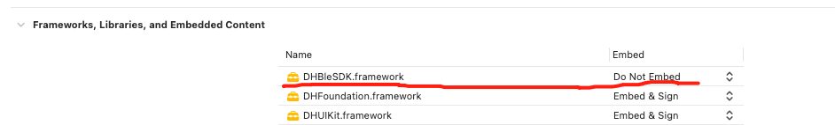
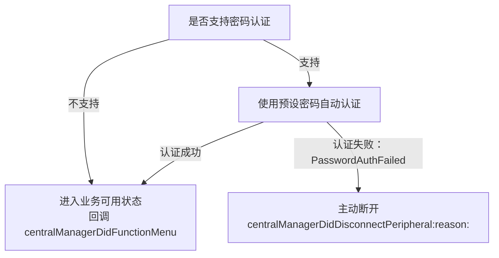
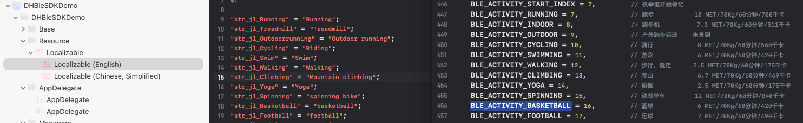

# RW BLE iOS SDK使用说明文档

## 1. 简介

本文档主要对SDK里所提供的功能接口与使用场景进行解释说明。

此文档仅适用于RW公司的蓝牙设备.

#### 1.1 适用平台与语言

- iOS12及以上, 语言Objective-C.

#### 1.2 相关术语

-  App: 本⽂指的是⼿机端或平板电脑上运⾏的应⽤程序;
-  设备: 本⽂指的是可穿戴式硬件设备:如⼿表,戒指等;
-  上传: 指的是设备向App发送数据;
-  下发: 指的是App向设备发送数据;

#### 1.3 注意事项

1. 此文档只⽤Objective-C语言进行说明;如果是使用swifit语言开发,需要在项目的 `Bridging Header` 文件中导入相应的Objective-C 头文件;

3. SDK不提供模拟器版本，因为在模拟器上⽆法调试BLE且我们依赖的第三⽅库部分也不⽀持模拟器环境下运⾏。

   

## 2. 快速开始（Quick Start）

**第1步: 获取最新版本的Xcode**

要想使用 RW BLE SDK for iOS 开发项目，您需要安装Xcode.

**第2步: 手动部署添加依赖库**

手动添加`DHBleSDK.framework`到工程;




**第3步: 配置 info.plist⽂件**

```objective-c
 //需要在info.plist中对使⽤蓝⽛进⾏说明
 NSBluetoothAlwaysUsageDescription
 NSBluetoothPeripheralUsageDescription
```

**第4步: 初始化SDK**

```objective-c
//AppDelegate里初始化DHBleSDK库  
- (void)initBleSDK{
    [DHBleCentralManager setLogStatus:YES];
    [DHBleCentralManager initWithServiceUuids:@[]];
    
    //Demo里工具类初始化,可选择;
    [DHBluetoothManager shareInstance];
}
```

> [!CAUTION]
>
> 日志开启后 `[DHBleCentralManager setLogStatus:YES]`; 日志文件将保存在 Document/DeviceLog文件夹下.


## 3. 接口说明（API Reference）

### 3.1 设备搜索与连接, 绑定与重连

##### 3.1.1 搜索蓝牙

>  接口说明: 搜索蓝牙设备需使用[DHBleCentralManager startScan]; 并实现DHBleConnectDelegate回调接口;
>
>  **返回的DHPeripheralModel实体如果model.macAddr为空,代表手机设置是已配对设备**

```objective-c
// 1. 开始搜索
[DHBleCentralManager startScan];

//2. 设备委托
[DHBleCentralManager shareInstance].connectDelegate = self;

//3. DHBleConnectDelegate接口会回调搜索到的蓝牙设备
- (void)centralManagerDidDiscoverPeripheral:(NSArray <DHPeripheralModel *>*)peripherals
```

##### 3.1.2 停止搜索

> 接口说明: 停止搜索蓝牙设备

```objective-c
[DHBleCentralManager stopScan];
```


##### 3.1.3 连接设备

> 接口说明: 连接指定设备,并设置设备连接回调 `DHBleConnectDelegate`.

```objective-c
// 1. 初始化并注册回调
[DHBleCentralManager shareInstance].connectDelegate = self;

// 2. 连接设备
DHPeripheralModel *deviceModel = self.deviceArray[indexPath.row];
[DHBleCentralManager connectDeviceWithModel:deviceModel];

// 3. 实现并回调蓝牙连接状态
@protocol DHBleConnectDelegate <NSObject>
```

`DHBleConnectDelegate` 接口说明:

| 方法                                  | 说明                                                 |
| :------------------------------------ | ---------------------------------------------------- |
| centralManagerDidDiscoverPeripheral   | startScan 调用后,搜索到设备后会回调返回              |
| centralManagerDidConnectPeripheral    | connectDeviceWithModel后,连接成功会返回.             |
| centralManagerDidFunctionMenu         | 成功获取设备配置表后会返回;业务操作应该在此之后操作. |
| centralManagerDidDisconnectPeripheral | 蓝牙断开会回调；实现带 `reason` 的新方法后，可获取断开原因 |
| centralManagerDidFailedPeripheral     | 蓝牙失败会回调                                       |
| centralManagerDidUpdateState          | 蓝牙开关状态变化会回调                               |

带断开原因的回调:

`-(void)centralManagerDidDisconnectPeripheral:(CBPeripheral *)peripheral reason:(DHBleDisconnectReason)reason`

| 枚举值                                    | 说明             |
| ----------------------------------------- | ---------------- |
| `DHBleDisconnectReasonUnknown`            | 未知或普通断开   |
| `DHBleDisconnectReasonManualDisconnect`   | App主动断开      |
| `DHBleDisconnectReasonPasswordAuthFailed` | 设备密码认证失败 |

> 实现带 `reason` 的新方法后，SDK不再重复调用原有的 `centralManagerDidDisconnectPeripheral:`；未实现新方法时，仍回调原有方法。

> [!TIP]
>
> 连接后, 业务操作应该在`centralManagerDidFunctionMenu`之后才进行操作.


(1) 监听`BluetoothNotificationConnectStateChange`也可获取连接状态变化

```objective-c
[[NSNotificationCenter defaultCenter] addObserver:self selector:@selector(connectStateChange:) name:BluetoothNotificationConnectStateChange object:nil];

- (void)connectStateChange:(NSNotification *)ntf
{
  NSLog(@"NewHomeController connectStateChange");
  if ([DHBluetoothManager shareInstance].isConnected){
    self.infoDeviceStateLb.text = @"Connected";
  }
  else{
    self.infoDeviceStateLb.text = @"Disconnected";
  }
}
```

(2) `[DHBleCentralManager isConnected]` 可以获取是否连接成功.

##### 3.1.4 断开连接设备

> 接口说明: 断开正在连接的设备;

```objective-c
 [DHBleCentralManager disconnectDevice];
```

##### 3.1.5 绑定与自动重连,解绑

###### 3.1.5.1 DHBleCentralManager 本地保存当前设备

> 设置后将保存当前设备的UDID,将会自动重新连接.

方法说明: 

`+(void)setBindedStatus:(BOOL)isBinded`

调用示例: 

```objective-c
//保存本地，重新打开将重连
[DHBleCentralManager setBindedStatus:YES];
```

###### 3.1.5.2 DHBleCentralManager 删除本地保存

> 设置后将删除当前设备的UDID, 类似于解除本地绑定.

方法说明: 

`+(void)setBindedStatus:(BOOL)isBinded`

调用示例: 

```objective-c
[DHBleCentralManager setBindedStatus:NO];
[DHBleCentralManager disconnectDevice];
```

##### 3.1.6 设备配置表

> [!IMPORTANT]
>
> 因设备型号多, 支持的功能不同,所以引入功能表信息,可查询设备功能支持情况. 具体参考DeviceFuncV2Model类. 可根据业务自行保存功能表内容. 

`-(void)centralManagerDidFunctionMenu:(DeviceFuncV2Model *)deviceFuncModel`

DeviceFuncV2Model类属性定义:

| 属性                        | 说明                        |
| --------------------------- | --------------------------- |
| isPushMsgEnableSwitch       | 是否启用消息控制开关        |
| pushMsgSwitchValue          | 消息类型支持能力低32位（bit0-bit31） |
| pushMsgSwitchValue2         | 消息类型支持能力高32位（bit32-bit63），旧设备默认为0 |
| activityDataInterval        | 当天计步明细间隔（分钟）；未配置时按60处理 |
| isAlarm                     | 是否支持闹钟                |
| isBackLight                 | 是否支持屏幕睡眠时间设置    |
| isSupportWorkout3           | 是否支持多运动;             |
| isSupportMuslimCountSwitch  | 是否支持Muslim赞念开关      |
| isSupportHrSp02Alert        | 是否支持HR,SP02报警提示功能 |
| isSupportMotoVibrationLevel | 是否支持马达震动提醒        |
| isSupportAlarmVibrationDuration | 是否支持闹钟震动时长设置 |
| isSupportVibrationInterval  | 是否支持震动间隔时长设置 |
| isDataTypeActivity          | 是否支持计步                |
| isDataTypeHeart             | 是否支持心率                |
| isDataTypeBloodPressure     | 是否支持血压                |
| isDataTypeSleep             | 是否支持睡眠                |
| isDataTypeSPO2              | 是否支持血氧                |
| isDataTypeHRV               | 是否支持心率变异性          |
| isDataTypeStress            | 是否支持压力                |
| isDataTypeBloodSugar        | 是否支持血糖                |
| isDataTypeMuslimCount       | 是否支持赞念                |
| isDataTypeTemperature       | 是否支持体温                |
| isSupportMuslimTimeDisplayMode | 是否支持Muslim时间显示模式 |
| isSupportSensorRawPPG       | 是否支持获取PPG Green原始数据 |
| isSupportPPGMonitoring      | 是否支持PPG定时监测       |
| isSupportTemperatureMonitoring | 是否支持温度定时监测    |
| isSupportCountReminder      | 是否支持计数提醒间隔设置 |
| isSupportSensorRawACC       | 是否支持获取ACC原始数据     |
| isSupportSensorRawPPGRed    | 是否支持获取PPG Red原始数据 |
| isSupportSensorRawIR        | 是否支持获取IR红外原始数据  |
| isSupportSensorRawSleep     | 是否支持睡眠实时数据       |
| isSupportFallDetect         | 是否支持跌落提醒           |
| isSupportRecording          | 是否支持录音功能           |
| isSupportDevicePasswordAuth | 是否支持设备密码认证       |
| isSupportScreenControl      | 是否支持即时屏幕亮灭控制   |

##### 3.1.8 使用外部 CBCentralManager 搜索并由 SDK 连接

> 接口说明: 当客户 App 同时集成多个 BLE SDK，并使用自己的统一蓝牙搜索入口时，可将搜索使用的 `CBCentralManager` 传给本 SDK。客户只负责搜索，不负责连接；连接、服务发现、特征发现、数据收发和断连仍由 SDK 处理。

> [!IMPORTANT]
>
> `CBPeripheral` 与扫描它的 `CBCentralManager` 是绑定的。客户传入的 `peripheral` 必须来自当前设置的 `externalCentralManager`。SDK 不使用私有 API 校验来源，如果传入的 Central 与 Peripheral 不匹配，连接可能失败或超时。

方法说明:

```objective-c
// 初始化 SDK，并指定外部 CBCentralManager。centralManager 传 nil 时使用 SDK 自管理模式。
+ (void)initWithServiceUuids:(NSArray <NSString *>*)uuids
      externalCentralManager:(nullable CBCentralManager *)centralManager;

// 运行中设置外部 CBCentralManager。只能在未连接、未连接中状态下设置。
+ (void)setExternalCentralManager:(nullable CBCentralManager *)centralManager;

// 是否正在使用外部 CBCentralManager。
+ (BOOL)isUsingExternalCentralManager;

// 连接客户统一搜索到的设备。
+ (void)connectPeripheral:(CBPeripheral *)peripheral
        advertisementData:(nullable NSDictionary *)advertisementData
                     RSSI:(nullable NSNumber *)RSSI;
```

参数说明:

| 参数 | 类型 | 说明 |
| ---- | ---- | ---- |
| centralManager | CBCentralManager | 客户统一搜索使用的同一个 Central。SDK 后续会使用它发起连接。 |
| peripheral | CBPeripheral | 客户通过 `centralManager` 搜索到的设备对象，连接必须使用该对象。 |
| advertisementData | NSDictionary | 广播数据，用于补全 `DHPeripheralModel` 的 `macAddr`、`deviceModel`、设备名等信息；连接本身不依赖该参数，可传 nil。 |
| RSSI | NSNumber | 信号强度，用于补全 `DHPeripheralModel.rssi`；连接本身不依赖该参数，可传 nil。 |

调用示例:

```objective-c
// 1. 客户使用自己的 CBCentralManager 统一搜索设备。
// centralManager、peripheral、advertisementData、RSSI 来自客户自己的扫描回调。

// 2. 将同一个 CBCentralManager 交给 SDK。
[DHBleCentralManager initWithServiceUuids:@[]
                   externalCentralManager:centralManager];

// 或者 SDK 已初始化时，运行中设置外部 Central。
[DHBleCentralManager setExternalCentralManager:centralManager];

// 3. 设置 SDK 连接回调。
[DHBleCentralManager shareInstance].connectDelegate = self;

// 4. 由 SDK 发起连接。
[DHBleCentralManager connectPeripheral:peripheral
                     advertisementData:advertisementData
                                  RSSI:RSSI];
```

注意事项:

- 旧接入方式 `[DHBleCentralManager initWithServiceUuids:@[]]` 保持不变，SDK 会自行创建 `CBCentralManager`。
- 外部 Central 模式下，SDK 会使用客户传入的同一个 `CBCentralManager` 连接设备。
- SDK 开始连接后会接管 `centralManager.delegate`，后续连接回调由 SDK 处理。
- 客户应在交给 SDK 连接前停止自己的扫描流程。
- 连接中、已连接、正在服务发现或正在同步数据时，不允许切换 `externalCentralManager`。
- 外部 Central 模式下如需自动重连，客户需要保持传入的 `centralManager` 实例存活。


### 3.2 设备功能操作

调用接口发送错误码定义 SendStateCode:

| SendStateCode           | 值   | 说明             |
| ----------------------- | ---- | ---------------- |
| SendState_OK            | 0    | 成功             |
| SendState_BLENoOpen     | 1    | 失败, 蓝牙未打开 |
| SendState_BLEDisconnect | 2    | 失败, 蓝牙未连接 |
| SendState_TimeOut       | 3    | 失败, 超时       |
| SendState_Failed        | 4    | 失败             |
| SendState_DuplicateSend | 5    | 有重复指令       |
| SendState_NotSupport    | 6    | 设备不支持       |


#### 3.2.1 基础功能指令接口

##### 3.2.1.0 Get SDK Version

> 获取SDK版本号.

方法说明: 

`[DHBleCommand getSDKVersion]`

调用示例:

```objective-c
NSLog(@"%@", [DHBleCommand getSDKVersion]);
```


##### 3.2.1.1 获取蓝牙Mac地址

> 因iOS系统配对后,广播包无法拿到mac地址,提供此方法可获取.

方法说明: 

`+ (void)ringGetMacAddress:(void(^)(int code, id data))block`

返回参数说明:

| 参数  | 类型              | 说明 | 值                |
| ----- | ----------------- | ---- | ----------------- |
| model | DHDeviceInfoModel | 类   | macAddr:  Mac地址 |

调用示例:

```objective-c
[DHBleCommand ringGetMacAddress:^(int code, id  _Nonnull data) {
  DHDeviceInfoModel *tDeviceInfoData = data;
  NSLog(@"mac: %@", tDeviceInfoData.macAddr);
}];
```


##### 3.2.1.2 设置用户信息

> 用户信息设置与计步卡路里,距离有关; 设备初始化时性别为1, 年龄 18, 身高170cm, 体重 65 kg.

方法说明: 

`+ (void)setUserInfo:(DHUserInfoSetModel *)model block:(void(^)(int code, id data))block`

参数说明:

| 参数  | 类型               | 说明 | 值                                                           |
| ----- | ------------------ | ---- | ------------------------------------------------------------ |
| model | DHUserInfoSetModel | 类   | gender: 性别（0.女 1.男)<br>height: 身高cm,浮点型<br>weight: 体重kg,浮点型<br/>stepGoal: 计步目标值,暂无功能<br/>age: 年龄<br/> |

调用示例:

```objective-c
DHUserInfoSetModel *userInfoModel = [[DHUserInfoSetModel alloc] init];
userInfoModel.gender = 1;
userInfoModel.height = 170;
userInfoModel.weight = 600;
userInfoModel.stepGoal = 8000;
userInfoModel.age = 20;
[DHBleCommand setUserInfo:userInfoModel block:^(int code, id  _Nonnull data) {
  if (code == 0){
    NSLog(@"set ok");
  }
}];
```


##### 3.2.1.3 获取设备信息

> 获取设备型号、固件版本号和UI版本号.

方法说明:

`+ (void)getFirmwareVersion:(void(^)(int code, id data))block`

返回说明:

| DHFirmwareVersionModel属性 | 类型 | 说明 |
| -------------------------- | ---- | ---- |
| deviceModel | NSString | 设备型号, 每个型号产品的唯一标识 |
| firmwareVersion | NSString | 固件版本号 |
| uiVersion | NSString | UI版本号 |

> **注意:** 升级固件前必须校验设备的 `deviceModel` 与升级固件对应的设备型号是否一致, 只有型号一致时才能进行升级, 型号不一致时禁止升级.

调用示例:

```objective-c
[DHBleCommand getFirmwareVersion:^(int code, id _Nonnull data) {
    if (code == 0 && [data isKindOfClass:[DHFirmwareVersionModel class]]) {
        DHFirmwareVersionModel *model = data;
        NSLog(@"型号 %@ 固件版本 %@ UI版本 %@",
              model.deviceModel, model.firmwareVersion, model.uiVersion);
    }
}];
```

##### 3.2.1.4 获取电量

> APP获取设备的电量信息.

方法说明:

`+ (void)getBattery:(void(^)(int code, id data))block`

返回说明:

| DHBatteryInfoModel属性 | 类型 | 说明 |
| ---------------------- | ---- | ---- |
| battery | NSInteger | 剩余电量, 范围0-100 |

调用示例:

```objective-c
[DHBleCommand getBattery:^(int code, id _Nonnull data) {
    if (code == 0 && [data isKindOfClass:[DHBatteryInfoModel class]]) {
        DHBatteryInfoModel *model = data;
        NSLog(@"设备电量 %zd", model.battery);
    }
}];
```

##### 3.2.1.5 获取与设置视频控制开关

> 设置戒指手势控制模式; <u>此功能需配对蓝牙HID.</u>

参数说明:

| 参数     | 类型 | 说明         | 值                                             |
| -------- | ---- | ------------ | ---------------------------------------------- |
| `isOpen` | int  | 视频控制模式 | `0`: 关闭，`1`: 视频，`2`: Book，`3`: Music |

```objective-c
//设置视频控制开关
DHVideoHidSetModel *tModeSetModel = [[DHVideoHidSetModel alloc] init];
tModeSetModel.isOpen = 1; //0关闭，1视频，2 Book，3 Music
[DHBleCommand setVideoHid:tModeSetModel block:^(int code, id  _Nonnull data) {
  if (code == 0){
    NSLog(@"setVideoHid OK");
  }
}];

// 获取视频控制开关
[DHBleCommand getVideoHid:^(int code, id  _Nonnull data) {
  if (code == 0){
    DHVideoHidSetModel *model = data;
    NSLog(@"getVideoHid OK 模式 %d", model.isOpen);
  }
}];
```

##### 3.2.1.6 获取与设置LED亮屏强度

方法说明: 

`+(void)getRingLEDLight:(void(^)(int code, id data))block;`

`+(void)setRingLEDLight:(DHLedLightSetModel *)model block:(void(^)(int code, id data))block;`

参数说明:

| 参数  | 类型               | 说明 | 值                                                           |
| ----- | ------------------ | ---- | ------------------------------------------------------------ |
| model | DHLedLightSetModel | 类   | isOpen: false为off,ture为(1-3Level)<br/>lightLevel: 1微光, 2柔光, 3强光 |

调用示例:

```objective-c
// 获取LED亮屏强度
[DHBleCommand getRingLEDLight:^(int code, id  _Nonnull data) {
  if (code == 0){
    DHLedLightSetModel *model = data;
    NSLog(@"getRingLEDLight OK 开关 %d", model.isOpen);
  }
}];

//设置LED亮屏强度
DHLedLightSetModel *tModeSetModel = [[DHLedLightSetModel alloc] init];
tModeSetModel.isOpen = YES; //设置为NO关闭
tModeSetModel.lightLevel = 3; //1微光2柔光3强光
[DHBleCommand setRingLEDLight:tModeSetModel block:^(int code, id  _Nonnull data) {
  if (code == 0){
    NSLog(@"setRingLEDLight OK");
  }
}];
```


##### 3.2.1.7 获取与设置佩戴位置

> 获取或设置戒指的佩戴位置.
>
> 配置表属性: `isWearDir`.

方法说明:

`+ (void)getRingWearHand:(void(^)(int code, id data))block`

`+ (void)setRingWearHand:(UInt8)wearHand block:(void(^)(int code, id data))block`

参数说明:

| 参数 | 类型 | 说明 | 值 |
| ---- | ---- | ---- | -- |
| wearHand | UInt8 | 佩戴位置 | 0.左手 1.右手 |

返回说明:

| 返回数据 | 类型 | 说明 |
| -------- | ---- | ---- |
| data | NSNumber | 佩戴位置: 0.左手 1.右手 |

调用示例:

```objective-c
// 获取佩戴位置
[DHBleCommand getRingWearHand:^(int code, id  _Nonnull data) {
  if (code == 0){
    NSInteger tWearHand = [data intValue]; //0左手 1右手
    NSLog(@"getRingWearHand OK 佩戴位置 %zd", tWearHand);
  }
}];

//设置佩戴位置
uint8_t tModeSetModel = 0; //0左手 1右手
[DHBleCommand setRingWearHand:tModeSetModel block:^(int code, id  _Nonnull data) {
  if (code == 0){
    NSLog(@"setRingWearHand OK");
  }
}];
```

##### 3.2.1.8 启动与关闭拍照

> APP进入自定义相机页面时开启拍照控制, 开启后设备可通过手势通知APP执行拍照; APP退出相机页面时关闭拍照控制.
>
> 配置表属性: `isTakePhoto`.
>
> 通过 `BluetoothNotificationCameraTakePicture` 接收设备发出的拍照通知.

方法说明:

`+ (void)controlCamera:(NSInteger)type block:(void(^)(int code, id data))block`

参数说明:

| 参数 | 类型 | 说明 | 值 |
| ---- | ---- | ---- | -- |
| type | NSInteger | 拍照控制 | 0.关闭拍照 1.开启拍照 |

调用示例:

```objective-c
// APP进入相机页面时调用
- (void)openCameraPage {
    [[NSNotificationCenter defaultCenter] addObserver:self
                                             selector:@selector(cameraTakePictureNotification:)
                                                 name:BluetoothNotificationCameraTakePicture
                                               object:nil];
    [DHBleCommand controlCamera:1 block:^(int code, id _Nonnull data) {
        NSLog(@"开启拍照控制 code=%d", code);
    }];
}

// APP退出相机页面时调用
- (void)closeCameraPage {
    [DHBleCommand controlCamera:0 block:^(int code, id _Nonnull data) {
        NSLog(@"关闭拍照控制 code=%d", code);
    }];
    [[NSNotificationCenter defaultCenter] removeObserver:self
                                                    name:BluetoothNotificationCameraTakePicture
                                                  object:nil];
}

- (void)cameraTakePictureNotification:(NSNotification *)notification {
    // 设备发出拍照通知, APP在此执行自定义相机拍照
}
```

##### 3.2.1.9 查找设备

> 调用查找后设备灯或屏幕会亮.

方法说明:

`+(void)controlFindDeviceBegin:(void(^)(int code, id data))block;`

调用示例:

```objective-c
[DHBleCommand controlFindDeviceBegin:^(int code, id  _Nonnull data) {

}];

```


##### 3.2.1.10 关机,恢复出厂设置

方法说明: 

`+(void)controlDevice:(NSInteger)type block:(void(^)(int code, id data))block;`

参数说明:

| 参数 | 类型      | 说明 | 值                      |
| ---- | --------- | ---- | ----------------------- |
| type | NSInteger | 整形 | 1: 关机<br/>2: 恢复出厂 |

调用示例:

```objective-c
// 1关机 2 恢复出厂
[DHBleCommand controlDevice:1 block:^(int code, id  _Nonnull data) {

}];

```

##### 3.2.1.11 闹钟

配置表属性: `isAlarm`

###### 3.2.1.11.1 获取已设置闹钟

方法说明: 

`+(void)getAlarms:(void(^)(int code, id data))block`

调用示例:

```objective-c
//获取设备里已保存的闹钟
[DHBleCommand getAlarms:^(int code, id  _Nonnull data) {
  if (code == 0) {
    NSArray *tAlarmList = data;
    NSLog(@"getAlarms %zd", tAlarmList.count);
  }
}];
```

###### 3.2.1.11.2 设置闹钟

> **当前协议不支持单独修改闹钟，任何单个闹钟的开关或删除操作，均需重新下发全部闹钟配置。**

方法说明: 

`+(void)setAlarms:(NSArray <DHAlarmSetModel *>*)alarms block:(void(^)(int code, id data))block;`

参数说明:

| 参数   | 类型                  | 说明     | 值                                                           |
| ------ | --------------------- | -------- | ------------------------------------------------------------ |
| alarms | List<DHAlarmSetModel> | 闹钟数组 | isOpen: true开/false关<br/>repeats: IntArray(7)周日至周六,要重复的对应置1<br/>hour: 闹钟开始时<br/>minute: 闹钟开始分 |

调用示例:

```objective-c
//设置闹钟        
DHAlarmSetModel *tAlarm1 = [[DHAlarmSetModel alloc] init];
tAlarm1.hour = 07; //时
tAlarm1.minute = 00;//分
tAlarm1.isOpen = true;//开关
tAlarm1.repeats = @[@(0),@(0),@(0),@(0),@(0),@(0),@(1)]; //重复周期,周六重复

DHAlarmSetModel *tAlarm2 = [[DHAlarmSetModel alloc] init];
tAlarm2.hour = 8;
tAlarm2.minute = 00;
tAlarm2.isOpen = true;
tAlarm2.repeats = @[]; //单次闹钟

[DHBleCommand setAlarms:@[tAlarm1, tAlarm2] block:^(int code, id  _Nonnull data) {

}];
```

###### 3.2.1.11.3 删除所有闹钟

> setAlarms 参数传空数组,即可删除所有闹钟

```objective-c
[DHBleCommand setAlarms:@[] block:^(int code, id  _Nonnull data) {

}];
```


##### 3.2.1.12 震动次数设置与获取

> 设置设备震动次数;
>
> 配置表属性:  `isSupportMotoVibrationLevel`

方法说明: 

`+(void)setRingMotorLevel:(NSInteger)motorLevel motorNum:(NSInteger)motorNum block:(void(^)(int code, id data))block;`

`+(void)getRingMotorLevel:(void(^)(int code, id data))block;`

参数说明:

| 参数       | 类型 | 说明 | 值                                                        |
| ---------- | ---- | ---- | --------------------------------------------------------- |
| motorLevel | Int  | 整形 | 震动强度, 0:关闭 1:低 2: 中 3: 高; *未定义此功能的可忽略* |
| motorNum   | Int  | 整形 | 震动次数可以被设置(0-6次)，初始默认2次.设置0次不震动      |

调用示例:

```objective-c
//设置 
[DHBleCommand setRingMotorLevel:1 motorNum:2 block:^(int code, id  _Nonnull data) {
  if (code == 0){
    NSLog(@"set ok");
  }
}];

//获取
[DHBleCommand getRingMotorLevel:^(int code, id  _Nonnull data) {
  if (code == 0){
    DHVibrationLevelModel *tVibrationModel = data;
    NSLog(@"getRingMotorLevel Level %d num %d", tVibrationModel.vibrationLevel, tVibrationModel.vibrationNumber);
  }
}];


```

##### 3.2.1.13 屏幕睡眠模式设置与获取

>  设置屏幕睡眠开启与时间;
>
> 配置表属性:  `isBackLightSleepMode`

方法说明: 

`+(void)setDisplaySleepMode:(DHBrightTimeSetModel *)model block:(void(^)(int code, id data))block`

`+(void)getDisplaySleepMode:(void(^)(int code, id data))block`

参数说明:

| 参数                 | 类型 | 说明 | 值                                                           |
| -------------------- | ---- | ---- | ------------------------------------------------------------ |
| DHBrightTimeSetModel | 类   |      | sleepOpen, 开关打开YES或关闭NO<br>sleepStartHour, 开始时间小时<br>sleepStartMin,开始时间分钟<br>sleepEndHour,结束时间小时<br>sleepEndMin,结束时间分钟 |

调用示例:

```objective-c

//设置 
DHBrightTimeSetModel *sleepModel = [[DHBrightTimeSetModel alloc] init];
sleepModel.sleepOpen = YES;
sleepModel.sleepStartHour = 20;
sleepModel.sleepStartMin = 00;
sleepModel.sleepEndHour = 06;
sleepModel.sleepEndMin = 00;
[DHBleCommand setDisplaySleepMode:sleepModel block:^(int code, id  _Nonnull data) {

}];

//获取
[DHBleCommand getDisplaySleepMode:^(int code, id  _Nonnull data) {
  if (code == 0){
    DHBrightTimeSetModel *tModel = data;
    NSLog(@"getDisplaySleepMode sleepOpen %d sleepStartHour %d sleepStartMin %d", tModel.sleepOpen, tModel.sleepStartHour, tModel.sleepEndMin);
  }
}];


```

##### 3.2.1.14 消息推送开关设置与获取

> 配置表属性 `isPushMsgEnableSwitch` 表示设备是否支持消息推送开关设置；
> `pushMsgSwitchValue` 和 `pushMsgSwitchValue2` 是消息类型支持能力，分别对应
> bit0-bit31 和 bit32-bit63，不表示设备当前的开关状态。
>
> 进入消息推送设置页面时，应调用 `ringGetAncs:` 从设备拉取当前开关。
> 查询成功后，`data` 为 `DHAncsSetModel`；修改模型后再调用 `ringSetAncs:block:`
> 写回设备。

| 用途 | 属性/接口 | 返回内容 |
| ---- | --------- | -------- |
| 判断功能是否支持 | `DeviceFuncV2Model.isPushMsgEnableSwitch` | 是否支持消息推送开关 |
| 判断消息类型是否支持 | `pushMsgSwitchValue` / `pushMsgSwitchValue2` | 支持的消息类型 bit0-bit63 |
| 拉取当前开关 | `ringGetAncs:` | `DHAncsSetModel` |
| 设置当前开关 | `ringSetAncs:block:` | 设置结果 |

方法说明: 

`+(void)ringSetAncs:(DHAncsSetModel *)model block:(void(^)(int code, id data))block`

`+(void)ringGetAncs:(void(^)(int code, id data))block`

参数说明:

| 参数           | 类型 | 说明 | 值                     |
| -------------- | ---- | ---- | ---------------------- |
| DHAncsSetModel | 类   |      | 见DHAncsSetModel类定义 |

调用示例:

```objective-c
//设置 
DHAncsSetModel *tAncsModel = [[DHAncsSetModel alloc] init];
tAncsModel.isSMS = YES;
[DHBleCommand ringSetAncs:tAncsModel block:^(int code, id  _Nonnull data) {

}];

//获取
[DHBleCommand ringGetAncs:^(int code, id  _Nonnull data) {
  if (code == 0){
    DHAncsSetModel *ancsModel = data;
    NSLog(@"SMS=%d Wechat=%d", ancsModel.isSMS, ancsModel.isWechat);
  }
}];

//按下面的顺序确定当前设备支持哪些应用消息.
UInt8 tBitRow = i;
if (i == 24){ //其它
  tBitRow = 0;
}
if (i > 0 && (tMsgSwitchValue & (1 << tBitRow)) < 1){ //不支持的消息全设置为false,不管从设备读到的值.
  continue;
}

self.msgOpenFlagArr = [NSMutableArray arrayWithArray:@[
  @(self.model.isCall),
  @(self.model.isSMS),
  @(self.model.isEmail),
  @(self.model.isSkype),
  @(self.model.isFacebook),
  @(self.model.isWhatsapp),
  @(self.model.isLine),
  @(self.model.isInstagram),
  @(self.model.isKakaotalk),
  @(self.model.isGmail),
  @(self.model.isTwitter),
  @(self.model.isLinkedin),
  @(self.model.isJLSinaWeiBo),

  @(self.model.isQQ),
  @(self.model.isWechat),
  @(self.model.isJLBand),
  @(self.model.isJLTelegram),
  @(self.model.isJLBetween),
  @(self.model.isJLNavercafe),
  @(self.model.isYoutube),
  @(self.model.isJLNetflix), //(1<<21)
  @(self.model.isMax), // (1<<22)
  @(self.model.isVkim), // (1<<23)
  //        @(self.model.isMessenger),

  @(self.model.isOther)
]];

```

##### 3.2.1.15 获取与设置赞念是否打开

>  设置赞念功能是否打开;
>
>  配置表属性:  `isSupportMuslimCountSwitch`

方法说明: 

`+(void)setMuslimCountSwitch:(UInt8)isOpen block:(void(^)(int code, id data))block`

`+(void)getMuslimCountSwitch:(void(^)(int code, id data))block`

参数说明:

| 参数   | 类型 | 说明 | 值                 |
| ------ | ---- | ---- | ------------------ |
| isOpen | Int  |      | 0: 关闭<br>1: 打开 |

调用示例:

```objective-c

//设置 
[DHBleCommand setMuslimCountSwitch:1 block:^(int code, id  _Nonnull data) {

}];

//获取
[DHBleCommand getMuslimCountSwitch:^(int code, id  _Nonnull data) {
  if (code == 0){
    Boolean tOpen = [data boolValue];
    NSLog(@"getMuslimCountSwitch tOpen %d", tOpen);
  }
}];

```


##### 3.2.1.16 获取与设置心率/血氧报警配置

>  设置心率与血氧通知报警数据功能; 报警提示会通 `BluetoothNotificationRingHealthOverAlert` 通知出来.
>
>  配置表属性:  `isSupportHrSp02Alert`

方法说明: 

`+(void)getHRAlert:(void(^)(int code, id data))block`

`+(void)setHRAlert:(DHHRAlertModel *)overModel block:(void(^)(int code, id data))block`


 `+(void)getSP02Alert:(void(^)(int code, id data))block`  

 `+(void)setSP02Alert:(DHHRAlertModel *)overModel block:(void(^)(int code, id data))block`

参数说明:

| 参数           | 类型 | 说明 | 值                                                           |
| -------------- | ---- | ---- | ------------------------------------------------------------ |
| DHHRAlertModel | 类   |      | isOpen: YES 开, NO 关;<br>overValue: 报警值, 默认值为 心率超过160，血氧低于94%; <br>underValue: 低于设置值报警; 如果获取到为0xff,代表不支持此项功能; |

**注意: 通过 getHRAlert()获取如果underValue为0xff,代表不支持此项功能. **

调用示例:

```objective-c

//设置 
DHHRAlertModel *tHRAlertModel = [[DHHRAlertModel alloc] init];
tHRAlertModel.isOpen = YES;
tHRAlertModel.overValue = 160;
tHRAlertModel.underValue = 0xff;
[DHBleCommand setHRAlert:tHRAlertModel block:^(int code, id  _Nonnull data) {

}];

//获取
[DHBleCommand getHRAlert:^(int code, id  _Nonnull data) {
  if (code == 0){
    DHHRAlertModel *model = data;
    NSLog(@"getHRAlert %d %zd", model.isOpen, model.overValue);
  }
}];


//报警结果通知推送
    [[NSNotificationCenter defaultCenter] addObserver:self selector:@selector(healthOverAlert:) name:BluetoothNotificationRingHealthOverAlert object:nil];

- (void)healthOverAlert:(NSNotification *)ntf
{
    NSDictionary *tUserInfo = ntf.userInfo;
    NSInteger tType = [tUserInfo[@"type"] integerValue];
    NSInteger tValue = [tUserInfo[@"value"] integerValue];
    
    if (tType == 0){ //HeartRate Alert
        
    }
    else if (tType == 1){ //SP02
        
    }
    else if (tType == 2){ //HeartRate Alert Under
        
    }
}
```


##### 3.2.1.17 获取与设置亮屏时长

>  配置表属性:  `isBackLight`
>

方法说明: 

`+(void)getBrightTime:(void(^)(int code, id data))block`

`+(void)setBrightTime:(DHBrightTimeSetModel *)model block:(void(^)(int code, id data))block`

参数说明:

| DHBrightTimeSetModel参数 | 类型   | 说明                                         | 值   |
| ------------------------ | ------ | -------------------------------------------- | ---- |
| duration                 | Int    | 亮屏时长,秒(s), 范围0-30s;                   |      |
| durationNums             | String | 设备支持的时长值, 获取到如果有值,以逗号隔开; |      |


##### 3.2.1.18 获取与设置抬腕亮屏时长

>  配置表属性:  `isSupportRaisescreen`
>

方法说明: 

`+(void)ringGetGesture:(void(^)(int code, id data))block;`

`+(void)ringSetGesture:(DHGestureSetModel *)model block:(void(^)(int code, id data))block;`

参数说明:

| BrightScreenBean参数 | 类型 | 说明                   | 值   |
| -------------------- | ---- | ---------------------- | ---- |
| isOpen               | Int  | true:开启; false: 关闭 |      |
| startHour            | Int  | 开始时间小时           |      |
| startMin             | Int  | 开始时间分钟           |      |
| endHour              | Int  | 结束时间小时           |      |
| endMin               | Int  | 结束时间分钟           |      |

##### 3.2.1.19 设置时间格式12/24小时制

>  带屏显示时间的设备才有效.

方法说明: 

`+(void)ringSetTimeformat:(UInt8)timeformat block:(void(^)(int code, id data))block;`

参数说明:

| 参数       | 类型 | 说明                       |      |
| ---------- | ---- | -------------------------- | ---- |
| timeformat | Int  | 0: 24小时制<br>1: 12小时制 |      |


##### 3.2.1.20 闹钟震动时长设置与获取

> 设置闹钟震动次数;
>
> 配置表属性: `isSupportAlarmVibrationDuration`

方法说明:

`+(void)setAlarmVibrationDuration:(UInt8)count block:(void(^)(int code, id data))block`

`+(void)getAlarmVibrationDuration:(void(^)(int code, id data))block`

参数说明:

| 参数  | 类型  | 说明 | 值                                       |
| ----- | ----- | ---- | ---------------------------------------- |
| count | UInt8 | 整形 | 震动次数(0-6), 默认2次, 设置0次为不震动 |

调用示例:

```objective-c
//设置
[DHBleCommand setAlarmVibrationDuration:2 block:^(int code, id  _Nonnull data) {
    if (code == 0){
        NSLog(@"setAlarmVibrationDuration OK");
    }
}];

//获取
[DHBleCommand getAlarmVibrationDuration:^(int code, id  _Nonnull data) {
    if (code == 0){
        NSLog(@"getAlarmVibrationDuration count %@", data);
    }
}];
```


##### 3.2.1.21 触摸事件通知

> 设备触摸事件通知, 设备主动上报. 触摸操作无论熄屏与否都会上报, 由APP定义响应行为.
>
> 通过 `BluetoothNotificationTouchEvent` 通知返回.
>
> **提示:** 此功能为设备端定制功能, 使用前请确认设备厂家已在固件中集成并启用; 未定制或未启用时, APP无法收到触摸事件通知.

通知 userInfo 数据说明:

| 字段      | 说明     | 值                                                    |
| --------- | -------- | ----------------------------------------------------- |
| keyType   | 按键类型 | 1: 触摸按键(默认), 2: 跌落(需开启跌落提醒3.2.1.24)    |
| touchType | 触摸类型 | 1: 单击, 2: 双击, 3: 三击, 4: 长按, 5: 甩动. <br>按键类型为2(跌落)时, 触摸类型默认为1 |

调用示例:

```objective-c
[[NSNotificationCenter defaultCenter] addObserver:self selector:@selector(touchEventNotification:) name:BluetoothNotificationTouchEvent object:nil];

- (void)touchEventNotification:(NSNotification *)ntf
{
    NSDictionary *tUserInfo = ntf.userInfo;
    NSInteger keyType = [tUserInfo[@"keyType"] integerValue];   // 1:触摸按键
    NSInteger touchType = [tUserInfo[@"touchType"] integerValue]; // 1:单击 2:双击 3:三击 4:长按 5:甩动
    NSLog(@"TouchEvent keyType=%zd touchType=%zd", keyType, touchType);
}
```


##### 3.2.1.22 震动间隔时长设置与获取

> 设置每次震动之间的间隔时间, 用于调节震动节奏;
>
> 配置表属性: `isSupportVibrationInterval`

方法说明:

`+(void)setVibrationInterval:(UInt16)intervalMs block:(void(^)(int code, id data))block`

`+(void)getVibrationInterval:(void(^)(int code, id data))block`

参数说明:

| 参数       | 类型   | 说明 | 值                                          |
| ---------- | ------ | ---- | ------------------------------------------- |
| intervalMs | UInt16 | 整形 | 间隔时长(100-1000ms), 默认500ms             |

调用示例:

```objective-c
//设置
[DHBleCommand setVibrationInterval:500 block:^(int code, id  _Nonnull data) {
    if (code == 0){ NSLog(@"setVibrationInterval OK"); }
}];

//获取
[DHBleCommand getVibrationInterval:^(int code, id  _Nonnull data) {
    if (code == 0){ NSLog(@"getVibrationInterval %@ms", data); }
}];
```


##### 3.2.1.23 心率校正(工厂测试)

> 启动设备心率校正模式. 发送校正指令后, 设备会返回两条数据:
>
> 第1条 result=0 表示校正中; 第2条 result非0 表示校正完成.
>
> block 回调 data 为 NSDictionary: `testMode`(UInt8) + `result`(UInt32, 0=校正中, 非0=完成).

方法说明:

`+(void)startFactoryTest:(UInt8)testMode block:(void(^)(int code, id data))block`

参数说明:

| 参数     | 类型  | 说明     | 值                |
| -------- | ----- | -------- | ----------------- |
| testMode | UInt8 | 测试模式 | 0x15: 心率校正    |

调用示例:

```objective-c
[DHBleCommand startFactoryTest:0x15 block:^(int code, id  _Nonnull data) {
    if (code == 0 && [data isKindOfClass:[NSDictionary class]]){
        NSDictionary *info = data;
        NSInteger result = [info[@"result"] integerValue];
        if (result == 0){
            NSLog(@"HR calibrating...");
        } else {
            NSLog(@"HR calibration done, result=%zd", result);
        }
    }
}];
```


##### 3.2.1.24 跌落提醒设置

> 设置或获取跌落提醒开关. 开启后设备检测到跌落时会通过触摸事件通知(3.2.1.21)上报.
>
> 跌落事件通过 `BluetoothNotificationRingTouchEvent` 通知返回, 按键类型(keyType)=2 表示跌落事件.
>
> 配置表属性: `isSupportFallDetect`

方法说明:

`+(void)setFallDetect:(UInt8)enable block:(void(^)(int code, id data))block`

`+(void)getFallDetect:(void(^)(int code, id data))block`

参数说明:

| 参数   | 类型  | 说明 | 值            |
| ------ | ----- | ---- | ------------- |
| enable | UInt8 | 开关 | 0: 关, 1: 开 |

调用示例:

```objective-c
//获取跌落提醒开关
[DHBleCommand getFallDetect:^(int code, id  _Nonnull data) {
    if (code == 0){
        NSLog(@"getFallDetect OK: %@", data);
    }
}];

//设置跌落提醒开启
[DHBleCommand setFallDetect:1 block:^(int code, id  _Nonnull data) {
    if (code == 0){
        NSLog(@"setFallDetect ON OK");
    }
}];
```


##### 3.2.1.25 计数提醒间隔设置

> 设置或获取计数提醒间隔. 开启后用户完成一次计数操作开始计时, 达到设定间隔后设备震动一次提醒继续计数.
>
> 配置表属性: `isSupportCountReminder`

方法说明:

`+(void)setCountReminderInterval:(UInt8)interval block:(void(^)(int code, id data))block`

`+(void)getCountReminderInterval:(void(^)(int code, id data))block`

参数说明:

| 参数     | 类型  | 说明     | 值                                       |
| -------- | ----- | -------- | ---------------------------------------- |
| interval | UInt8 | 间隔分钟 | 0: 关闭, 30/60/90/120: 提醒间隔(分钟) |

调用示例:

```objective-c
//获取计数提醒间隔
[DHBleCommand getCountReminderInterval:^(int code, id  _Nonnull data) {
    if (code == 0){
        NSLog(@"CountReminderInterval: %@ min", data);
    }
}];

//设置计数提醒间隔60分钟
[DHBleCommand setCountReminderInterval:60 block:^(int code, id  _Nonnull data) {
    if (code == 0){
        NSLog(@"setCountReminderInterval OK");
    }
}];

//关闭计数提醒
[DHBleCommand setCountReminderInterval:0 block:^(int code, id  _Nonnull data) {
    if (code == 0){
        NSLog(@"CountReminder OFF");
    }
}];
```


##### 3.2.1.26 设备密码认证

> 设备是否支持密码认证通过功能配置表属性 `isSupportDevicePasswordAuth` 判断。
>
> 密码为4位数字。传入 `nil` 或空字符串时按默认密码 `0000` 处理。
>
> 支持密码认证的设备，认证成功后才回调 `centralManagerDidFunctionMenu`；认证失败时SDK主动断开，并返回 `DHBleDisconnectReasonPasswordAuthFailed`。不支持的设备沿用原连接流程。



###### 3.2.1.26.1 设置自动认证密码

`+(void)prepareAutoPassword:(nullable NSString *)password`

> 设置SDK连接时自动认证使用的密码。可在SDK初始化后提前设置，但必须在连接设备前完成调用；该密码同时用于后续已绑定设备的自动重连。

输入参数说明:

| 参数       | 类型       | 说明                                               |
| ---------- | ---------- | -------------------------------------------------- |
| `password` | `NSString` | 4位数字密码；传入 `nil` 或空字符串时按 `0000` 处理 |

返回回调说明:

| 回调方法                                                  | 返回值                                      | 说明                               |
| --------------------------------------------------------- | ------------------------------------------- | ---------------------------------- |
| `centralManagerDidFunctionMenu:peripheral:`               | `DeviceFuncV2Model`                         | 密码认证成功，设备进入业务可用状态 |
| `centralManagerDidDisconnectPeripheral:reason:`           | `DHBleDisconnectReasonPasswordAuthFailed`   | 密码认证失败，SDK会主动断开设备    |

调用示例:

```objective-c
//可在SDK初始化后提前设置；连接前确保已经传入当前账号对应的4位密码。
[DHBleCommand prepareAutoPassword:@"1234"];
[DHBleCentralManager connectDeviceWithModel:deviceModel];

//密码认证成功后，设备才进入业务可用状态。
- (void)centralManagerDidFunctionMenu:(DeviceFuncV2Model *)deviceFuncModel
                           peripheral:(DHPeripheralModel *)peripheral {
    NSLog(@"Device ready");
}
```

###### 3.2.1.26.2 修改设备密码

`+(void)modifyDevicePwd:(nullable NSString *)password completion:(void (^ _Nullable)(BOOL success))completion`

> 在设备已连接且密码认证成功后修改设备密码。`success` 为 `YES` 表示设备确认修改成功。正常解绑时，应先将设备密码修改为 `0000`，确认成功后再清除本地绑定并断开连接。

调用示例:

```objective-c
[DHBleCommand modifyDevicePwd:@"0000" completion:^(BOOL success) {
    if (success) {
        [DHBleCentralManager setBindedStatus:NO];
        [DHBleCentralManager disconnectDevice];
    }
}];
```

##### 3.2.1.27 即时屏幕控制

> 通过功能配置表属性 `isSupportScreenControl` 判断设备是否支持。

方法说明：

`+(void)setScreenOn:(BOOL)isOn block:(void(^)(int code, id data))block`

| 参数 | 类型 | 说明 |
| ---- | ---- | ---- |
| isOn | BOOL | `YES`：亮屏；`NO`：息屏 |

调用示例：

```objective-c
[DHBleCommand setScreenOn:YES block:^(int code, id _Nonnull data) {
    NSLog(@"set screen on, code=%d", code);
}];
```

#### 3.2.2 健康数据同步(实时单次与全天检测)

> 健康数据检测有两种方式: 实时单次检测与全天检测。健康数据包括心率,血氧,压力,HRV,睡眠等, **睡眠无实时检测**。 
>
> (1) 实时单次检测: APP侧启动设备进入单次检测,检测完后马上返回结果。
>
> (2) 全天检测: 可设置间隔时间,比如30分钟或60分钟设备会进行检测并保存值; **app一直不同步情况下,设备可保存3-6天的数据**。


##### 3.2.2.1 实时检测-启动与关闭设备健康数据检测

> 启动健康数据检测(心率,血氧,HRV,压力,血糖); 
>
> 测试完成设备通过 `BluetoothNotificationHealthRingMeasureStateChange` 通知app；
>
> 测试实时值通过 `BluetoothNotificationHealthRingMeasureValueChange` 通知app;

> [!CAUTION]
>
> 同一时间只能开启一种健康检测类型, 必须等当前检测结束(收到完成回调)或主动关闭后, 才能启动新的检测类型. 同时开启多种会导致检测异常.

方法说明:

`+(void)controlOpen:(NSInteger)type dataType:(NSInteger)dataType block:(void(^)(int code, id data))block`

参数说明:

| 参数     | 类型      | 说明         | 值                                                           |
| -------- | --------- | ------------ | ------------------------------------------------------------ |
| dataType | NSInteger | 健康数据类型 | 心率: BLE_KEY_HEART_RATE<br>血氧: BLE_KEY_BLOOD_OXYGEN<br>HRV: BLE_KEY_HRV<br>压力: BLE_KEY_STRESS<br>血糖: BLE_KEY_BLOOD_SUGAR<br>血压: BLE_KEY_BLOOD_PRESSURE<br>体温: BLE_KEY_TEMPERATURE |
| type     | NSInteger | 启动/关闭    | 启动: 1<br>关闭: 0                                           |

调用示例:

```objective-c
+ (void)controlOpen:(NSInteger)type dataType:(NSInteger)dataType block:(void(^)(int code, id data))block
//启动心率测试
[DHBleCommand controlOpen:1 dataType:BLE_KEY_HEART_RATE block:^(int code, id  _Nonnull data) {

}];

//关闭心率测试
[DHBleCommand controlOpen:0 dataType:BLE_KEY_HEART_RATE block:^(int code, id  _Nonnull data) {

}];

// 监听测量中实时数值改变
[[NSNotificationCenter defaultCenter] addObserver:self selector:@selector(updateRingMeasureValueChange:) name:BluetoothNotificationHealthRingMeasureValueChange object:nil];

- (void)updateRingMeasureValueChange:(NSNotification *)ntf
{
    NSDictionary *tUserInfo = ntf.userInfo;
    NSInteger tDataValue = [tUserInfo[@"dataValue"] integerValue];
    NSInteger tDataType = [tUserInfo[@"dataType"] integerValue];

    
    NSLog(@"updateRingMeasureValueChange 0x%04X 数值: %zd", (unsigned int)tDataType, tDataValue);
    if (tDataType == BLE_KEY_APP_REAL_TIME_MUSLIM_COUNT){ //Muslim Count
        
    }
    else if (tDataType == BLE_KEY_APP_REAL_BLOOD_SUGAR_DATA){ //BloodSugar 血糖
        
    }
    else if (tDataType == BLE_KEY_APP_REAL_TIME_HRV_DATA){ //HRV 心率变异性
        
    }
    else if (tDataType == BLE_KEY_APP_REAL_TIME_HR_DATA){ //HR 心率
        
    }
    else if (tDataType == BLE_KEY_APP_REAL_TIME_BLOOD_OXYGEN_DATA){ //BloodOxygen 血氧
        
    }
    else if (tDataType == BLE_KEY_APP_REAL_TIME_STRESS_DATA){ //Stress 压力
        
    }
    else if (tDataType == BLE_KEY_APP_REAL_TIME_BP_DATA){ //BloodPressure 血压
        NSInteger sp = [tUserInfo[@"systolic"] integerValue]; //收缩压
        NSInteger dp = [tUserInfo[@"diastolic"] integerValue]; //舒张压
        NSLog(@"BloodPressure sp=%zd dp=%zd", sp, dp);
    }
    else if (tDataType == BLE_KEY_APP_REAL_TIME_TEMPERATURE_DATA){ //Temperature 体温
        NSLog(@"Temperature value=%.1f", tDataValue / 10.0); //除以10得实际温度
    }
}

```


##### 3.2.2.2 全天检测-设置健康数据全天监听间隔

> 设置健康数据(心率,血氧,HRV,压力,血糖)全天监听间隔，单位分钟.
>
> **注意事项:暂间隔只有心率可设置30分钟与60分钟, 其它(血氧,HRV,压力,血糖)只能设置开与关; 开始与结束时间固定全天,不可修改.**

###### 3.2.2.2.1 心率检测设置与获取

> 间隔只有心率可设置30分钟与60分钟; 

方法说明: 

`+(void)setHeartRateMode:(DHHeartRateModeSetModel *)model block:(void(^)(int code, id data))block`

`+(void)getHeartRateMode:(void(^)(int code, id data))block`

参数说明:

| 参数  | 类型                    | 说明 | 值                                                           |
| ----- | ----------------------- | ---- | ------------------------------------------------------------ |
| model | DHHeartRateModeSetModel | 类   | isOpen: true开/false关<br>interval: 间隔时间30或60分钟<br>startHour: 0 固定0不能修改<br>startMin: 0 固定0不能修改<br>endHour: 23 固定23不能修改<br>endMin: 59 固定59不能修改; |

调用示例:

```objective-c
// 1. Set HeartRate Monitor(设置心率监听)
DHHeartRateModeSetModel *tModeSetModel = [[DHHeartRateModeSetModel alloc] init];
tModeSetModel.isOpen = YES;
tModeSetModel.startHour = 00; //开始时间固定
tModeSetModel.startMinute = 00;
tModeSetModel.endHour = 23; //结束时间固定
tModeSetModel.endMinute = 59;
tModeSetModel.interval = 30; //可设置30分钟或60分钟
[DHBleCommand setHeartRateMode:tModeSetModel block:^(int code, id  _Nonnull data) {
  if (code == 0){
    NSLog(@"setHeartRateMode OK");
  }
}];

//1. 获取心率监听
[DHBleCommand getHeartRateMode:^(int code, id  _Nonnull data) {
  if (code == 0){
    DHHeartRateModeSetModel *model = data;
    NSLog(@"getHeartRateMode OK 开关 %d 检测周期 %d", model.isOpen, model.interval);
  }
}];
```

###### 3.2.2.2.2 血氧检测设置与获取

> 间隔血氧只可设置60分钟;

方法说明: 

`+(void)setBoMode:(DHBoModeSetModel *)model block:(void(^)(int code, id data))block`

`+(void)getBoMode:(void(^)(int code, id data))block`

参数说明:

| 参数  | 类型             | 说明 | 值                                                           |
| ----- | ---------------- | ---- | ------------------------------------------------------------ |
| model | DHBoModeSetModel | 类   | isOpen: true开/false关<br>interval: 间隔时间固定60分钟<br>startHour: 0 固定0不能修改<br>startMin: 0 固定0不能修改<br>endHour: 23 固定23不能修改<br>endMin: 59 固定59不能修改; |

调用示例:

```objective-c
// 2. Set Blood oxygen Monitor(设置血氧监听)
DHBoModeSetModel *tModeSetModel = [[DHBoModeSetModel alloc] init];
tModeSetModel.isOpen = YES;
tModeSetModel.startHour = 00; //开始时间固定
tModeSetModel.startMinute = 00;
tModeSetModel.endHour = 23; //结束时间固定
tModeSetModel.endMinute = 59;
tModeSetModel.interval = 60; //固定不可设置
[DHBleCommand setBoMode:tModeSetModel block:^(int code, id  _Nonnull data) {
  if (code == 0){
    NSLog(@"setBoMode OK");
  }
}];

//2. 获取血氧监听
[DHBleCommand getBoMode:^(int code, id  _Nonnull data) {
  if (code == 0){
    DHBoModeSetModel *model = data;
    NSLog(@"getBoMode OK 开关 %d 检测周期 %d", model.isOpen, model.interval); 
  }
}];  

```

###### 3.2.2.2.3 心率变异性(HRV)检测设置与获取

> 间隔HRV只可设置60分钟;

方法说明: 

`+(void)setHrvMode:(DHHrvModeSetModel *)model block:(void(^)(int code, id data))block`

`+(void)getHrvMode:(void(^)(int code, id data))block`

参数说明:

| 参数  | 类型              | 说明 | 值                                                           |
| ----- | ----------------- | ---- | ------------------------------------------------------------ |
| model | DHHrvModeSetModel | 类   | isOpen: true开/false关<br>interval: 间隔时间固定60分钟<br>startHour: 0 固定0不能修改<br>startMin: 0 固定0不能修改<br>endHour: 23 固定23不能修改<br>endMin: 59 固定59不能修改; |

调用示例:

```objective-c
// 3. Set HRV Monitor(设置HRV监听)
DHHrvModeSetModel *tModeSetModel = [[DHHrvModeSetModel alloc] init];
tModeSetModel.isOpen = YES;
tModeSetModel.startHour = 00;//开始时间固定
tModeSetModel.startMinute = 00;
tModeSetModel.endHour = 23; //结束时间固定
tModeSetModel.endMinute = 59;
tModeSetModel.interval = 60; //固定不可设置
[DHBleCommand setHrvMode:tModeSetModel block:^(int code, id  _Nonnull data) {
  if (code == 0){
    NSLog(@"setHrvMode OK");
  }
}];

//3. 获取HRV监听
[DHBleCommand getHrvMode:^(int code, id  _Nonnull data) {
  if (code == 0){
    DHHrvModeSetModel *model = data;
    NSLog(@"getHrvMode OK 开关 %d", model.isOpen);
  }
}];

```

###### 3.2.2.2.4 压力检测设置与获取

> 间隔压力只可设置60分钟;

方法说明: 

`+(void)setStressMode:(DHStressModeSetModel *)model block:(void(^)(int code, id data))block`

`+(void)getStressMode:(void(^)(int code, id data))block`

参数说明:

| 参数  | 类型                 | 说明 | 值                                                           |
| ----- | -------------------- | ---- | ------------------------------------------------------------ |
| model | DHStressModeSetModel | 类   | isOpen: true开/false关<br>interval: 间隔时间固定60分钟<br>startHour: 0 固定0不能修改<br>startMin: 0 固定0不能修改<br>endHour: 23 固定23不能修改<br>endMin: 59 固定59不能修改; |

调用示例:

```objective-c
// 4. 设置压力监听
DHStressModeSetModel *tModeSetModel = [[DHStressModeSetModel alloc] init];
tModeSetModel.isOpen = YES;
tModeSetModel.startHour = 00;//开始时间固定
tModeSetModel.startMinute = 00;
tModeSetModel.endHour = 23; //结束时间固定
tModeSetModel.endMinute = 59;
tModeSetModel.interval = 60; //固定不可设置
[DHBleCommand setStressMode:tModeSetModel block:^(int code, id  _Nonnull data) {
  if (code == 0){
    NSLog(@"setStressMode OK");
  }
}];

//4. 获取压力监听
[DHBleCommand getStressMode:^(int code, id  _Nonnull data) {
  if (code == 0){
    DHStressModeSetModel *model = data;
    NSLog(@"getStressMode OK 开关 %d", model.isOpen);
  }
}];

```


###### 3.2.2.2.5 血糖检测设置与获取

> 间隔血糖只可设置60分钟;
>
> 配置表属性: `isDataTypeBloodSugar`

方法说明: 

`+(void)setBloodSugarMode:(DHBloodSugarModeSetModel *)model block:(void(^)(int code, id data))block`

`+(void)getBloodSugarMode:(void(^)(int code, id data))block`

参数说明:

| 参数  | 类型                     | 说明 | 值                                                           |
| ----- | ------------------------ | ---- | ------------------------------------------------------------ |
| model | DHBloodSugarModeSetModel | 类   | isOpen: true开/false关<br>interval: 间隔时间固定60分钟<br>startHour: 0 固定0不能修改<br>startMin: 0 固定0不能修改<br>endHour: 23 固定23不能修改<br>endMin: 59 固定59不能修改; |

调用示例:

```objective-c
// 5. 设置血糖监听
DHBloodSugarModeSetModel *tModeSetModel = [[DHBloodSugarModeSetModel alloc] init];
tModeSetModel.isOpen = YES;
tModeSetModel.startHour = 00;//开始时间固定
tModeSetModel.startMinute = 00;
tModeSetModel.endHour = 23; //结束时间固定
tModeSetModel.endMinute = 59;
tModeSetModel.interval = 60; //固定不可设置
[DHBleCommand setBloodSugarMode:tModeSetModel block:^(int code, id  _Nonnull data) {
  if (code == 0){
    NSLog(@"setBloodSugarMode OK");
  }
}];

//5. 获取血糖监听
[DHBleCommand getBloodSugarMode:^(int code, id  _Nonnull data) {
  if (code == 0){
    DHBloodSugarModeSetModel *model = data;
    NSLog(@"getBloodSugarMode OK 开关 %d", model.isOpen);
  }
}];

```


###### 3.2.2.2.6 血压检测设置与获取

> 间隔血压只可设置60分钟;
>
> 配置表属性: `isDataTypeBloodPressure`

方法说明: 

`+(void)setBpMode:(DHBpModeSetModel *)model block:(void(^)(int code, id data))block`

`+(void)getBpMode:(void(^)(int code, id data))block`

参数说明:

| 参数  | 类型             | 说明 | 值                                                           |
| ----- | ---------------- | ---- | ------------------------------------------------------------ |
| model | DHBpModeSetModel | 类   | isOpen: true开/false关<br>interval: 间隔时间固定60分钟<br>startHour: 0 固定0不能修改<br>startMin: 0 固定0不能修改<br>endHour: 23 固定23不能修改<br>endMin: 59 固定59不能修改; |

调用示例:

```objective-c
// 6. 设置血压监听
DHBpModeSetModel *tModeSetModel = [[DHBpModeSetModel alloc] init];
tModeSetModel.isOpen = YES;
tModeSetModel.startHour = 00;//开始时间固定
tModeSetModel.startMinute = 00;
tModeSetModel.endHour = 23; //结束时间固定
tModeSetModel.endMinute = 59;
tModeSetModel.interval = 60; //固定不可设置
[DHBleCommand setBpMode:tModeSetModel block:^(int code, id  _Nonnull data) {
  if (code == 0){
    NSLog(@"setBpMode OK");
  }
}];

//6. 获取血压监听
[DHBleCommand getBpMode:^(int code, id  _Nonnull data) {
  if (code == 0){
    DHBpModeSetModel *model = data;
    NSLog(@"getBpMode OK 开关 %d", model.isOpen);
  }
}];

```


###### 3.2.2.2.7 体温检测设置与获取

> 间隔体温可设置30分钟与60分钟; 
>
> 配置表属性: `isSupportTemperatureMonitoring`

方法说明: 

`+(void)setTimedBodyTemperature:(DHHeartRateModeSetModel *)model block:(void(^)(int code, id data))block`

`+(void)getTimedBodyTemperature:(void(^)(int code, id data))block`

参数说明:

| 参数  | 类型                     | 说明 | 值                                                           |
| ----- | ------------------------ | ---- | ------------------------------------------------------------ |
| model | DHHeartRateModeSetModel  | 类   | isOpen: true开/false关<br>interval: 间隔时间30或60分钟<br>startHour: 0 固定<br>startMinute: 0 固定<br>endHour: 23 固定<br>endMinute: 59 固定 |

调用示例:

```objective-c
// 7. 设置体温监听
DHHeartRateModeSetModel *tModeSetModel = [[DHHeartRateModeSetModel alloc] init];
tModeSetModel.isOpen = YES;
tModeSetModel.startHour = 00;
tModeSetModel.startMinute = 00;
tModeSetModel.endHour = 23;
tModeSetModel.endMinute = 59;
tModeSetModel.interval = 60;
[DHBleCommand setTimedBodyTemperature:tModeSetModel block:^(int code, id  _Nonnull data) {
    if (code == 0){ NSLog(@"setTimedBodyTemperature OK"); }
}];

//7. 获取体温监听
[DHBleCommand getTimedBodyTemperature:^(int code, id  _Nonnull data) {
    if (code == 0){
        DHHeartRateModeSetModel *model = data;
        NSLog(@"getTimedBodyTemperature OK 开关 %d 周期 %zd", model.isOpen, model.interval);
    }
}];
```


##### 3.2.2.3 全天检测-同步健康历史数据

> 同步健康历史数据, 会根据设备支持情况自动同步对应健康数据.
>
> data为数组,为获取到的对应类型的多天数据，会依次返回对应类型数据, data里不会有多种类型数据.

```objective-c
[DHBleCommand startDataSyncing:^(int code, id data){
  NSLog(@"同步完成 %d", code);
} datablcok:^(int code, int progress, id  _Nonnull data) {
  if (code == 0) {
    if ([data isKindOfClass:[NSArray class]]) {
      NSArray *array = data;
      for (id model in array) {
        if ([model isKindOfClass:[DHDailyStepModel class]]) {  //计步数据
          NSLog(@"同步有 计步数据");
        }
        else if ([model isKindOfClass:[DHDailySleepModel class]]) { //睡眠数据
          NSLog(@"同步有 睡眠数据");
        }
        else if ([model isKindOfClass:[DHDailyHrModel class]]) { //心率数据
          NSLog(@"同步有 心率数据");
        }
        else if ([model isKindOfClass:[DHDailyBoModel class]]) { //血氧数据
          NSLog(@"同步有 血氧数据");
        }
        else if ([model isKindOfClass:[DHDailyHrvModel class]]) { ///HRV数据
          NSLog(@"同步有 HRV数据");
        }
        else if ([model isKindOfClass:[DHDailyPressureModel class]]) { ///压力数据
          NSLog(@"同步有 Stress数据");
        }
        else if ([model isKindOfClass:[DHDailyBloodSugarModel class]]) { ///血糖数据
          NSLog(@"同步有 血糖数据");
        }
        else if ([model isKindOfClass:[DHDailyMuslimCountModel class]]) { ///赞念数据
          NSLog(@"同步有 赞念数据");
        }
        else if ([model isKindOfClass:[DHDailyTempModel class]]) { ///体温数据
          NSLog(@"同步有 体温数据");
        }          
        else if ([model isKindOfClass:[DHDailyBpModel class]]) { ///血压数据
          NSLog(@"同步有 血压数据");
        }
      }
    }
  }
}];
```


##### 3.2.2.4 全天检测-健康数据说明

`dataBlock` 每次返回同一种数据类型的模型数组, 不会在同一个数组中混合多种类型.

> **时间说明:** 本节模型中的 `timestamp`、`beginTime`、`endTime` 以及明细字典中的 `timestamp` 均为Unix时间戳, 单位为秒. 模型时间字段使用 `NSString`; 明细字典时间值为 `NSNumber`.

数据类型总览:

| 数据 | 每日模型 | `items`明细字典主要字段 |
| ---- | -------- | ----------------------- |
| 计步 | DHDailyStepModel | timestamp、index、step、calorie、distance |
| 睡眠 | DHDailySleepModel | status、value |
| 心率 | DHDailyHrModel | timestamp、value |
| 血压 | DHDailyBpModel | timestamp、systolic、diastolic |
| 血氧 | DHDailyBoModel | timestamp、value |
| 体温 | DHDailyTempModel | timestamp、value |
| 压力 | DHDailyPressureModel | timestamp、value |
| 血糖 | DHDailyBloodSugarModel | timestamp、value |
| HRV | DHDailyHrvModel | timestamp、value |
| 赞念 | DHDailyMuslimCountModel | timestamp、index、value |

普通测量数据:

心率、血压、血氧、体温、压力、血糖和HRV每日模型均包含:

| 属性 | 类型 | 说明 |
| ---- | ---- | ---- |
| timestamp | NSString | 当天日期对应的Unix时间戳, 单位秒 |
| date | NSString | 日期, 格式`yyyyMMdd` |
| items | NSMutableArray&lt;NSDictionary *&gt; | 当天测量明细 |

| 数据 | 明细字段 | 单位或换算 |
| ---- | -------- | ---------- |
| 心率 | timestamp、value | bpm |
| 血压 | timestamp、systolic、diastolic | systolic为收缩压、diastolic为舒张压, 单位mmHg |
| 血氧 | timestamp、value | % |
| 体温 | timestamp、value | 实际体温=`value / 10.0`, 单位℃ |
| 压力 | timestamp、value | 设备压力值, 无标准单位 |
| 血糖 | timestamp、value | iOS返回的`value`为数值字符串, 数值运算前需先转换 |
| HRV | timestamp、value | ms |

> **注意:** 血压包含收缩压和舒张压两个值, 不能按单值数据处理. 血糖 `value` 为字符串类型.

计步数据 `DHDailyStepModel`:

| 属性 | 类型 | 说明 |
| ---- | ---- | ---- |
| timestamp | NSString | 当天日期对应的Unix时间戳, 单位秒 |
| date | NSString | 日期, 格式`yyyyMMdd` |
| step | NSInteger | 当天总步数 |
| calorie | NSInteger | 当天总卡路里 |
| distance | NSInteger | 当天总距离, 单位米 |
| activityDataInterval | NSInteger | `items`明细间隔, 单位分钟; 未配置时默认60 |
| items | NSMutableArray&lt;NSDictionary *&gt; | 明细字段为timestamp、index、step、calorie、distance |

| 数据 | `dataBlock`中的progress | 返回内容与每日总数 |
| ---- | ---------------------- | ------------------ |
| 今天计步 | 1 | 返回当天模型; 总数直接使用设备返回的step、calorie、distance |
| 历史计步 | 2 | 可能返回多天模型; 每天总数由当天明细分别累加 |

`activityDataInterval=60`表示每小时一条, `10`表示每10分钟一条. 明细时间请以每条 `items.timestamp` 为准.

睡眠数据 `DHDailySleepModel`:

| 属性 | 类型 | 说明 |
| ---- | ---- | ---- |
| timestamp | NSString | 日期对应的Unix时间戳, 单位秒 |
| date | NSString | 日期, 格式`yyyyMMdd` |
| duration | NSInteger | 总睡眠时长, 单位分钟 |
| beginTime | NSString | 入睡时间, Unix时间戳秒 |
| endTime | NSString | 醒来时间, Unix时间戳秒 |
| items | NSMutableArray&lt;NSDictionary *&gt; | 每条包含status和value |

睡眠明细中 `value` 为该阶段时长, 单位分钟; `status`: 0.清醒 1.浅睡 2.深睡 3.REM.

赞念数据 `DHDailyMuslimCountModel`:

| 属性 | 类型 | 说明 |
| ---- | ---- | ---- |
| timestamp | NSString | 日期对应的Unix时间戳, 单位秒 |
| date | NSString | 日期, 格式`yyyyMMdd` |
| muslimcount | NSInteger | 当天赞念总数 |
| items | NSMutableArray&lt;NSDictionary *&gt; | 每条包含timestamp、index、value |

赞念明细按小时返回, `value` 为小时累计值.


#### 3.2.3 OTA升级

> [!NOTE]
>
> OTA升级文件需由厂家提供并确认适用于当前产品. 升级前必须先按[3.2.1.3 获取设备信息](#3213-获取设备信息)读取 `DHFirmwareVersionModel.deviceModel`, 与厂家提供的升级文件目标型号进行比较. 只有型号一致时才能升级, 型号为空或不一致时必须终止, 防止使用错误固件导致设备无法使用.

##### 3.2.3.1 获取可用固件

可通过以下接口查询指定设备型号的可用固件列表：

```http
GET https://ruiwo168.com/api/device/getOtaListByModel?model=<deviceModel>
```

查询参数 `model` 对应 `getFirmwareVersion` 返回的 `DHFirmwareVersionModel.deviceModel`。请求接口前应先读取设备固件信息，并使用设备实际返回的型号。

```objective-c
[DHBleCommand getFirmwareVersion:^(int code, id _Nonnull data) {
    if (code != 0 || ![data isKindOfClass:[DHFirmwareVersionModel class]]) {
        return;
    }
    DHFirmwareVersionModel *version = data;
    if (version.deviceModel.length == 0) {
        return;
    }
    NSString *model = [version.deviceModel stringByAddingPercentEncodingWithAllowedCharacters:NSCharacterSet.URLQueryAllowedCharacterSet];
    NSString *url = [NSString stringWithFormat:@"https://ruiwo168.com/api/device/getOtaListByModel?model=%@", model];
    NSLog(@"query firmware: %@, currentVersion=%@", url, version.firmwareVersion);
    // 使用项目现有的网络组件请求该地址。
}];
```

接口返回示例：

```json
{
  "code": 0,
  "msg": "操作成功",
  "data": [
    {
      "deviceModel": "DEVICE_MODEL",
      "toVersion": "X.Y.Z",
      "size": 123456,
      "downloadUrl": "https://example.com/path/firmware.bin"
    }
  ]
}
```

| 字段 | 类型 | 说明 |
| ---- | ---- | ---- |
| deviceModel | String | 固件适用的设备型号，应与 `DHFirmwareVersionModel.deviceModel` 完全一致 |
| toVersion | String | 目标固件版本，正式发布环境用于判断是否有更高版本可升级 |
| size | Int | 固件文件大小，单位为字节（Byte） |
| downloadUrl | String | 固件文件下载地址 |

正式发布时，应按 `X.Y.Z` 各段数值比较当前版本 `firmwareVersion` 与目标版本 `toVersion`，通常只提示升级到更高版本，不能直接按字符串比较。测试时可在确认固件有效后进行同版本升级或降级测试。

下载及升级前均须确认 `deviceModel` 完全一致。固件下载到本地后，读取为 `NSData` 并传给 `ringOtaWithFileData`；如使用自有服务器，请自行维护设备型号、版本号与固件包的对应关系。

##### 3.2.3.2 执行OTA升级

升级前校验:

| 数据 | 来源 | 用途 |
| ---- | ---- | ---- |
| deviceModel | `DHFirmwareVersionModel.deviceModel` | 当前设备型号, 每个型号产品的唯一标识 |
| 固件目标型号 | 厂家随升级文件提供 | 必须与deviceModel完全一致 |
| firmwareVersion | `DHFirmwareVersionModel.firmwareVersion` | 可用于判断当前版本是否需要升级 |

方法说明:

`+(void)ringOtaWithFileData:(NSData *)fileData block:(void(^)(int code, CGFloat progress, id data))block`

参数说明:

| 参数     | 类型   | 说明         |
| -------- | ------ | ------------ |
| fileData | NSData | 固件文件数据 |
| block    | Block  | 进度与结果回调, code=0进行中, progress为进度(0-1) |

调用示例:

```objective-c
[DHBleCommand getFirmwareVersion:^(int code, id _Nonnull data) {
    if (code != 0 || ![data isKindOfClass:[DHFirmwareVersionModel class]]) {
        return;
    }

    DHFirmwareVersionModel *version = data;
    NSString *firmwareTargetModel = @"厂家提供的升级文件目标型号";
    if (version.deviceModel.length == 0 ||
        ![version.deviceModel isEqualToString:firmwareTargetModel]) {
        NSLog(@"设备型号不匹配, 禁止升级");
        return;
    }

    NSString *filePath = @""; //厂家提供的固件文件路径
    NSData *fileData = [NSData dataWithContentsOfFile:filePath];
    if (fileData.length == 0) {
        return;
    }
    [DHBleCommand ringOtaWithFileData:fileData block:^(int otaCode, CGFloat progress, id _Nonnull otaData) {
        NSLog(@"OTA code %d progress %.2f", otaCode, progress);
    }];
}];
```
#### 3.2.4 多运动Workout

> [!CAUTION]
>
> 支持多运动配置表属性为 `isSupportWorkout3`; 开启多运动后, 设备会进入运动中, APP断开与关闭都不会停止,只有通过APP或设备主动停止, 所以带多运动功能的设备,连接后先查询下状态,确定是否在运动中,在多运动状态下会影响其它功能使用;
>
> **运动时长需超过2分钟,设备才会保存此次运动数据.**


##### 3.2.4.1 获取设备多运动状态

> 获取设备是否在多运动中;  当前不在运动中时才开启新的运动.
>

方法说明: 

`+(void)getControlSportWithRing:(void(^)(int code, id data))block`

参数说明:

| WorkoutControlType枚举 | 类型 | 说明 | 值       |
| ---------------------- | ---- | ---- | -------- |
| Workout_Begin          | Int  | 整形 | 运动开始 |
| Workout_Continue       | Int  | 整形 | 运动继续 |
| Workout_Pause          | Int  | 整形 | 运动暂停 |
| Workout_Finish         | Int  | 整形 | 运动结束 |

调用示例:

```objective-c
[DHBleCommand getControlSportWithRing:^(int code, id  _Nonnull data) {
  // @{@"keySportType":@(tSportType), @"keyControlType":@(tControlType)}
  if (code == 0 && [data isKindOfClass:[NSDictionary class]]){
    NSDictionary *tDic = data;
    NSInteger tSportType = [tDic[@"keySportType"] integerValue];
    WorkoutControlType tControlType = [tDic[@"keyControlType"] integerValue];
  }];

```


##### 3.2.4.2 控制设备进入多运动

> 控制设备进入多运动, 启动运动.
>
> 运动中数据变化通过接收 `BluetoothNotificationRingRuningData` 通知获取.

方法说明: 

`+(void)controlSportWithRing:(DHSportControlModel *)model block:(void(^)(int code, id data))block`

参数说明:

| 参数                | 类型 | 说明 | 值                                                           |
| ------------------- | ---- | ---- | ------------------------------------------------------------ |
| DHSportControlModel | 类   |      | controlType:参考WorkoutControlType <br>sportType: 参考BleActivityMode |

运动数据变化通知返回数据说明:

| 参数             | 类型 | 说明 | 值                                           |
| ---------------- | ---- | ---- | -------------------------------------------- |
| ActivityTime     | Int  | 整形 | 运动持续时间,单位 秒(s);                     |
| ActivitySteps    | Int  | 整形 | 运动中步数                                   |
| ActivityDistance | Int  | 整形 | 运动中产生距离, 单位 米(m);                  |
| ActivityCalorie  | Int  | 整形 | 运动中产生热量, 单位 卡(cal);                |
| ActivityHr       | Int  | 整形 | 运动中动态心率                               |
| ActivityDataType | Int  | 整形 | 来源类型, setRingEnterWorkOut也会返回此数据. |


调用示例:

```objective-c
DHSportControlModel *model = [[DHSportControlModel alloc] init];
model.controlType = Workout_Begin; //开始
model.sportType = tbleActivityMode;
[DHBleCommand controlSportWithRing:model block:^(int code, id  _Nonnull data) {
  if (code == 0){
    WorkoutRunningController *runningC = [[WorkoutRunningController alloc] initWithNibName:@"WorkoutRunningController" bundle:nil];
    runningC.bleActivityMode = tbleActivityMode;
    runningC.controllType = Workout_Begin; //开始
    runningC.modalPresentationStyle = UIModalPresentationOverFullScreen;
    [weakSelf presentViewController:runningC animated:YES completion:^{

    }];
  }
}];


[[NSNotificationCenter defaultCenter] addObserver:self selector:@selector(ringRuningDataUdpate:) name:BluetoothNotificationRingRuningData object:nil];

- (void)ringRuningDataUdpate:(NSNotification *)ntf
{
    NSDictionary *tUserInfo = ntf.userInfo;
    if (tUserInfo.count > 0){
        NSInteger duration = [tUserInfo[@"ActivityTime"] integerValue];
        NSInteger totalStep = [tUserInfo[@"ActivitySteps"] integerValue];
        NSInteger activityDistance = [tUserInfo[@"ActivityDistance"] integerValue];
        NSInteger activityCalorie = [tUserInfo[@"ActivityCalorie"] integerValue];
        NSInteger activityHr = [tUserInfo[@"ActivityHr"] integerValue];
        NSInteger tActivityDataType = [tUserInfo[@"ActivityDataType"] integerValue];
        
        NSLog(@"ringRuningDataUdpate tActivityDataType %04X", (UInt32)tActivityDataType);
        NSInteger hours = duration / 3600;
        NSInteger minutes = (duration % 3600) / 60;
        NSInteger seconds = duration % 60;
        self.workoutTimeLb.text = [NSString stringWithFormat:@"Time: %02ld:%02ld:%02ld", (long)hours, (long)minutes, (long)seconds];
        self.workoutStepLb.text = [NSString stringWithFormat:@"Steps: %ld", totalStep];
        self.workoutDistanceLb.text = [NSString stringWithFormat:@"Distance: %.2f Km", floor(activityDistance/1000.0*100)/100];
        self.workoutCaloriesLb.text = [NSString stringWithFormat:@"Calories: %.1f KCal", floor(activityCalorie/1000.0*10)/10];
        self.workoutHeartLb.text = [NSString stringWithFormat:@"HeartRate: %ld bpm", activityHr];
    }
}

```


BleActivityMode 对应名字见示例Demo 字符串里定义:




##### 3.2.4.3 控制开启/关闭设备实时通知运动数据

> 控制开启/关闭设备实时通知运动数据;
>
> 运动中数据变化通过接收 `BluetoothNotificationRingRuningData` 通知获取,有时app关闭与进入后台,可告诉设备停止通知数据.

方法说明: 

`+(void)setRingEnterWorkOut:(UInt8)isEnter block:(void(^)(int code, id data))block`

参数说明:

| 参数    | 类型 | 说明 | 值                                            |
| ------- | ---- | ---- | --------------------------------------------- |
| isEnter | Int  | 整形 | 1: 开启通知运动数据; <br>0: 关闭通知运动数据; |


调用示例:

```objective-c
//退出运动界面
[DHBleCommand setRingEnterWorkOut:0 block:^(int code, id  _Nonnull data) {

}];
```


##### 3.2.4.4 获取多运动数据报告

方法说明: 

`+(void)startRingWorkout3Syncing:(void(^)(int code, id data))block dataBlock:(void(^)(int code, int progress, id data))dataBlock`

返回数据DHDailySportModel参数说明:

| DHDailySportModel类 | 类型     | 说明 | 值                                                           |
| ------------------- | -------- | ---- | ------------------------------------------------------------ |
| timestamp           | NSString |      | 运动开始时间戳                                               |
| date                | NSString |      | 日期yyyyMMdd                                                 |
| viewType            | Int      |      | 当前运动类型有无步数,步频,配速,距离:<br>有步频 viewTypeHaveStepFaq: <br> 无步数 viewTypeNoStepNum:<br> 有配速 viewTypeHavePace:<br> 无距离 viewTypeNoDistance: |
| heartRateItems      | 数组     |      | 当前运动产生的心率列表, 1分钟保存一个;                       |
| pacePerKmItems      | 数组     |      | 每公里配速列表, 单位秒/公里; 如设备不支持则为空              |
| .....               |          |      | 其它属性见类注释                                             |


调用示例:

```objective-c
[DHBleCommand startRingWorkout3Syncing:^(int code, id  _Nonnull data) {
  NSLog(@"startRingWorkout3Syncing 同步完成 code %d", code);
} dataBlock:^(int code, int progress, id  _Nonnull data) {
  if (code == 0) {
    if ([data isKindOfClass:[NSArray class]]){
      NSArray *array = data;
      for (id model in array) {
        if ([model isKindOfClass:[DHDailySportModel class]]) {
          //保存数据库或其它操作

        }
      }

      NSLog(@"startRingWorkout3Syncing data %zd", array.count);

    }
  }
}];
```


#### 5.2.5 传感器原始数据

本节包含两种不同的数据方式:

| 数据 | 获取方式 | 说明 |
| ---- | -------- | ---- |
| PPG/ACC/PPG Red/IR原始数据 | 历史获取 | APP控制设备开始/停止采集, 采集完成后主动同步历史数据 |
| 睡眠状态数据 | 实时推送 | 设备在睡眠过程中自动推送, APP只需监听通知 |

> [!IMPORTANT]
>
> PPG/ACC/PPG Red/IR原始数据不支持实时推送, 仅支持历史方式获取; 睡眠状态数据只使用实时推送, 不通过历史原始数据接口获取.
>
> 当前历史原始数据采样率最高可达100Hz, 最多支持约1分钟测试数据. 每个采样点不单独记录时间戳, 无法还原每个采样点的绝对时间.
>
> 配置表属性: `isSupportSensorRawPPG` (PPG), `isSupportSensorRawACC` (ACC), `isSupportSensorRawPPGRed` (PPG Red), `isSupportSensorRawIR` (IR), `isSupportSensorRawSleep` (睡眠实时数据).

PPG/ACC/PPG Red/IR历史采集的 `sensorType` 合法组合:

| 值   | 含义              | 说明                    |
| ---- | ----------------- | ----------------------- |
| 1    | ACC               | 仅ACC                   |
| 2    | 绿光(PPG Green)   | 仅绿光                  |
| 3    | 绿光 + ACC        | 绿光与ACC同时输出       |
| 4    | 红光(PPG Red)     | 仅红光                  |
| 5    | 红光 + ACC        | 红光与ACC同时输出       |
| 10   | 绿光 + 红外(IR)   | 绿光与红外同时输出      |
| 11   | 绿光 + ACC + 红外 | 绿光、ACC与红外同时输出 |
| 12   | 红光 + 红外       | 红光与红外同时输出      |
| 13   | 红光 + ACC + 红外 | 红光、ACC与红外同时输出 |

> **规则: 绿光与红光不能共存; 红外不能单独启动,必须与绿光或红光组合使用.**
>
> **注意:** 控制接口的 `sensorType` 是传感器按位组合值, 返回字典的 `sensorType` 是数据类型, 两者编号定义不同. 例如控制 `sensorType=1` 表示开启ACC, 而历史数据 `sensorType=1` 表示PPG; 控制 `sensorType=5` 表示红光+ACC, 而睡眠实时数据 `sensorType=5` 表示睡眠状态.


##### 5.2.5.0 PPG定时监测

> PPG定时监测设置, 类似心率/HRV定时监测;
>
> 配置表属性: `isSupportPPGMonitoring`

方法说明:

`+(void)setPPGMode:(DHHrvModeSetModel *)model block:(void(^)(int code, id data))block`

`+(void)getPPGMode:(void(^)(int code, id data))block`

参数说明:

| 参数  | 类型              | 说明 | 值                                                           |
| ----- | ----------------- | ---- | ------------------------------------------------------------ |
| model | DHHrvModeSetModel | 类   | isOpen: true开/false关<br>interval: 间隔时间默认30分钟<br>startHour: 0 固定<br>startMinute: 0 固定<br>endHour: 23 固定<br>endMinute: 59 固定 |

调用示例:

```objective-c
//设置PPG监听
DHHrvModeSetModel *tModeSetModel = [[DHHrvModeSetModel alloc] init];
tModeSetModel.isOpen = YES;
tModeSetModel.startHour = 00;
tModeSetModel.startMinute = 00;
tModeSetModel.endHour = 23;
tModeSetModel.endMinute = 59;
tModeSetModel.interval = 60;
[DHBleCommand setPPGMode:tModeSetModel block:^(int code, id  _Nonnull data) {
    if (code == 0){ NSLog(@"setPPGMode OK"); }
}];

//获取PPG监听
[DHBleCommand getPPGMode:^(int code, id  _Nonnull data) {
    if (code == 0){
        DHHrvModeSetModel *model = data;
        NSLog(@"getPPGMode OK 开关 %d", model.isOpen);
    }
}];
```


##### 5.2.5.1 启动与关闭传感器原始数据

> 本接口仅用于控制PPG/ACC/PPG Red/IR历史原始数据采集, 睡眠实时数据无需调用此接口.
>
> block 回调 code==0 表示启动/关闭成功;
>
> 设备也可能主动停止传感器, 通过 `BluetoothNotificationHealthRingSenorStopChange` 通知.

方法说明: 

`+(void)ringControlSensorRaw:(UInt8)outputType type:(UInt8)sensorType block:(void(^)(int code, id data))block`

参数说明:

| 参数       | 类型  | 说明         | 值                                    |
| ---------- | ----- | ------------ | ------------------------------------- |
| outputType | UInt8 | 输出控制类型 | 1: 开启Sensor输出<br>2: 关闭Sensor输出 |
| sensorType | UInt8 | 传感器类型(按位组合) | 见上方合法组合表 |

调用示例:

```objective-c
//监听设备主动停止传感器
[[NSNotificationCenter defaultCenter] addObserver:self selector:@selector(sensorStopChange:) name:BluetoothNotificationHealthRingSenorStopChange object:nil];

- (void)sensorStopChange:(NSNotification *)ntf {
    NSLog(@"设备主动停止传感器");
}

//开启PPG+ACC原始数据输出 (sensorType=3)
[DHBleCommand ringControlSensorRaw:1 type:3 block:^(int code, id data) {}];

//关闭PPG+ACC原始数据输出
[DHBleCommand ringControlSensorRaw:2 type:3 block:^(int code, id data) {}];

// 页面销毁或不再监听时移除
[[NSNotificationCenter defaultCenter] removeObserver:self
                                                name:BluetoothNotificationHealthRingSenorStopChange
                                              object:nil];
```


##### 5.2.5.2 历史原始数据获取

> PPG/ACC/PPG Red/IR原始数据仅支持历史方式获取. 设备先采集并保存数据, APP后续通过 `ringGetHistorySensorRaw` 主动同步获取;
>
> 数据通过 `dataBlock` 回调返回, `block` 的 `code==0` 表示同步完成.

方法说明:

`+(void)ringGetHistorySensorRaw:(void(^)(int code, id data))block dataBlock:(void(^)(int code, int progress, id data))dataBlock`

`dataBlock` 返回 `NSArray<NSDictionary *>`, 每个字典表示一个传感器数据包:

| 字段 | 类型 | 说明 |
| ---- | ---- | ---- |
| sensorType | NSNumber | 数据类型: 1=PPG, 2=ACC, 3=PPG Red, 4=IR |
| sequence | NSNumber | 数据包序号, 从1开始, 每返回一个数据包递增一次; 同时开启多个传感器时共用同一序号 |
| count | NSNumber | 当前数据包的采样点数 |
| ppgData | NSArray&lt;NSNumber *&gt; | PPG数据, 每项为int32; 仅sensorType=1时存在 |
| accData | NSArray&lt;NSDictionary *&gt; | ACC数据, 每项包含x、y、z三个int16值; 仅sensorType=2时存在 |
| ppgRedData | NSArray&lt;NSNumber *&gt; | PPG Red数据, 每项为int32; 仅sensorType=3时存在 |
| irData | NSArray&lt;NSNumber *&gt; | IR数据, 每项为int32; 仅sensorType=4时存在 |

> `dataBlock` 只回调一次并传入完整结果数组, `progress` 固定为100. 原始采样点不包含独立时间戳.

调用示例:

```objective-c
[DHBleCommand ringGetHistorySensorRaw:^(int code, id  _Nonnull data) {
    NSLog(@"Sensor History sync finished code %d", code);
} dataBlock:^(int code, int progress, id  _Nonnull data) {
    if (code == 0 && data) {
        NSArray *resultArray = data;
        for (NSDictionary *info in resultArray) {
            NSLog(@"sensorType=%@ seq=%@ count=%@", info[@"sensorType"], info[@"sequence"], info[@"count"]);
        }
    }
}];
```

##### 5.2.5.3 睡眠状态实时推送

> 睡眠状态数据只支持实时推送. 无需调用 `ringControlSensorRaw` 启动或关闭; 设备支持此功能时, 会在睡眠过程中自动推送.
>
> 配置表属性: `isSupportSensorRawSleep`.
>
> 通过 `BluetoothNotificationSensorRawData` 通知接收, 通知的 `userInfo` 包含以下字段:

| 字段 | 类型 | 说明 |
| ---- | ---- | ---- |
| sensorType | NSNumber | 固定为5, 表示睡眠状态数据 |
| sleepData | NSArray&lt;NSDictionary *&gt; | 睡眠状态列表, 每项包含timestamp和mode |

`sleepData`明细:

| 字段 | 类型 | 说明 |
| ---- | ---- | ---- |
| timestamp | NSNumber | Unix时间戳, 单位秒 |
| mode | NSNumber | 睡眠模式 |

睡眠模式:

| 值 | 说明 |
| -- | ---- |
| 17 | 睡眠开始 |
| 34 | 睡眠结束 |
| 1 | 深睡 |
| 2 | 浅睡 |
| 3 | 清醒 |
| 4 | REM |

调用示例:

```objective-c
// 页面初始化时注册
[[NSNotificationCenter defaultCenter] addObserver:self
                                         selector:@selector(sensorRawDataUpdate:)
                                             name:BluetoothNotificationSensorRawData
                                           object:nil];

- (void)sensorRawDataUpdate:(NSNotification *)notification {
    NSDictionary *userInfo = notification.userInfo;
    if ([userInfo[@"sensorType"] integerValue] != 5) {
        return;
    }
    NSArray<NSDictionary *> *sleepData = userInfo[@"sleepData"];
    for (NSDictionary *item in sleepData) {
        NSLog(@"sleep timestamp=%@ mode=%@", item[@"timestamp"], item[@"mode"]);
    }
}

// 页面销毁或不再接收时移除
[[NSNotificationCenter defaultCenter] removeObserver:self
                                                name:BluetoothNotificationSensorRawData
                                              object:nil];
```


## SDK修订记录

**V2.0.0_20260817** (2026.08.17)

- 添加即时屏幕控制功能(3.2.1.27)
- 补充获取可用固件接口及 OTA 设备型号、版本校验说明(3.2.3.1)

**V2.0.0_20260807** (2026.08.07)

- 添加设备密码认证功能(3.2.1.26)

**V2.0.0_20260724** (2026.07.24)

- 添加计步明细间隔支持

**V2.0.0_20260706** (2026.07.06)

- 添加外部 `CBCentralManager` 接入方式(3.1.8)，支持客户统一搜索设备后由 SDK 使用同一个 Central 发起连接。

**V2.0.0_20260616** (2026.06.16)

- 添加计数提醒间隔设置功能(3.2.1.25)
- 功能配置表添加`isSupportCountReminder`
- 睡眠数据items新增`isTemporary`字段(1:临时数据 0:正式数据)

**V2.0.0_20260610** (2026.06.10)

- 添加定时体温监测功能(3.2.2.2.7)
- 功能配置表添加`isDataTypeTemperature`
- 添加跌落提醒设置功能(3.2.1.24)
- 功能配置表添加`isSupportFallDetect`

**V2.0.0_20260522** (2026.05.22)

- 添加心率校正功能(3.2.1.23)
- `DHPeripheralModel`新增设备型号`deviceModel`属性

**V2.0.0_20260507** (2026.05.07)

- 添加睡眠实时数据(`sensorType=5`)支持

**V2.0.0_20260505** (2026.05.05)

- 添加震动间隔时长设置(3.2.1.22)

**V2.0.0_20260429** (2026.04.29)

- 添加PPG定时监测功能(5.2.5.0)

**V2.0.0_20260428** (2026.04.28)

- OTA改成`ringOtaWithFileData`接口

**V2.0.0_20260414** (2026.04.14)

- 健康实时数据返回格式优化

**V2.0.0_20260408** (2026.04.08)

- 添加传感器原始数据历史获取功能(5.2.5.2)
- 添加闹钟震动时长设置(3.2.1.20)
- 修改设置睡眠模式、功能表用错问题
- 添加触摸事件通知(3.2.1.21)

**V2.0.0_20260327** (2026.03.27)

- 多运动报告数据添加每公里配速(`pacePerKmItems`)字段

**V2.0.0_20260314** (2026.03.14)

- 传感器原始数据添加PPG Red(`type=3`)和IR红外(`type=4`)类型
- 功能配置表添加`isSupportSensorRawPPGRed`和`isSupportSensorRawIR`

**V2.0.0_20260309** (2026.03.09)

- 处理读取亮屏等级Bug
- PPG/ACC传感器原始数据加`type=0`输出

**V2.0.0_20260303** (2026.03.03)

- 添加Muslim计数清零方式设置与获取功能

**V2.0.0_20260302** (2026.03.02)

- 加血压监测功能
- 加Muslim时间显示模式
- 加PPG/ACC传感器原始数据接口

**V2.0.0_20260225** (2026.02.25)

- 添加[设置时间格式12/24小时制](#32119-设置时间格式1224小时制)

**V2.0.0_20260208** (2026.02.08)

- OTA升级加超时处理

**V2.0.0_20260118** (2026.01.18)

- 加SDK版本号接口
- 加功能配置表
- 加震动、睡眠模式、消息推送、报警等设置新功能指令
- 加多运动功能指令

**1.0.6** (2026.01.15)

- 添加赞念客户新需求

**1.0.5** (2026.01.05)

- 加设置亮屏时长时关闭睡眠模式功能

**1.0.4** (2025.08.21)

- 赞念可设置测试值
- 启动单次赞念也实时同步数据

**1.0.3** (2025.08.12)

- 添加Muslim定制功能
- 戒指产品去掉第三方Framework

**1.0.2** (2025.07.23)

- 添加Muslim定制产品相关功能

**1.0.1** (2025.04.08)

- 添加戒指产品功能

**1.0.0** (2024.12.01)

- 添加电子烟新功能

## 联系方式 / 技术支持

- 技术支持邮箱  developer@dhouse88.com
